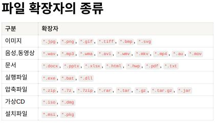

# 컴퓨터 기본 종합 요약.

## ***목차***
[1. 마크다운 작성법](#1-마크다운-작성법)   
[2. 프로그래밍 언어 필기 방법](#2-프로그래밍-언어-필기-방법)   
[3. 확장자 설명](#3-확장자-설명)   
[4. 터미널 명령어](#4-터미널-명령어)   
[5. 개발자 환경구축](#5-개발자-환경구축01----pdf-파일-1pw-123qwe)

---

## <span style="color:yellowgreen">1. 마크다운 작성법</span>

- 순서 있는 목록
  - 1. 일
  - 2. 이
  - 3. 삼

- 순서 없는 목록
  - 하이픈
  + 플러스
  * 별표

---

## <span style="color:yellowgreen">2. 프로그래밍 언어 필기 방법</span>

### ` ```표시 사이에 명령어 작성, 첫 ```옆에 각 프로그램 명을 작성할 경우 색인 추가 `

```js
const name = req.body.name;

if (name === undefined) {
    console.log('이름이 없습니다.');
}
```

```html
<p>내용을 입력하세요.</p>
```

```css
p,div {font-size: 15px;};
```

### 폰트 표현 변경법

별표 두 개로 감싸면 굵게 표현 **이렇게**   
별표 하나로 감싸면 기울여 표현 *이렇게*   
물결표 두 개로 감싸면 취소선 표현 ~~이렇게~~   

### 링크 및 이미지 작성법

[링크 제목](사이트 주소)
[네이버](https://www.naver.com)로 이동하기


    **로컬 이미지를 로컬 주소로 삽입하는 방법 여쭤보기**

### 표 그리는 방법
|(shift + \ 타이프라인)
| | html | css | js |
|:---|---:|:---:|---|
|a|92|22|32|
|b|22|33|55|

---

## <span style="color:yellowgreen">3. 확장자 설명</span>



## <span style="color:yellowgreen">4. 터미널 명령어</span>

### 기본 사항

    - 절대경로 - 현재 위치와 상관 없이 대상 폴더나 파일의 경로를 최상위 위치부터 전체적으로 명시
    - 상대경로 - 현재 위치를 기준으로 하여 어떤 폴더의 안, 혹은 상위 등 상대적인 위치를 명시
      - Windows는 경로나 파일 이름의 대소문자를 구분하지 않지만, Mac의 경우 구분하여야 한다.
    - 파일 경로 구분
      - Windows = \
      - Mac = /

### 명령어

- <span style="color:yellow">디렉토리 위치</span>
```
  - . = 현재 디렉토리
  - .. = 상위 디렉토리
```
---
- <span style="color:yellow"> 폴더 열기 </span>
```
  - explorer . (현재 경로 폴더 열기)
  - explorer d:\ (D드라이브 열기)
  - open . (Mac 현재 경로 Finder 열기)
  - open ~ (홈 디렉토리 열기) 
  - pwd (현재 위치 표시)
```
---
- <span style="color:yellow">디렉토리 이동</span>
```
  - cd 경로
  - 드라이브 변경 시 cd /d 경로
```
---
- <span style="color:yellow">화면 청소</span>

*Windows*
```
  - cls
```
*Mac*
```
  - clear
```
---
- <span style="color:yellow">파일 복사</span>
*Windows*
```
  - copy "파일 위치" "복사할 위치"
```
*Mac*
```
  - cp "파일 위치" "복사할 위치"
```
---
- <span style="color:yellow">파일 삭제</span>

*Windows*
```
  - del 파일 위치 
    - del은 폴더 삭제가 불가능하다.
    - 추가 명령어
      - /p : 파일 삭제 전 확인 메세지 출력
      - /q : 삭제할 것인지 묻지 않고 삭제
      - /f : 읽기전용 파일도 삭제
      - /s : 지정된 파일을 모든 하위 디렉토리에서 삭제
```
*Mac*
```
  - rm 파일 위치
    - 추가 명령어
      - /f : 강제로 파일이나 디렉토리를 삭제
      - /r : 디렉토리 내부의 모든 내용을 삭제
      - /d : 비어있는 디렉토리들만 삭제
      - /i : 파일 삭제 전 확인 메세지 출력
      - /v : 삭제되는 대상의 정보 출력
      - rm /rf 경로 (무조건 삭제시키는 명령어)
```
---
- <span style="color:yellow">현재 디렉토리 파일 정보 출력</span>

*Windows*
```
  - dir
    - 추가 명령어
      - /b : 파일 이름만 보기
      - /s : 하위 디렉토리 보기
      - /ad : 디렉토리만 보기
      - /ah : 숨김 파일만 보기
      - /ar : 읽기 전용 파일만 보기
      - /as : 시스템 파일만 보기
      - /p : 출력 내용이 한 화면을 벗어나면 잠시 멈춤(아무키나 누르면 진행)
      - /w : 파일 이름을 가로로 보여줌 
```
*Mac*
```
  - ls [옵션] [대상 디렉토리 경로]
    - 추가 명령어
      - /l : 리스트 형태로 출력
      - /a : 숨김 파일이나 숨김 디렉토리까지 표현
      - /al : 숨김 파일이나 숨김 디렉토리를 포함하여 리스트 형태로 출력
    - 대상 디렉토리 경로가 지정되지 않은 경우 현재 위치의 항목을 표시한다.
```
---
- <span style="color:yellow"> 출력문 </span>
```
- echo 출력할 내용
```
---
- <span style="color:yellow">종료</span>
```
- exit
```
---
- <span style="color:yellow">디렉토리 생성</span>

*Windows*
```
- md
```
*Mac*
```
- mkdir
```
---
- <span style="color:yellow">디렉토리 삭제</span>

*Windows*
```
- rd
  - 추가 명령어
      - /s : 비어있지 않은 폴더의 하위 항목까지 모두 삭제
```
*Mac*
```
- rmdir (비어있지 않은 폴더는 삭제가 불가능하다.)
```
---
- <span style="color:yellow">파일 및 폴더 이름 변경</span>

*Windows*
```
- rename
```

*Mac*
```
- mv 원본경로 대상경로 -> 원본 경로를 대상 경로로 이동한다. 같은 폴더 안의 이동일 경우 이름 변경 효과가 있다.
```
---

## <span style="color:yellowgreen">5. 개발자 환경구축(#01) </span> - *PDF 파일 1(pw: 123qwe!@#)*


