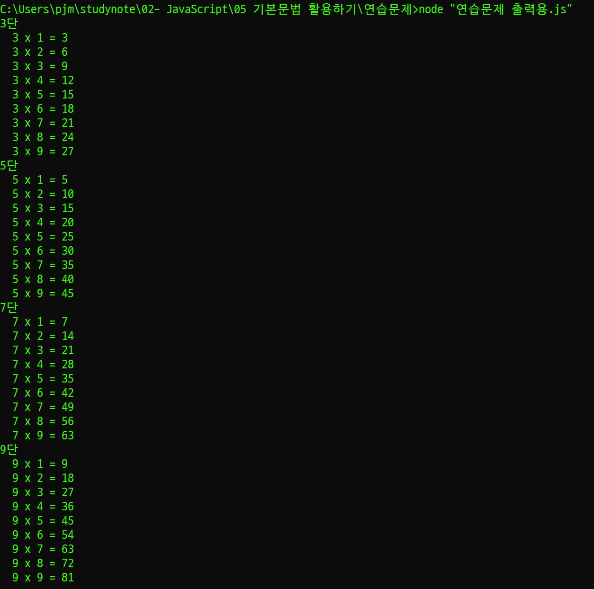

# 박정모 기본문법 활용하기 연습문제

> 2022-01-27

## 문제 1.

for문을 사용하여 0부터 10미만의 정수 중에서 홀수만을 큰수부터 출력하시오.

```js
for(i = 10; i > 0; i--) {
    if(i % 2 > 0) {
        console.log(i);
    }
}
```


---


## 문제 2.

while문을 사용하여 0 부터 10 미만의 정수 중에서 홀수만을 큰수부터 출력하시오.

```js
let i = 10;

while (i > 0) {
    if(i % 2 > 0) {
        console.log(i);
    } else {}
    i--;
}
```


---


## 문제 3.

1부터 20 미만의 정수 중에서 2 또는 3의 배수인 수의 총합을 구하시오.

```js
const a = 2
const b = 3

let sum = 0;

for(i = 1; i < 21; i++) {
    if( i % a == 0 || i % b == 0) {
        sum += i;
        if ( i % a == 0 && i % b ==0) {
            sum -= i;
        } else {}
    } else {}
}

console.log("1부터 20 미만의 정수 중에서 %d 또는 %d의 배수인 수의 총 합 = %d", a, b, sum);
```


---


## 문제 4.

두 개의 주사위를 던졌을 때, 눈의 합이 6이 되는 모든 경우의 수를 출력하고 경우의 수는 총 몇가지 인지를 아래와 같이 출력하는 코드를 작성하시오.

```
[ 1, 5 ]
[ 2, 4 ]
[ 3, 3 ]
[ 4, 2 ]
[ 5, 1 ]
경우의 수는 5개 입니다.
```

```js
let sum = 0;

for(i = 1; i < 7; i++) {
    for(j = 1; j < 7; j++) {
        if( i + j == 6){
            console.log("[%d, %d]", i, j);
            sum += 1
        } else {}
    }
} 
console.log("경우의 수는 총 %d개 입니다.", sum);
```


---


## 문제 5.

for문을 중첩하여 실행하여 아래와 같은 출력 결과를 만드시오.

```
0 1 2 3 
1 2 3 4 
2 3 4 5 
3 4 5 6 
```

```js
for(i = 0; i < 4; i++){
    let str = "";
    for(j = i; j < i + 4; j++) {
        str += j;
        str += " ";
    } console.log(str);
}
```
```js
let str = "";
for (let j=0; j<4; j++) {
    str += i + j;

    if (j + 1 < 4) {
        str += " ";
    }
}

console.log(str);
```


---


## 문제 6.

아래와 같은 출력 결과가 나타나도록 중첩 반복문을 for 문 형식으로 구현하시오.

```
1
12
123
1234
12345
123456
1234567
```

```js
for(i = 1; i < 8; i++) {
    let str = "";
    for(j = 1; j < i + 1; j++){
        str += j;
    } console.log(str);
}
```


---


## 문제 7.

number라는 변수를 정의하고 1 혹은 2의 값을 임의로 할당하시오. 이 변수에는 1이나 2밖에 저장될 수 없습니다.

구구단 프로그램을 만들고자 한다.

전체를 출력하는 구구단이 아니라 number가 1일 때는 홀수 단(3, 5, 7, 9), number가 2일 때는 입력하면 짝수 단(2, 4, 6, 8)을 출력하는 프로그램을 완성하시오.

```js
let number = 1;

for(i = 2; i < 10; i++) {
    if(number == 1) {        
        if(i % 2 > 0) {
            console.group("%d단", i);
            for(j = 1; j < 10; j++){
                console.log("%d x %d = %d", i, j, i * j);
            } console.groupEnd();
        }
    } else if (number == 2) {
        if(i % 2 == 0) {
            console.group("%d단", i);
            for(j = 1; j < 10; j++){
                console.log("%d x %d = %d", i, j, i * j);
            } console.groupEnd();
        }
    }
}
```

## number에 1을 할당 했을 때



## number에 2를 할당 했을 때
.JPG)