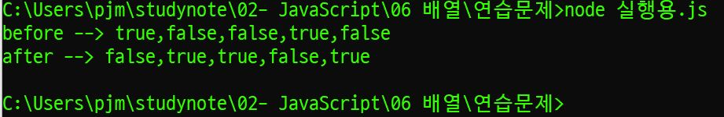
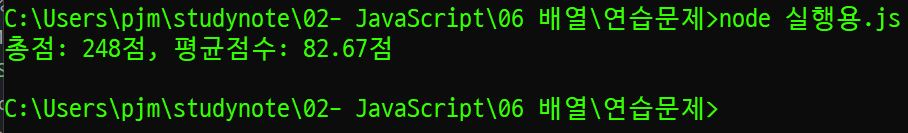
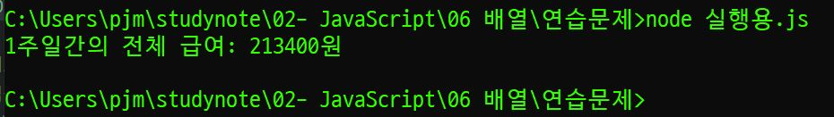
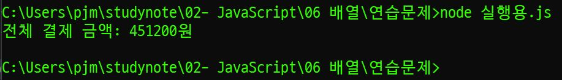
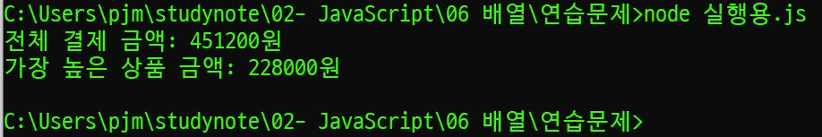
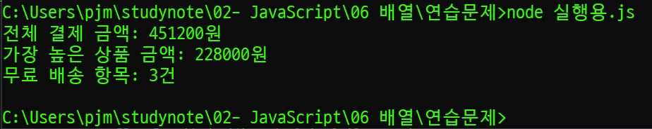
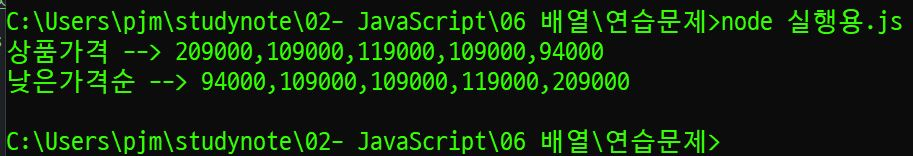
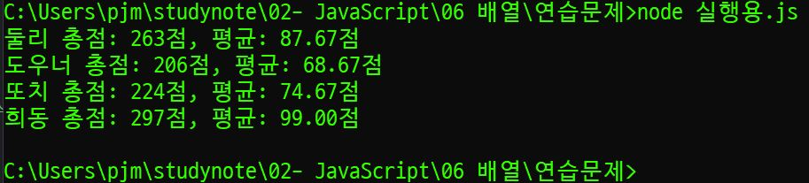
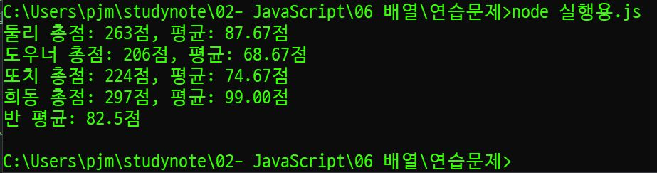
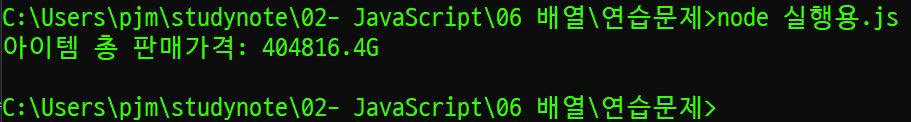

# 박정모 연습문제
> 2022-01-31

## 문제 1.
다음의 소스코드는 boolean 데이터를 저장하고 있는 배열에 대한 어떤 처리를 보여준다.
실행 결과에서 제시하는 것과 같이 배열에 저장되어 있는 값들을 반전(true는 false로, false는 true로) 
변환하는 처리를 완성하시오.
```js
var check_list = [true, false, false, true, false];
console.log("before --> " + check_list);

    // codes here

console.log("after --> " + check_list);
```
```js
for (let i = 0; i < check_list.length; i++) {
    if(check_list[i] == true) {
        check_list[i] = false;
    } else {
        check_list[i] = true;
    }
}
```



---

## 문제2.

다음 표는 어떤 학생의 과목별 점수이다.
||HTML|CSS|Javascript|
|:---:|:---:|:---:|:---:|
|점수|75|82|91|

이 학생의 총점과 평균점수를 구하는 프로그램에 대한 아래의 소스코드를 완성하시오.

```js
var grade =            ;   // 성적표 배열
var sum = 0, avg = 0;      // 총점과 평균점수 변수 생성

// 총점 구하기

// 평균 구하기

// arr의 값을 소수점 둘째 자리까지로 제한한다.
avg = avg.toFixed(2);
console.log("총점: " + sum + "점, 평균점수: " + avg + "점");
```

```js
var grade = [75, 82, 91];   // 성적표 배열
var sum = 0, avg = 0;      // 총점과 평균점수 변수 생성

// 총점 구하기
for (let i = 0; i < grade.length; i++) {
    sum += grade[i];
}
// 평균 구하기
avg = sum / grade.length;

// arr의 값을 소수점 둘째 자리까지로 제한한다.
avg = avg.toFixed(2);
console.log("총점: " + sum + "점, 평균점수: " + avg + "점");
```



---

## 문제 3.

다음 표는 어떤 학생이 일요일부터 토요일까지의 일주일간 아르바이트를 한 시간이다.

|일|월|화|수|목|금|토|
|:---:|:---:|:---:|:---:|:---:|:---:|:---:|
|7|5|5|5|5|10|7|

주말에는 7시간, 평일에는 5시간을 일하기로 했지만, 금요일에 다른 직원의 사정으로 대신 근무를 하게
되어 10시간을 일했다.
이 학생의 시급이 4,500이었지만 목요일부터는 5,200원으로 올랐다고 할 때 일주일간의 총 급여를 구하
는 프로그램을 작성하시오. (기본 코드는 아래 제시되는 내용을 사용하세요.)

```js
var time = [ 7, 5, 5, 5, 5, 10, 7 ];
var money = 0;

    // codes here

console.log("1주일간의 전체 급여: " + money + "원");
```

```js
var time = [ 7, 5, 5, 5, 5, 10, 7 ];
var money = 0;

for (let i = 0; i < time.length; i++) {
    if (i > 3) {
        money += time[i] * 5200;
    } else money += time[i] * 4500;
}

console.log("1주일간의 전체 급여: " + money + "원");
```




---

## 문제 4.

아래의 화면은 어떤 사람이 쇼핑몰의 장바구니에 담은 상품에 대한 내역이다.

|이미지|상품정보|판매가|수량|적립금|배송구분|배송비|
|:---:|:---:|:---:|:---:|:---:|:---:|:---:|
||**3CE MOOD RECIPE MULTI EYE COLOR PALETTE**<BR>**#PLOT TWIST**<BR>[옵션: PLOT TWIST/FRE]|38,000원|6|-|기본배송<BR>(해외배송가능)|[무료]|
||**LOVE 3CE VELVET LIP STICK #GIRLS GIRLS**<BR>[옵션: GIRLS GIRLS/FRE]|20,000원|4|-|기본배송<BR>(해외배송가능)|[무료]|
||**3CE MOOD RECIPE MATTE LIP COLOR #218**<BR>[옵션: 218/FRE]|17,900원|3|-|기본배송<BR>(해외배송가능)|[무료]|
||**3CE MOOD RECIPE MATTE LIP COLOR #219**<BR>[옵션: 219/FRE]|17,900원|3|-|기본배송<BR>(해외배송가능)|[무료]|

상품의 가격을 원소로 갖는 1차 배열 price와 각 상품의 수량을 원소로 갖는 1차 배열 qty를 다음과 같이 정의하였을 때 이 사람이 총 얼마를 결제해야 하는지 총 결제금액을 구하는 프로그램을 작성하시오.

```js
var price = [38000, 20000, 17900, 17900];
var qty = [6, 4, 3, 5];
var money = 0;

    //codes here
    
console.log("전체 결제 금액: " + money + "원");
```

```js
var price = [38000, 20000, 17900, 17900];
var qty = [6, 4, 3, 5];
var money = 0;

for(let i = 0; i < 4; i++) {
    money2 = price[i] * qty[i];
    money += money2;
}
    
console.log("전체 결제 금액: " + money + "원");
```



---

## 문제 5.

문제 4번의 장바구니 내역에서 상품금액(판매가*수량)이 가장 비싼 항목은 얼마인지 출력하시오.

```js
var price = [38000, 20000, 17900, 17900];
var qty = [6, 4, 3, 5];
var money = 0;
let eachPrice = new Array (4);

for(let i = 0; i < 4; i++) {
    money2 = price[i] * qty[i];
    money += money2;
    eachPrice[i] = money2;
}
    
console.log("전체 결제 금액: " + money + "원");

let max = eachPrice[0];
for(let i = 1; i < 4; i++) {
    if (max < eachPrice[i]) {
        max = eachPrice[i];
    }
}

console.log("가장 높은 상품 금액: " + max + "원");
```



---

## 문제6.

문제4번의 장바구니 내역에서는 모든 장바구니 상품이 개별 배송이라고 한다. 상품금액(판매가*수량)이
8만원 이상인 경우 무료로 배송이 된다고 할 때 무료로 배송되는 항목은 모두 몇 개 인지 구하는 프로그램을 구현하시오.

```js
let freeShip = 0;

for (let i = 0; i < 4; i++) {
    if (eachPrice[i] >= 80000) {
        freeShip++;
    }
}

console.log("무료 배송 항목: " + freeShip + "건");
```


## 문제 7.

다음은 어느 쇼핑몰의 상품 목록 화면이다.
아래의 소스코드는 위의 상품 목록에서 상품의 가격을 원소로 하는 배열 money를 정의하였을 때 “낮은 가격순”버튼이 눌러졌을 때 상품의 가격을 재정렬하기 위한 코드에 대한 일부이다. 빈 칸을 채워넣어 완성하시오

```js
var price = [209000, 109000, 119000, 109000, 94000];
console.log("상품가격 --> " + price);

for (var i = 0; i < ?????; i++) {
    for (var j = ?????; j<price.length; j++) {
        if (price[i] > price[j]) {
            var tmp = price[i];
            price[i] = price[j];
            price[j] = tmp;
        }
    }
}

console.log("낮은가격순 --> " + price);
```
```js
var price = [209000, 109000, 119000, 109000, 94000];
console.log("상품가격 --> " + price);

for (var i = 0; i < price.length - 1; i++) {
    for (var j = i + 1; j<price.length; j++) {
        if (price[i] > price[j]) {
            var tmp = price[i];
            price[i] = price[j];
            price[j] = tmp;
        }
    }
}

console.log("낮은가격순 --> " + price);
```


---

## 문제 8.

아래의 코드는 배열의 원소를 반대로 배치하는 소스코드의 일부이다.
빈 칸을 완성하시오. (번호가 같은 박스는 같은 코드가 들어갑니다.)

```js
var arr = [5, 3, 2, 8, 9];
console.log('before --> ' + arr);

for (var i = 0; i < parseInt(???????); i++) {
    var tmp = arr[i];
    arr[i] = arr[??????????];
    arr[????????]; = tmp;
}

console.log('after --> ' + arr);
```
```js
var arr = [5, 3, 2, 8, 9];
console.log('before --> ' + arr);

for (var i = 0; i < parseInt(arr.length / 2); i++) {
    var tmp = arr[i];
    arr[i] = arr[arr.length - i - 1];
    arr[arr.length - i - 1] = tmp;
}

console.log('after --> ' + arr);
```


---

## 문제 9.

다음 표는 어느 학급의 성적표이다.

| |HTML|CSS|Javascript|
|:---:|:---:|:---:|:---:|
|둘리|78|89|96|
|도우너|62|77|67|
|또치|54|90|80|
|희동|100|99|98|

총점과 평균점수를 구하기 위한 소스코드를 아래와 같이 작성중이다. 빈칸을 완성하시오.   
단, 평균점수의 경우 toFixed() 함수를 사용하여 소수점 둘째 자리까지만 출력하시오.

```js
/** 학생 이름 배열 */
var student = ['둘리', '도우너', '또치', '희동'];

/** 성적표 배열*/
var grade = [
    [78, 89, 96],
    [62, 77, 67],
    [54, 90, 80],
    [100, 99, 98]
];

// 총점과 평균 점수를 저장할 변수
var sum = 0, avg = 0;

/** 총점과 평균 구하기 */
```
```js
/** 학생 이름 배열 */
var student = ['둘리', '도우너', '또치', '희동'];

/** 성적표 배열*/
var grade = [
    [78, 89, 96],
    [62, 77, 67],
    [54, 90, 80],
    [100, 99, 98]
];

// 총점과 평균 점수를 저장할 변수

/** 총점과 평균 구하기 */

for (let i = 0; i < 4; i++){
    var sum = 0, avg = 0;
    for(let j = 0; j<3; j++) {
        sum += grade[i][j];
        avg = sum / 3;
    }
    console.log(student[i] + ' 총점: ' + sum + "점, 평균: " + avg.toFixed(2) + "점");
}
```


---

## 문제 10.

위의 문제에서 반 평균을 출력하시오. 반 평균은 학생의 평균점수 총 합/학생수로 구합니다.   
[주의] toFixed() 함수로 가공된 값은 문자열 형태이기 때문에 숫자 연산이 불가능합니다. 이를 감안하여 반 점수를 구하세요.

```js
/** 학생 이름 배열 */
var student = ['둘리', '도우너', '또치', '희동'];

/** 성적표 배열*/
var grade = [
    [78, 89, 96],
    [62, 77, 67],
    [54, 90, 80],
    [100, 99, 98]
];

// 총점과 평균 점수를 저장할 변수
var sum = 0, avg = 0;

/** 총점과 평균 구하기 */

for (let i = 0; i < 4; i++){
    var sum2 = 0, avg2 = 0;
    for(let j = 0; j<3; j++) {
        sum2 += grade[i][j];
        avg2 = sum2 / 3;
    }
    sum += sum2;
    avg += avg2;
    console.log(student[i] + ' 총점: ' + sum2 + "점, 평균: " + avg2.toFixed(2) + "점");
}

console.log("반 평균: " + avg / 4 + "점");
```



---

## 문제 11.

아래는 어느 게임 유저의 아이템 인벤토리이다    


첫 줄에 있는 아이템을 판매한다고 할 때 이 유저가 벌어들이는 골드(G)의 총액은 얼마인가?   
(판매를 위해 선택한 아이템의 상단에는 1개당 가격이 표시되고, 아이템을 판매할 때는 원래 가격의 90%만 받을 수 있다고 한다.)   
- 가격과 아이템 수량의 정보를 2차 배열로 구성하는 소스코드를 완성하세요.   
("단가-수량"을 한 세트로 하는 정보들을 배열로 구성하면 2차 배열 형태가 됩니다.)   
```js
let inventory = [ [500, 291], [320, 586], [100, 460], [120, 558], [92, 18], [30, 72]];
let gold = 0;

for(let i = 0; i < inventory.length; i++) {
    gold += (inventory[i][0] * inventory[i][1]) * 0.9;
}

console.log("아이템 총 판매가격: " + gold + "G");
```


---


## 문제 12.

자신의 주민번호 한 글자씩 모든 숫자를 원소로 갖는 배열 jumin을 아래와 같이 정의하시오.

```js
ssn = [0,1,1,2,1,3,1,0,0,0,1,2,3]
```

정의된 배열을 활용하여 유요한 주민등록번호인지 아닌지를 판별하는 코드를 구현해보자. 판별 방법은 아래와 같다.

- 기본 주민등록코드에는 각 숫자에 대응하는 가중치가 있다. 가중치는 주민등록번호의 순서에 따라 `2 3 4 5 6 7 8 9 2 3 4 5` 이다.
- 먼저 마지막 숫자는 제외하고, 기본코드의 각 12자리와 가중치를 모두 곱하여 합한다.
- 합한 값을 11로 나눈 나머지 값을 구한다.
- 11에서 그 나머지 값을 뺀 후, 이를 10을 나눈 나머지를 구한다.
- 나머지의 1의 자리 값과 주민등록번호 마지막 자리 값이 맞아야 유효한 주민등록번호이다.

```js
let ssn = [0, 1, 1, 2, 1, 3, 1, 0, 0, 0, 1, 2, 3];
let weight = [2, 3, 4, 5, 6, 7, 8, 9, 2, 3, 4, 5 ];
let sum = 0;

for(let i = 0; i<ssn.length - 1; i++) {
    let tmp = 0;
    tmp = ssn[i] * weight[i];
    sum += tmp;
}

// let a = sum % 11;
// let b = (11 - a) % 10
// let c = (b - ssn[12]) % 10;

let c = (((11 - (sum % 11)) % 10) - ssn[12]) % 10;

console.log(c);
if (c == 0) {
    console.log("유효한 주민등록번호입니다.");
} else {
    console.log("유효하지 않은 주민등록번호 입니다.");
}
```


