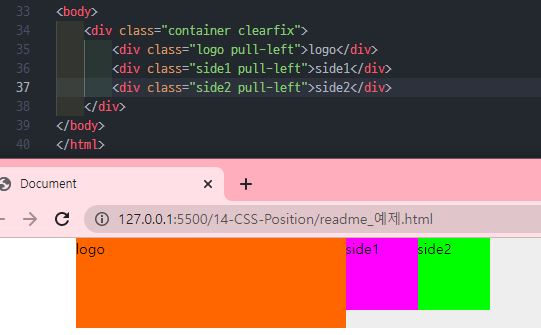
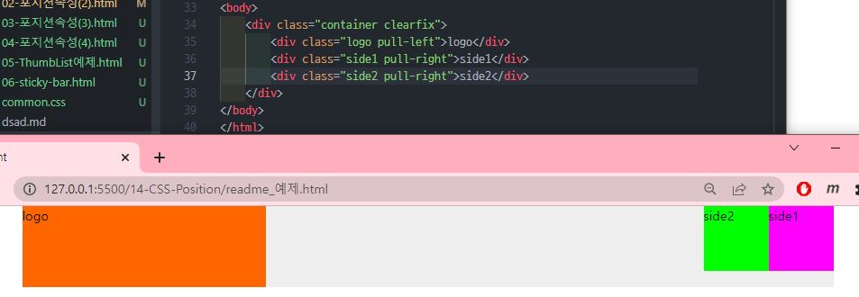
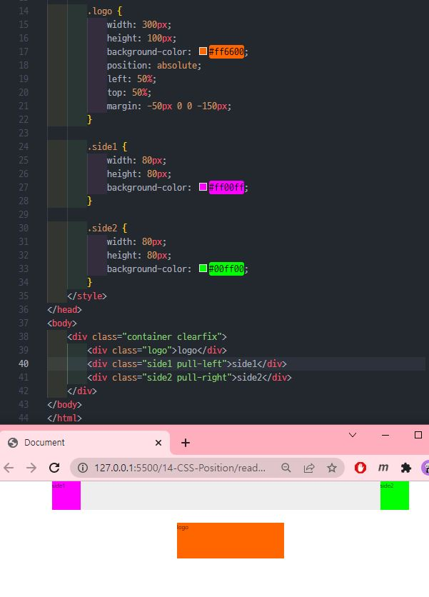
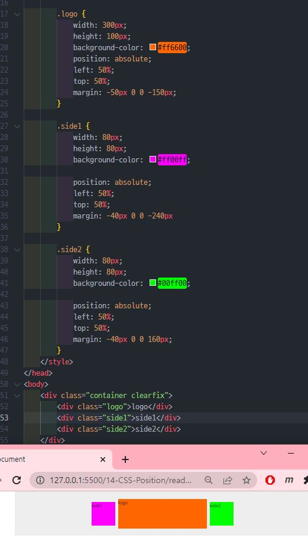
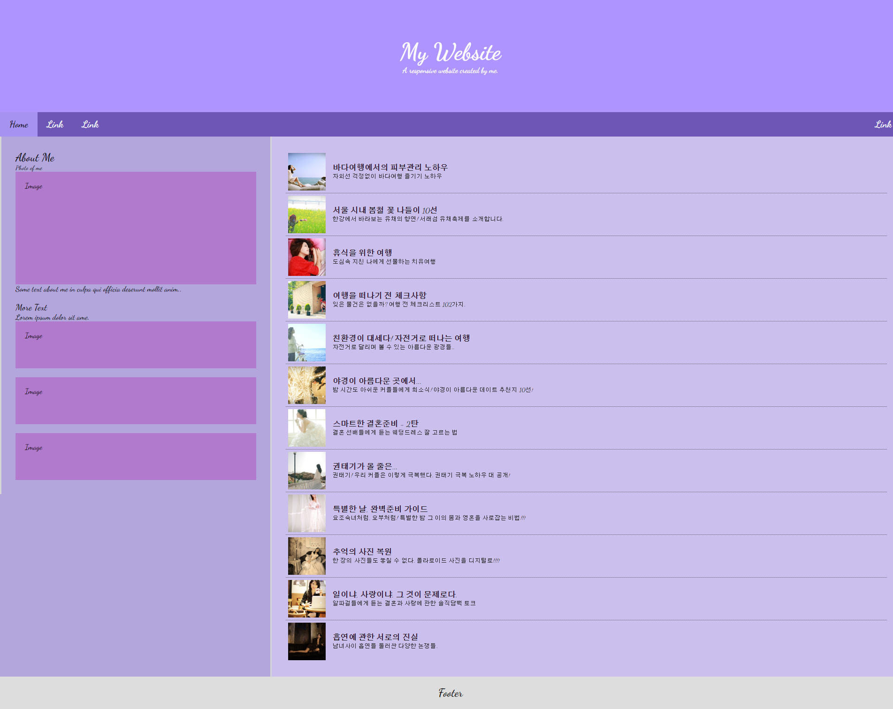

# 박정모 HTML 예제 제출
> 2022-03-07

# 1. HTML 예제
## case1 : 모두 왼쪽정렬

   
---   
---
   
## case2 : 로고는 왼쪽, 메뉴 요소들은 오른쪽

   
---   
---
   
## case3 : 로고는 중앙, 메뉴 요소들은 양 끝을 기준으로 간격 조절

   
---   
---
   
## case4 : 모두 가운데에서 출발. 간격조절

   
   
   
---   
---
   
# 2. 카카오톡 스크린샷

### 저도 디자인은 똥이라는 걸 깨닫습니다.
