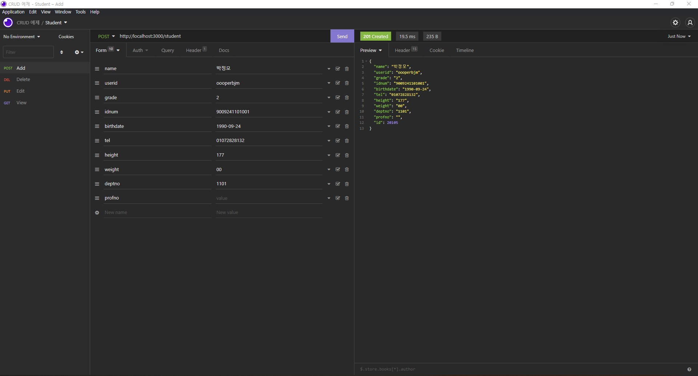

# 박정모 연습문제
>2022-04-07

## 1. 교수 관리
### 1) CRUD restful
#### GET

#### POST

#### PUT

#### DELETE

### 2) WebPage Screenshots

#### index.html

#### add.html

#### view.html

#### edit.html

#### 수정한 내용 view

#### 내용 삭제 알림

#### 내용 삭제 결과

---
---

## 2. 학생 관리
### 1) CRUD restful
#### GET

#### POST

#### PUT

#### DELETE

### 2) WebPage Screenshots

#### index.html

#### add.html

#### view.html

#### edit.html

#### 수정한 내용 view

#### 내용 삭제 알림

#### 내용 삭제 결과
