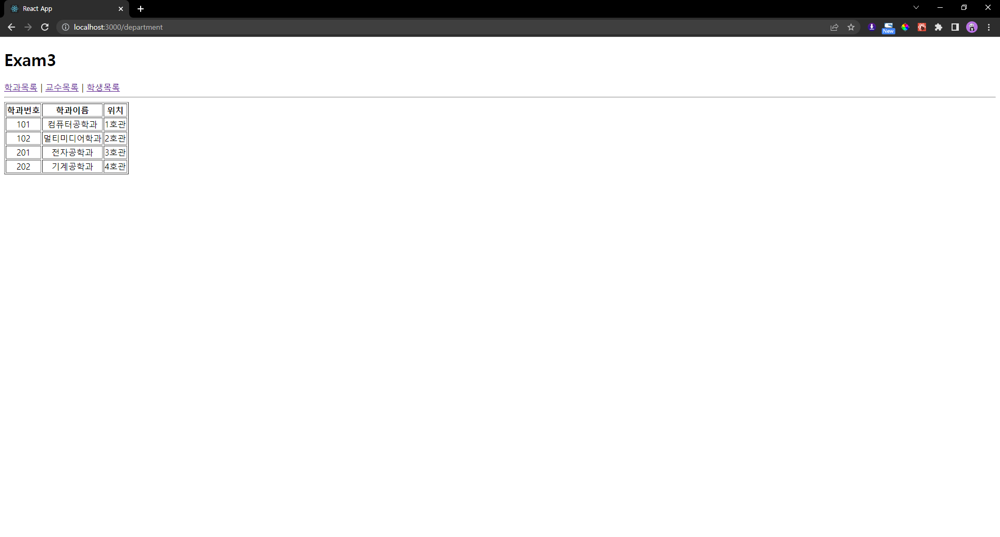
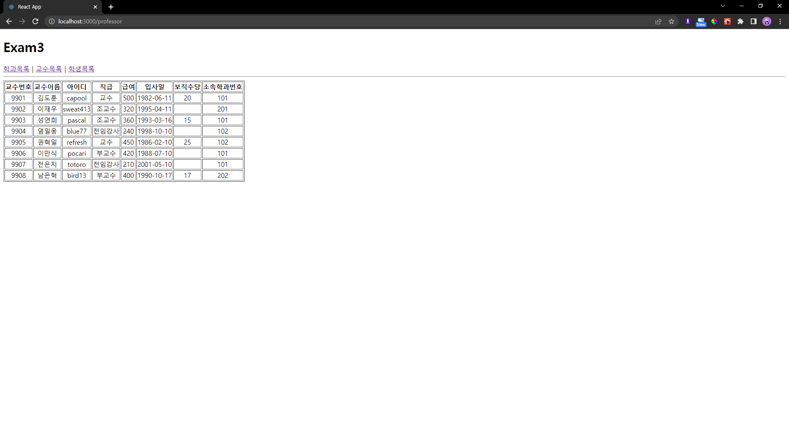
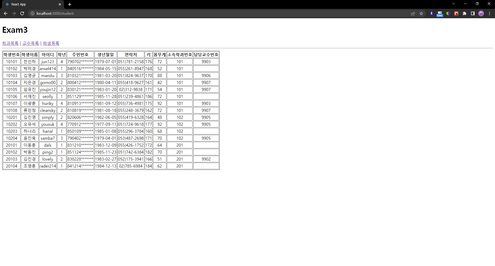

# 박정모 React 연습문제5
> 2022-04-26

## 파일 구조


## App.js
```js
import React from 'react';
import { Link, Routes, Route } from 'react-router-dom';
import Department from './pages/Department';
import Professor from './pages/Professor';
import Student from './pages/Student';

function App() {
  return (
    <div>
      <h1>Exam3</h1>
      <nav>
        <Link to='./department'>학과목록</Link>&nbsp;|&nbsp;
        <Link to='./professor'>교수목록</Link>&nbsp;|&nbsp;
        <Link to='./student'>학생목록</Link>
      </nav>
      <hr />

      <Routes>
        <Route path='/department' element={<Department />} />
        <Route path='/professor' element={<Professor />} />
        <Route path='/student' element={<Student />} />
      </Routes>

    </div>
  );
}

export default App;

```

<hr />

## Department.js
```js
import React from "react";
import data from "./myschool";
import DepartmentSub from './components/DepartmentSub';

const Department = () => {
    const { department } = data;
    console.log(department);

    return (
        <div>
            <table border="1">
                <thead>
                    <tr>
                        <th>학과번호</th>
                        <th>학과이름</th>
                        <th>위치</th>
                    </tr>
                </thead>
                <tbody>
                    <DepartmentSub sub={data.department} />
                </tbody>
            </table>
        </div>
    );
};

export default Department;

```

## DepartmentSub.js
```js
import React from "react";

const DepartmentSub = (props) => {
    return props.sub.map((v, i) => {
        return (
            <tr align="center">
                <td key={i}>{v.id}</td>
                <td key={i + "a"}>{v.dname}</td>
                <td key={i + "b"}>{v.loc}</td>
            </tr>
        );
    });
};

export default DepartmentSub;
```
### 학과목록 스크린샷


<hr />

## Professor.js
```js
import React from "react";
import data from "./myschool";
import ProfessorSub from './components/ProfessorSub';

const Professor = () => {
    return (
        <div>
            <table border="1">
                <thead>
                    <tr align="center">
                        <th>교수번호</th>
                        <th>교수이름</th>
                        <th>아이디</th>
                        <th>직급</th>
                        <th>급여</th>
                        <th>입사일</th>
                        <th>보직수당</th>
                        <th>소속학과번호</th>
                    </tr>
                </thead>
                <tbody>
                        <ProfessorSub sub={data.professor}/>
                </tbody>
            </table>
        </div>
    );
};

export default Professor;

```

## ProfessorSub.js
```js
import React from "react";

const ProfessorSub = (props) => {
    return props.sub.map((v, i) => {
        return (
            <tr align="center">
                <td>{v.id}</td>
                <td>{v.name}</td>
                <td>{v.userid}</td>
                <td>{v.position}</td>
                <td>{v.sal}</td>
                <td>{v.hiredate.substring(0, 10)}</td>
                <td>{v.comm}</td>
                <td>{v.deptno}</td>
            </tr>
        );
    });
};

export default ProfessorSub;

```
### 교수목록 스크린샷



## Student.js
```js
import React from "react";
import data from "./myschool";
import StudentSub from './components/StudentSub';

const Student = () => {
    const { student } = data;

    return (
        <div>
            <table border="1">
                <thead>
                    <tr>
                        <th>학생번호</th>
                        <th>학생이름</th>
                        <th>아이디</th>
                        <th>학년</th>
                        <th>주민번호</th>
                        <th>생년월일</th>
                        <th>연락처</th>
                        <th>키</th>
                        <th>몸무게</th>
                        <th>소속학과번호</th>
                        <th>담당교수번호</th>
                    </tr>
                </thead>
                <tbody>
                    <StudentSub sub={data.student}/>
                </tbody>
            </table>
        </div>
    );
};

export default Student;

```

## StudentSub.js
```js
import React from "react";

const StudentSub = (props) => {
    return props.sub.map((v, i) => {
        return (
            <tr align="center">
                <td>{v.id}</td>
                <td>{v.name}</td>
                <td>{v.userid}</td>
                <td>{v.grade}</td>
                <td>{v.idnum.substring(0, 6) + "*******"}</td>
                <td>{v.birthdate.substring(0, 10)}</td>
                <td>{v.tel}</td>
                <td>{v.height}</td>
                <td>{v.weight}</td>
                <td>{v.deptno}</td>
                <td>{v.profno}</td>
            </tr>
        );
    });
};

export default StudentSub;

```
### 학생목록 스크린샷



