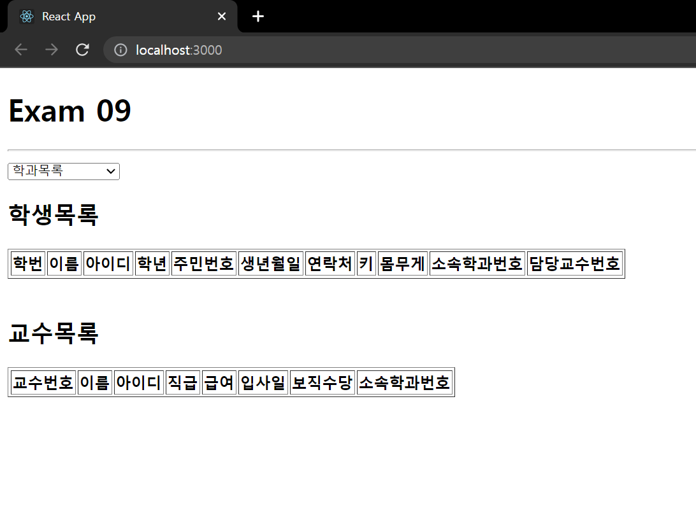
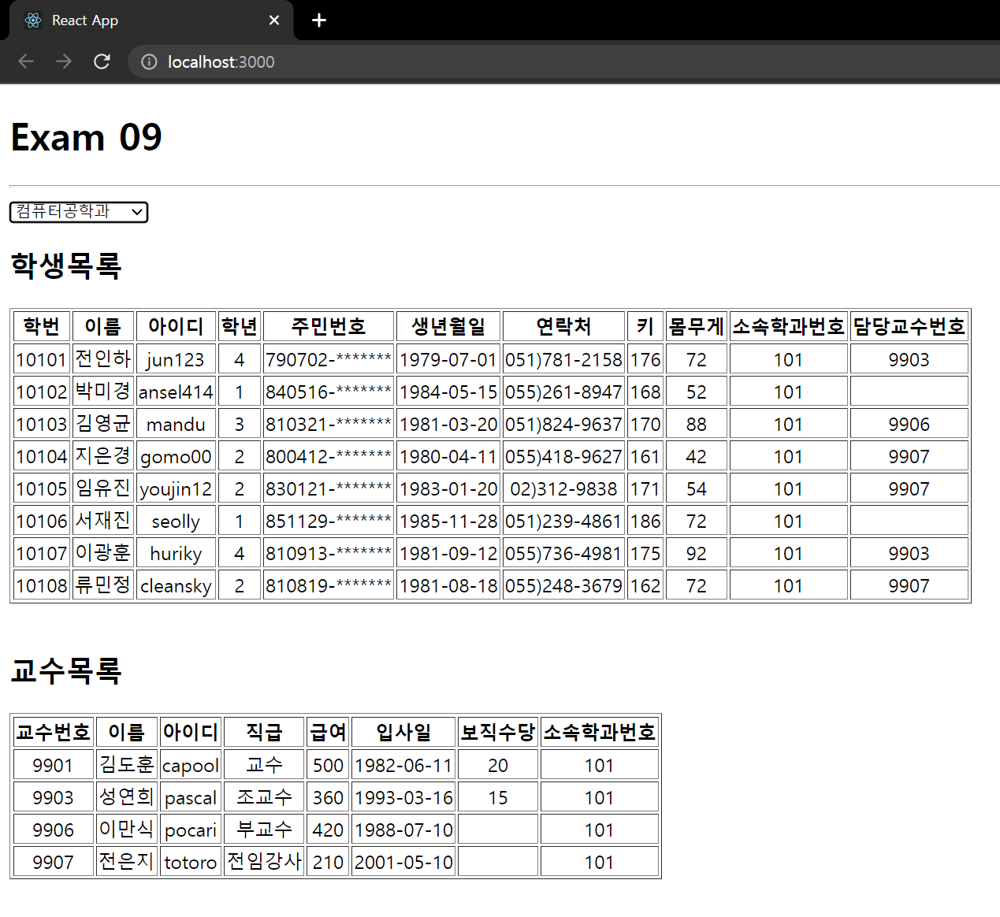

# React 연습문제 09
> 2022-05-16

# 최종결과



# App.js 
```js
import React from 'react';
import Professor from './components/Professor';
import Spinner from './components/Spinner';
import Student from './components/Student';
import axios from 'axios';

function App() {
    const [data, setData] = React.useState([]);
    const [deptno, setDeptno] = React.useState(-1);
    const [loading, setLoading] = React.useState(false);

    React.useEffect(() => {
        setTimeout(() => {
            (async () => {
                setLoading(true);
                try {
                    const response = await axios.get('http://localhost:4000/department');
                    setData(response.data);
                } catch (e) {
                    console.error(e);
                    alert('Ajax 통신오류 (App.js)');
                } finally {
                    setLoading(false);
                }
            })();
        }, 500)
    }, []);

    const onChange = React.useCallback((e) => {
        setDeptno(e.currentTarget.value);
    }, [])
    console.log(data);

    return (<div className="App">
        <Spinner visible={loading}/>
        <h1>Exam 09</h1>
        <hr/>
        <select onChange={onChange}>
            <option value='' selected>학과목록</option>
            {data.map((v, i) => {
                return (<option value={v.id} key={i}>{v.dname}</option>)
            })}
        </select>

        <h2>학생목록</h2>
        <Student props={deptno}/>
        <br/>
        <h2>교수목록</h2>
        <Professor props={deptno}/>
    </div>);
}

export default App;
```

# Student.js
```js
import React from 'react';
import axios from 'axios';
import Spinner from './Spinner';

const Student = ({props}) => {
    const [data, setData] = React.useState();
    const [loading, setLoading] = React.useState(false);

    React.useEffect(() => {
        setLoading(true);
        setTimeout(() => {
        (async () => {
            try {
                const response = await axios(`http://localhost:4000/student?deptno=${props}`);
                // const response = await axios(`http://localhost:4000/student`
                setData(response.data);
            } catch (e) {
                console.error(e);
                alert('Ajax 연동 실패 (Student.js)');
            } finally {
                setLoading(false);
            }
        })();
        },500);
    }, [props]);

    console.log(data);


    return (
        <table border={1}>
            <Spinner visible={loading} />
            <thead align='center'>
            <tr>
                <th>학번</th>
                <th>이름</th>
                <th>아이디</th>
                <th>학년</th>
                <th>주민번호</th>
                <th>생년월일</th>
                <th>연락처</th>
                <th>키</th>
                <th>몸무게</th>
                <th>소속학과번호</th>
                <th>담당교수번호</th>
            </tr>
            </thead>
            <tbody>
            {data && data.map((v, i) => {
                return (
                    <tr align='center'>
                        <td>{v.id}</td>
                        <td>{v.name}</td>
                        <td>{v.userid}</td>
                        <td>{v.grade}</td>
                        <td>{v.idnum.substring(0,6)}-*******</td>
                        <td>{v.birthdate.substring(0, 10)}</td>
                        <td>{v.tel}</td>
                        <td>{v.height}</td>
                        <td>{v.weight}</td>
                        <td>{v.deptno}</td>
                        <td>{v.profno}</td>

                    </tr>
                )
            })}
            </tbody>
        </table>
    );
};

export default Student;
```

# Professor.js
```js
import React from 'react';
import axios from 'axios';
import Spinner from './Spinner';

const Professor = ({props}) => {
    const [data, setData] = React.useState([]);
    const [loading, setLoading] = React.useState(false);

    React.useEffect(() => {
        setTimeout(() => {
            (async () => {
                setLoading(true);
                try {
                    const response = await axios.get(`http://localhost:4000/professor?deptno=${props}`);
                    setData(response.data);
                } catch (e) {
                    console.error(e);
                    alert('Ajax 연동 실패 (Professor.js)');
                } finally {
                    setLoading(false);
                }
            })();
        }, 500);
    }, [props]);


    return (
        <table border={1}>
            <Spinner visible={loading}/>
            <thead>
                <tr align='center'>
                    <th>교수번호</th>
                    <th>이름</th>
                    <th>아이디</th>
                    <th>직급</th>
                    <th>급여</th>
                    <th>입사일</th>
                    <th>보직수당</th>
                    <th>소속학과번호</th>
                </tr>
            </thead>
            <tbody>
            {data && data.map((v, i) => {
                return (
                    <tr key={i} align = 'center'>
                        <td>{v.id}</td>
                        <td>{v.name}</td>
                        <td>{v.userid}</td>
                        <td>{v.position}</td>
                        <td>{v.sal}</td>
                        <td>{v.hiredate.substring(0,10)}</td>
                        <td>{v.comm}</td>
                        <td>{v.deptno}</td>
                    </tr>
                )
            })}
            </tbody>


        </table>
    );
};

export default Professor;
```

# Spinner.js (예제의 것을 그대로 사용함)
```js
import React from "react";
import PropTypes from "prop-types";
import styled from "styled-components";

/** 로딩바 컴포넌트 */
// --> https://mhnpd.github.io/react-loader-spinner/
import { Bars } from "react-loader-spinner";

/** 로딩바 뒤에 표시될 반투명 막 */
const TransLayer = styled.div`
  position: fixed;
  left: 0;
  top: 0;
  z-index: 9999;
  background-color: #0003;
  width: 100%;
  height: 100%;
`;

const Spinner = ({visible, color, width, height}) => {
    return (
        <>
            {visible && (
                <TransLayer>
                    <Bars
                        color={color}
                        height={width}
                        width={height}
                        wrapperStyle={{
                            position: "absolute",
                            zIndex: 10000,
                            left: "50%",
                            top: "50%",
                            marginLeft: -width / 2 + "px",
                            marginTop: -height / 2 + "px",
                        }}
                    />
                </TransLayer>
            )}
        </>
    );
};

/** 기본값 정의 */

Spinner.defaultProps = {
    visible: false,
    color: '#06f',
    width: 100,
    height: 100
}

/** 데이터 타입 설정 */
Spinner.propTypes = {
    visible: PropTypes.bool.isRequired,
    color: PropTypes.string,
    width: PropTypes.number,
    height: PropTypes.number,
}

export default Spinner;

```