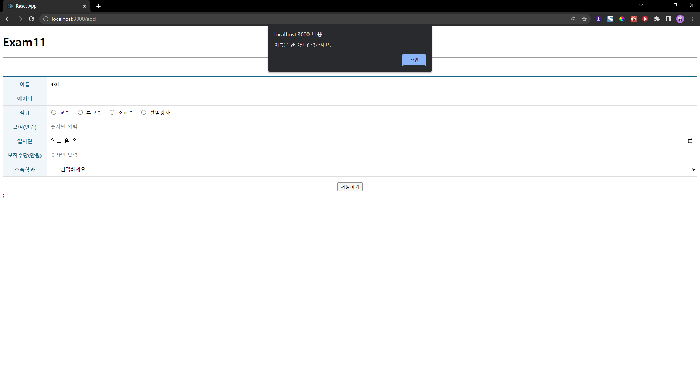
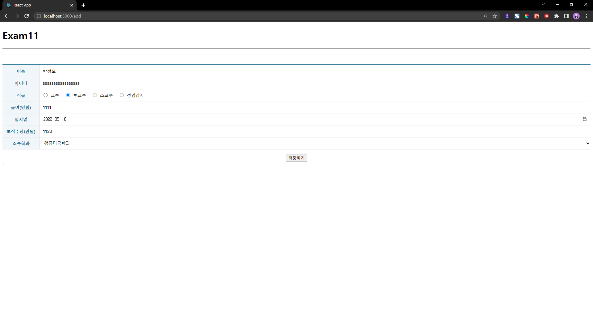
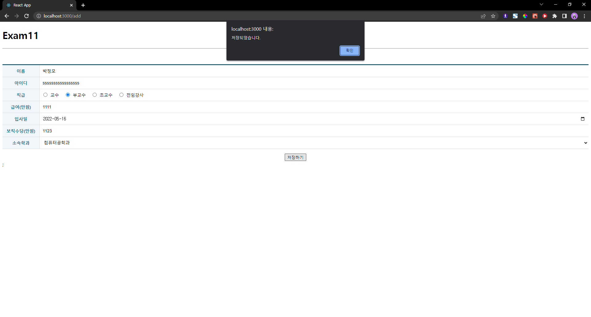
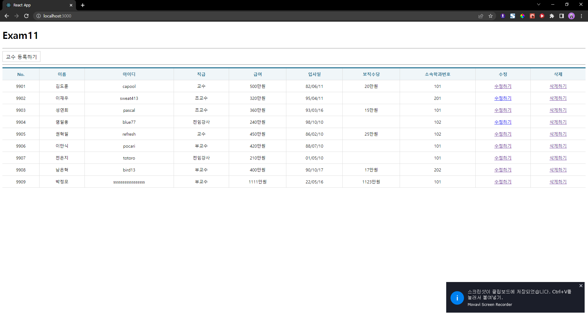
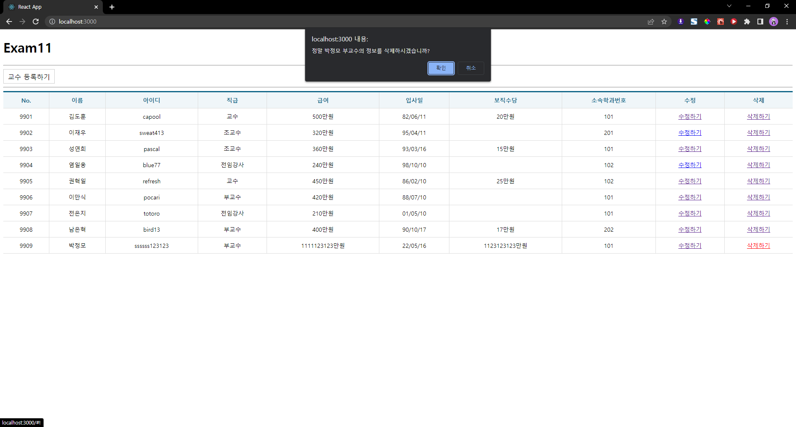
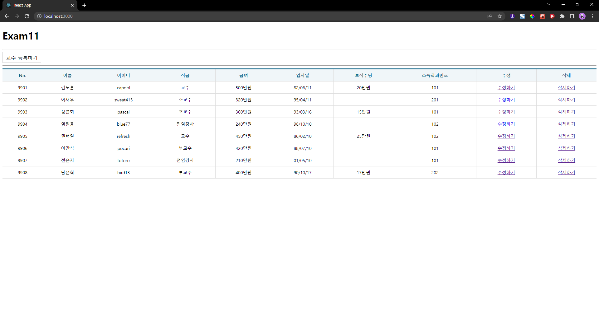
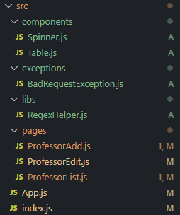

# Exam11 박정모
> 2022-05-19

# 실행 결과 스크린샷
















<hr />

# 파일 구조


# App.js
```js
import React from "react";
import { Routes, Route } from "react-router-dom";
import ProfessorAdd from "./pages/ProfessorAdd";
import ProfessorEdit from "./pages/ProfessorEdit";
import ProfessorList from "./pages/ProfessorList";

const App = () => {
    return (
        <div>
            <h1>Exam11</h1>
            <hr />
            <Routes>
                <Route path="/" element={<ProfessorList />} exact={true} />
                <Route path="/add" element={<ProfessorAdd />} />
                <Route path="/edit/:id" element={<ProfessorEdit />} />
            </Routes>
        </div>
    );
};

export default App;
```

# ProfessorList.js
```js
import React from 'react';
import Table from '../components/Table';
import Spinner from '../components/Spinner';
import useAxios from 'axios-hooks';
import {NavLink} from 'react-router-dom';
import styled from 'styled-components';

const TopLink = styled(NavLink)`
  margin-right: 15px;
  display: inline-block;
  font-size: 16px;
  padding: 7px 10px 5px 10px;
  border: 1px solid #ccc;
  background-color: #fff;
  color: #000;
  text-decoration: none;
  
  &:hover {
    background-color: #06f2;
  }
`;
const ProfessorList = () => {
    // 화면에 표시할 교수 데이터를 저장하기 위한 변수
    const [prof, setProf] = React.useState([]);

    // 백엔드로부터 데이터 가져오기
    const [{data, loading, error}, refetch] = useAxios('http://localhost:4000/professor', { useCache: false });

    // ajax로딩이 완료되었을 때 실행될 hook
    React.useEffect(() => {
        setProf(data);
    },[data]);

    // 백엔드 삭제기능 매뉴얼로 선언해두기
    const [{loading2}, delProf] = useAxios({
        method: 'DELETE'
    }, {
        useCache: false,
        manual: true
    });


    // 삭제 버튼이 클릭되었을 때 실행할 이벤트 핸들러
    const onClick = (e) => {
        e.preventDefault();

        const current = e.target;

        const name = current.dataset.name;
        const position = current.dataset.position;
        const id = parseInt(current.dataset.id);

        if(window.confirm(`정말 ${name} ${position}의 정보를 삭제하시겠습니까?`)){
            (async () => {
                let json = null;
                try {
                    const response = await delProf({
                        url: `http://localhost:4000/professor/${id}`
                    });

                    json = response.data;
                } catch (e) {
                    console.error(e);
                    window.alert(`[${e.response.status}] ${e.response.statusText}\n${e.message}`);
                }

                if(json !== null){
                    setProf((prof) => prof.filter((v, i) => v.id !== id));
                }
            })();
        }
    };


    return (
        <>
            <Spinner visible={loading || loading2}/>
            <nav>
            <TopLink to='/add'>교수 등록하기</TopLink>
            </nav>
            <hr />

            {error ? (
                <div>
                <h1>Oops~!! {error.code} Error.</h1>
                <hr />
                <p>{error.message}</p>
                </div>
            ): (
            <Table>
                <thead>
                <tr>
                    <th>No.</th>
                    <th>이름</th>
                    <th>아이디</th>
                    <th>직급</th>
                    <th>급여</th>
                    <th>입사일</th>
                    <th>보직수당</th>
                    <th>소속학과번호</th>
                    <th>수정</th>
                    <th>삭제</th>
                </tr>
                </thead>
                <tbody>
                {prof && prof.map(({id, name, userid, position, sal, hiredate, comm, deptno}, i) => {
                    const hiredate2 = hiredate.substring(2, 10).replaceAll('-', '/');
                    return (
                        <tr key={i}>
                            <td>{id}</td>
                            <td>{name}</td>
                            <td>{userid}</td>
                            <td>{position}</td>
                            {sal > 0 ? <td>{sal}만원</td> : <td></td>}
                            <td>{hiredate2}</td>
                            <td>{comm && `${comm}만원`}</td>
                            <td>{deptno}</td>
                            <td><NavLink to={`edit/${id}`}>수정하기</NavLink></td>
                            <td><a href='#!' data-id={id} data-name={name} data-position={position} onClick={onClick}>삭제하기</a></td>
                        </tr>
                    );
                })}
                </tbody>
            </Table>
            )}
        </>
    );
};

export default ProfessorList;
```

# ProfessorAdd.js
```js
import React from "react";
import styled from "styled-components";
import useAxios from "axios-hooks";
import { useNavigate } from "react-router-dom";
import Spinner from "../components/Spinner";
import Table from "../components/Table";
import regexHelper from "../libs/RegexHelper";

// Tabel 컴포넌트의 CSS를 확장한 컴포넌트
const TableEx = styled(Table)`
    margin-top: 50px;
    margin-bottom: 15px;

    .inputWrapper {
        padding: 0;
        position: relative;
        text-align: left;

        .field {
            box-sizing: border-box;
            display: block;
            position: absolute;
            left: 0;
            top: 0;
            width: 100%;
            height: 100%;
            border: 0;
            padding: 0 10px;
            outline: none;
            font-size: 14px;
        }

        label {
            margin-left: 7px;
            margin-right: 10px;

            input {
                margin-right: 10px;
            }
        }
    }
`;

const ProfessorAdd = () => {
    const navigate = useNavigate();

    // 소속학과 데이터를 저장하기 위한 상태값
    const [deptName, setDeptName] = React.useState([]);
    // 소속학과 데이터를 받아오기위한 axios-hook
    const [{ data: deptData, loading, error }] = useAxios("http://localhost:4000/department");
    // 소속학과 데이터를 저장
    React.useEffect(() => {
        setDeptName(deptData);
    }, [deptData, deptName]);

    // POST 기능 미리 선언해두기
    const [{ data: profAddData, loading2, error2 }, refetch] = useAxios(
        {
            method: "POST",
            url: "http://localhost:4000/professor",
        },
        {
            manual: true,
            useCache: false,
        }
    );

    // 저장하기 버튼이 눌렸을 때(submit 발생시) 동작할 이벤트 핸들러
    const onSubmit = (e) => {
        e.preventDefault();

        const current = e.target;

        // 유효성검사
        try {
            // 이름
            regexHelper.value(current.name, "이름을 입력하세요.");
            regexHelper.kor(current.name, "이름은 한글만 입력하세요.");
            regexHelper.maxLength(current.name, 10, "이름은 2~10글자로 입력하세요.");
            regexHelper.minLength(current.name, 2, "이름은 2~10글자로 입력하세요.");
            // 아이디
            regexHelper.value(current.userid, "아이디를 입력하세요.");
            regexHelper.engNum(current.userid, "아이디는 영문+숫자 조합만 가능합니다.");
            regexHelper.maxLength(current.userid, 20, "아이디는 2~20글자로 입력하세요.");
            regexHelper.minLength(current.userid, 2, "아이디는 2~20글자로 입력하세요.");
            // 직급
            regexHelper.value(current.position, "직급을 입력하세요.");
            // 급여
            regexHelper.value(current.sal, "급여를 입력하세요.");
            regexHelper.num(current.sal, "급여는 숫자로만 입력하세요.");
            // 입사일
            regexHelper.value(current.hiredate, "입사일을 입력하세요.");
            // 보직수당
            regexHelper.value(current.comm, "보직수당을 입력하세요.");
            regexHelper.num(current.comm, "보직수당은 숫자로만 입력하세요.");
            // 소속학과
            regexHelper.value(current.deptno, "소속학과를 입력하세요.");
        } catch (e) {
            window.alert(e.message);
            e.field.focus();
            return;
        }

        const name = current.name.value;
        const userid = current.userid.value;
        const position = current.position.value;
        const sal = current.sal.value;
        const hiredate = current.hiredate.value;
        const comm = current.comm.value;
        const deptno = current.deptno.value;

        (async () => {
            let json;
            try {
                const response = await refetch({
                    data: {
                        name: name,
                        userid: userid,
                        position: position,
                        sal: sal,
                        hiredate: hiredate,
                        comm: comm,
                        deptno: deptno,
                    },
                });
                json = response.data;
            } catch (e) {
                console.error(e);
                window.alert(`[${e.response.status}] ${e.response.statusText}\\n${e.message}`);
            }

            if (json !== null) {
                window.alert("저장되었습니다.");
                navigate("/");
            }
        })();
    };

    return (
        <>
            <Spinner visible={loading || loading2} />
            {error || error2 ? (
                <div>
                    <h1>Oops~!!! {(error || error2).code} Error.</h1>
                    <hr />
                    <p>{(error || error2).message}</p>
                </div>
            ) : (
                <form onSubmit={onSubmit}>
                    <TableEx>
                        <colgroup>
                            <col width="120" />
                            <col />
                        </colgroup>
                        <tbody>
                            <tr>
                                <th>이름</th>
                                <td className="inputWrapper">
                                    <input className="field" type="text" name="name" />
                                </td>
                            </tr>
                            <tr>
                                <th>아이디</th>
                                <td className="inputWrapper">
                                    <input className="field" type="text" name="userid" />
                                </td>
                            </tr>
                            <tr>
                                <th>직급</th>
                                <td className="inputWrapper">
                                    <label>
                                        <input type="radio" name="position" value="교수" />
                                        교수
                                    </label>
                                    <label>
                                        <input type="radio" name="position" value="부교수" />
                                        부교수
                                    </label>
                                    <label>
                                        <input type="radio" name="position" value="조교수" />
                                        조교수
                                    </label>
                                    <label>
                                        <input type="radio" name="position" value="전임강사" />
                                        전임강사
                                    </label>
                                </td>
                            </tr>
                            <tr>
                                <th>급여(만원)</th>
                                <td className="inputWrapper">
                                    <input className="field" type="number" name="sal" placeholder="숫자만 입력" />
                                </td>
                            </tr>
                            <tr>
                                <th>입사일</th>
                                <td className="inputWrapper">
                                    <input className="field" type="date" name="hiredate" />
                                </td>
                            </tr>
                            <tr>
                                <th>보직수당(만원)</th>
                                <td className="inputWrapper">
                                    <input className="field" type="number" name="comm" placeholder="숫자만 입력" />
                                </td>
                            </tr>
                            <tr>
                                <th>소속학과</th>
                                <td className="inputWrapper">
                                    <select name="deptno" className="field">
                                        <option value="">---- 선택하세요 ----</option>
                                        {deptName &&
                                            deptName.map((v, i) => {
                                                return <option value={v.id}>{v.dname}</option>;
                                            })}
                                    </select>
                                </td>
                            </tr>
                        </tbody>
                    </TableEx>

                    <div style={{ textAlign: "center" }}>
                        <button type="submit">저장하기</button>
                    </div>
                </form>
            )}
            ;
        </>
    );
};

export default ProfessorAdd;
```

# ProfessorEdit.js
```js
import React from "react";
import styled from "styled-components";
import useAxios from "axios-hooks";
import { useNavigate, useParams } from "react-router-dom";
import Spinner from "../components/Spinner";
import Table from "../components/Table";
import regexHelper from "../libs/RegexHelper";

// Tabel 컴포넌트의 CSS를 확장한 컴포넌트
const TableEx = styled(Table)`
    margin-top: 50px;
    margin-bottom: 15px;

    .inputWrapper {
        padding: 0;
        position: relative;
        text-align: left;

        .field {
            box-sizing: border-box;
            display: block;
            position: absolute;
            left: 0;
            top: 0;
            width: 100%;
            height: 100%;
            border: 0;
            padding: 0 10px;
            outline: none;
            font-size: 14px;
        }

        label {
            margin-left: 7px;
            margin-right: 10px;

            input {
                margin-right: 10px;
            }
        }
    }
`;

const ProfessorEdit = () => {
    const navigate = useNavigate();

    // 소속학과 데이터를 저장하기 위한 상태값
    const [deptName, setDeptName] = React.useState([]);
    // 소속학과 데이터를 받아오기위한 axios-hook
    const [{ data: deptData, loading, error }] = useAxios("http://localhost:4000/department");
    // 소속학과 데이터를 저장
    React.useEffect(() => {
        setDeptName(deptData);
    }, [deptData, deptName]);

    // Path 파라미터로 전달될 id
    const { id } = useParams();

    // 수정할 대상을 백엔드로부터 받아오기
    const [{ data: profEditData, loading2, error2 }, refetch] = useAxios(`http://localhost:4000/professor/${id}`);

    // 수정하기 버튼이 눌렸을 때(submit 발생시) 동작할 이벤트 핸들러
    const onSubmit = (e) => {
        e.preventDefault();

        const current = e.target;

        // 유효성검사
        try {
            // 이름
            regexHelper.value(current.name, "이름을 입력하세요.");
            regexHelper.kor(current.name, "이름은 한글만 입력하세요.");
            regexHelper.maxLength(current.name, 10, "이름은 2~10글자로 입력하세요.");
            regexHelper.minLength(current.name, 2, "이름은 2~10글자로 입력하세요.");
            // 아이디
            regexHelper.value(current.userid, "아이디를 입력하세요.");
            regexHelper.engNum(current.userid, "아이디는 영문+숫자 조합만 가능합니다.");
            regexHelper.maxLength(current.userid, 20, "아이디는 2~20글자로 입력하세요.");
            regexHelper.minLength(current.userid, 2, "아이디는 2~20글자로 입력하세요.");
            // 직급
            regexHelper.value(current.position, "직급을 입력하세요.");
            // 급여
            regexHelper.value(current.sal, "급여를 입력하세요.");
            regexHelper.num(current.sal, "급여는 숫자로만 입력하세요.");
            // 입사일
            regexHelper.value(current.hiredate, "입사일을 입력하세요.");
            // 보직수당
            regexHelper.value(current.comm, "보직수당을 입력하세요.");
            regexHelper.num(current.comm, "보직수당은 숫자로만 입력하세요.");
            // 소속학과
            regexHelper.value(current.deptno, "소속학과를 입력하세요.");
        } catch (e) {
            window.alert(e.message);
            e.field.focus();
            return;
        }

        const name = current.name.value;
        const userid = current.userid.value;
        const position = current.position.value;
        const sal = current.sal.value;
        const hiredate = current.hiredate.value;
        const comm = current.comm.value;
        const deptno = current.deptno.value;

        (async () => {
            let json = null;
            try {
                const response = await refetch({
                    method: "PUT",
                    data: {
                        name: name,
                        userid: userid,
                        position: position,
                        sal: sal,
                        hiredate: hiredate,
                        comm: comm,
                        deptno: deptno,
                    },
                });
                json = response.data;
            } catch (e) {
                console.error(e);
                window.alert(`[${e.response.status}] ${e.response.statusText}\\n${e.message}`);
            }

            if (json !== null) {
                window.alert("수정되었습니다.");
                navigate("/");
            }
        })();
    };

    return (
        <>
            <Spinner visible={loading || loading2} />
            {error || error2 ? (
                <div>
                    <h1>Oops~!! {(error || error2).code} Error.</h1>
                    <hr />
                    <p>{(error || error2).message}</p>
                </div>
            ):(
                profEditData && (

            <form onSubmit={onSubmit}>
                <TableEx>
                    <colgroup>
                        <col width="120" />
                        <col />
                    </colgroup>
                    <tbody>
                        <tr>
                            <th>이름</th>
                            <td className="inputWrapper">
                                <input className="field" type="text" name="name" defaultValue={profEditData.name} />
                            </td>
                        </tr>
                        <tr>
                            <th>아이디</th>
                            <td className="inputWrapper">
                                <input className="field" type="text" name="userid" defaultValue={profEditData.userid} />
                            </td>
                        </tr>
                        <tr>
                            <th>직급</th>
                            <td className="inputWrapper">
                                <label>
                                    <input type="radio" name="position" value="교수" defaultChecked={profEditData.position === "교수"} />
                                    교수
                                </label>
                                <label>
                                    <input type="radio" name="position" value="부교수" defaultChecked={profEditData.position === "부교수"} />
                                    부교수
                                </label>
                                <label>
                                    <input type="radio" name="position" value="조교수" defaultChecked={profEditData.position === "조교수"} />
                                    조교수
                                </label>
                                <label>
                                    <input type="radio" name="position" value="전임강사" defaultChecked={profEditData.position === "전임강사"} />
                                    전임강사
                                </label>
                            </td>
                        </tr>
                        <tr>
                            <th>급여(만원)</th>
                            <td className="inputWrapper">
                                <input className="field" type="number" name="sal" defaultValue={profEditData.sal} placeholder="숫자만 입력" />
                            </td>
                        </tr>
                        <tr>
                            <th>입사일</th>
                            <td className="inputWrapper">
                                <input className="field" type="date" name="hiredate" defaultValue={profEditData.hiredate} />
                            </td>
                        </tr>
                        <tr>
                            <th>보직수당(만원)</th>
                            <td className="inputWrapper">
                                <input className="field" type="number" name="comm" placeholder="숫자만 입력" defaultValue={profEditData.comm} />
                            </td>
                        </tr>
                        <tr>
                            <th>소속학과</th>
                            <td className="inputWrapper">
                                <select name="deptno" className="field" defaultValue={profEditData.deptno}>
                                    <option value="">---- 선택하세요 ----</option>
                                    {deptName &&
                                        deptName.map((v, i) => {
                                            return <option key={i} value={v.id}>{v.dname}</option>;
                                        })}
                                </select>
                            </td>
                        </tr>
                    </tbody>
                </TableEx>

                <div style={{ textAlign: "center" }}>
                    <button type="submit">저장하기</button>
                </div>
            </form>)
            )}
        </>
    );
};

export default ProfessorEdit;
```