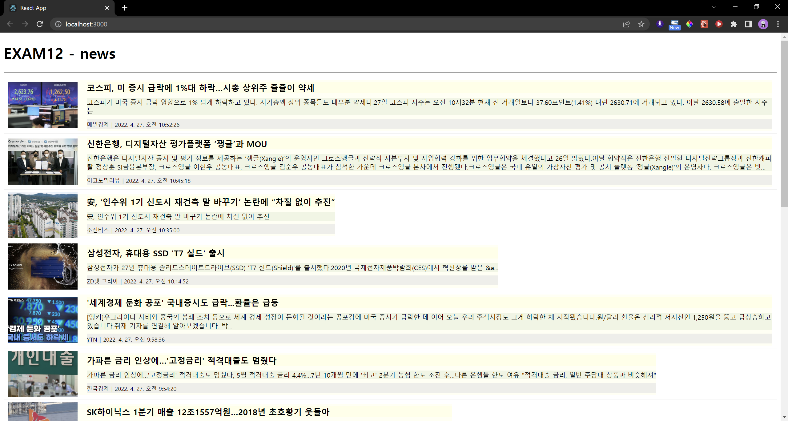

# EXAM12 - redux로 newsList 만들기 
> 2022-05-23 박정모

# 최종 결과 스크린샷


> src/components/Spinner.js   
> src/components/NewsItem.js   
> 위 두 파일은 08-simple-ajax의 파일을 재사용함   

# src/store.js
```js
import {configureStore, getDefaultMiddleware} from '@reduxjs/toolkit';

import newsSlice from './slices/newsSlice';

const store = configureStore({
    reducer: {
        news: newsSlice,
    },
    middleware : [...getDefaultMiddleware({serializableCheck: false})],
    devTools: true,
});

export default store;
```

# src/index.js
```js
import React from 'react';
import ReactDOM from 'react-dom/client';
import App from './App';
import {BrowserRouter} from 'react-router-dom';
import {Provider} from 'react-redux';
import store from './store';

const root = ReactDOM.createRoot(document.getElementById('root'));
root.render(
  <React.StrictMode>
      <Provider store={store}>
          <BrowserRouter>
              <App/>
          </BrowserRouter>
      </Provider>
  </React.StrictMode>
);
```

# src/App.js
```js
import React from 'react';
import News from './pages/News';

const App = () => {
    return (
        <div>
          <News />
        </div>
    );
};

export default App;
```

# src/slices/newsSlice.js
```js
import {createSlice, createAsyncThunk} from '@reduxjs/toolkit';
import axios from 'axios';

export const getList = createAsyncThunk("news/getList", async (payload, { rejectWithValue }) => {
    let result = null;
    try {
        result = await axios.get('http://localhost:4000/news');
    } catch (e) {
        result = rejectWithValue(e.response);
    }

    return result;
});

const newsSlice = createSlice({
    name: 'news',
    initialState: {
        data: null,
        loading: false,
        error: null,
    },
    reducers: {},
    extraReducers: {
        [getList.pending]: (state, {payload}) => {
            return {...state, loading: true}
        },
        [getList.fulfilled]: (state, {payload}) => {
            return {
                data: payload?.data,
                loading: false,
                error: null
            }
        },
        [getList.rejected]: (state, {payload}) => {
            return {
                data: payload?.data,
                loading: false,
                error: {
                    code: payload?.status ? payload.status : 500,
                    message: payload?.statusText ? payload.statusText : 'Server Error',
                }
            }
        }
    }
});

export default newsSlice.reducer;
```

# src/pages/News.js
```js
import React from "react";
import styled from "styled-components";
import NewsItem from "../components/NewsItem";
import Spinner from "../components/Spinner";

import {useSelector, useDispatch} from 'react-redux';
import {getList} from '../slices/newsSlice';

const ListContainer = styled.ul`
    list-style: none;
    padding: 0;
    margin: 0;
    width: 100%;
    box-sizing: border-box;
    display: flex;
    flex-direction: column;
    margin-bottom: 30px;
`;

const NewsList = () => {
    React.useEffect(() => console.clear(),[]);

    const {data, loading, error} = useSelector((state) => state.news);

    const dispatch = useDispatch();

    React.useEffect(() => {
        dispatch(getList());
    }, [dispatch]);

    return (
        <div>
            <Spinner visible={loading} />
            {error ? (
                <div>
                    <h1>Oops!!~ {error.code} Error.</h1>
                    <hr />
                    <p> {error.message} </p>
                </div>
            ) : (
                <div>
                <h1>EXAM12 - news</h1>
                    <hr/>
                <ListContainer>
                    {data && data.map((v, i) => (
                        <NewsItem key={i} item={v} />
                    ))}
                </ListContainer>
                </div>
            )}

        </div>
    );
};

export default NewsList;
```