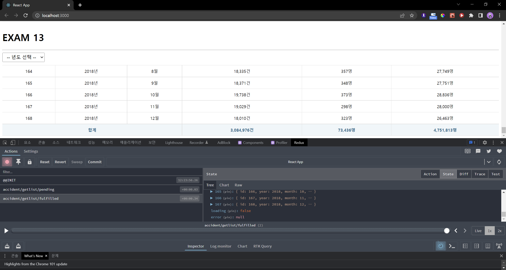
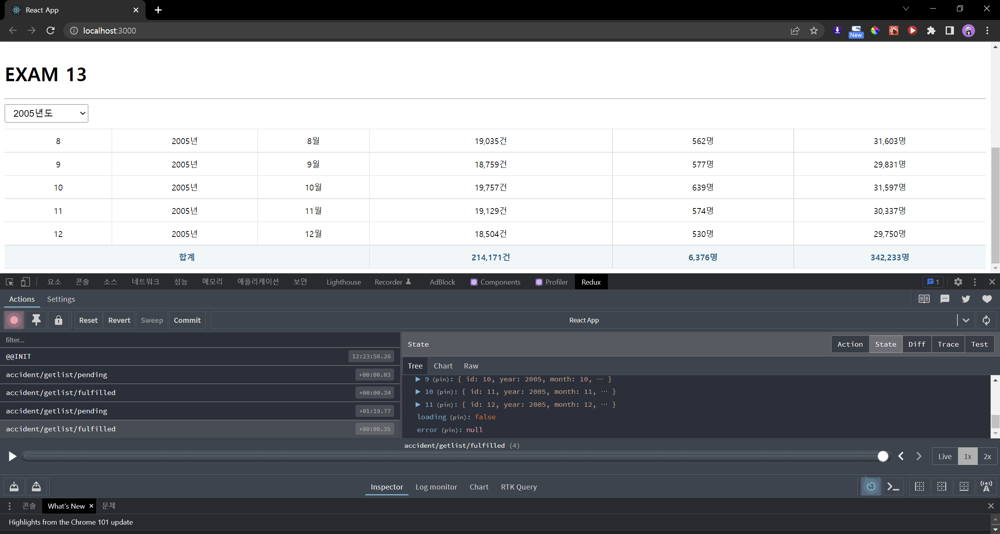
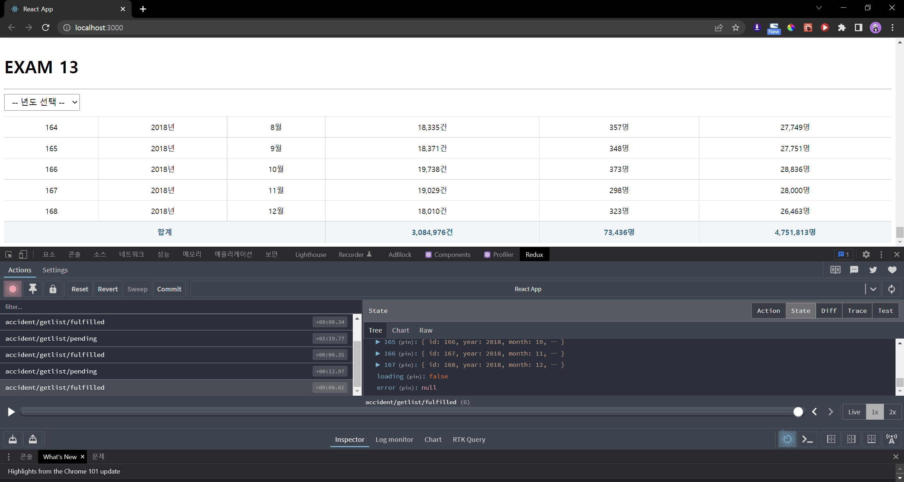
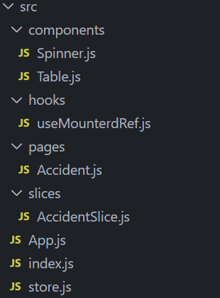

# 연습문제 13. redux로 교통사고 조회
> 2022-05-24 박정모

# 최종 결과 스크린샷
### 초기화면

### 드롭박스 선택시

### 드롭박스를 --- 년도 선택 ---으로 재선택시


# 파일구조


> useMountedRef, Spinner, Table은 기존 예제를 재사용함

# store.js
```js
import {configureStore, getDefaultMiddleware } from '@reduxjs/toolkit';
import AccidentSlice from './slices/AccidentSlice';

const store = configureStore({
    reducer: {
        // 개발자가 직접 작성한 reducer들이 명시되어야 한다.
        accident: AccidentSlice
    },
    // 미들웨어를 사용하지 않을 경우 이 라인 생략 가능 (redux-thunk 사용시 필수)
    middleware: [...getDefaultMiddleware({serializableCheck: false})],
    devTools: true,
});

export default store;
```

# App.js
```js
import React from 'react';
import Accident from './pages/Accident';

const App = () => {
  return (
    <div>
      <Accident />
    </div>
  );
};

export default App;
```

# AccidentSlice.js
```js
import {createSlice, createAsyncThunk} from '@reduxjs/toolkit';
import axios from 'axios';

/** 비동기 처리 함수 구현 */
// payload는 이 함수를 호출할 때 전달되는 파라미터
// const 'action함수명' // createAsyncThunk('함수별칭', ... )
export const accidentGetList = createAsyncThunk("accident/getlist", async (payload, {rejectWithValue}) => {
    let result = null;

    try {
        // get('URL)
        result = await axios.get('http://localhost:4000/traffic_acc', {
            params: {
                // payload로 params를 전달
                year: payload
            }
        });
    } catch (e) {
        // 에러 발생시 `rejectWithValue()` 함수에 에러 데이터를 전달하면 extraReducers의 rejected 함수가 호출된다.
        result = rejectWithValue(e.response);
    }

    return result;
});

/** Slice 정의(Action함수 + Reducers의 개념) */
const AccidentSlice = createSlice({
    // name: 상태값 별칭
    name: 'accident',
    initialState: {
        data: null,         // Ajax 처리를 통해 수신된 데이터
        loading: false,     // 로딩 여부
        error: null,        // 에러 정보
    },
    // 내부 action 및 동기 action
    reducers: {},
    // 외부 action 및 비동기 action(Ajax용)
    extraReducers: {
        [accidentGetList.pending]: (state, {payload}) => {
            return { ...state, loading: true };
        },
        [accidentGetList.fulfilled]: (state, {payload}) => {
            return {
                data: payload?.data,
                loading: false,
                error: null,
            }
        },
        [accidentGetList.rejected]: (state, {payload}) => {
            return {
                data: payload?.data,
                loading: false,
                error: {
                    code: payload?.status ? payload.status : 500,
                    message: payload?.statusText ? payload.statusText : 'Server Error',
                }
            }
        }
    }
});

// 리듀서 객체 내보내기
export default AccidentSlice.reducer;
```

# Accident.js
```js
import React, { memo } from "react";
import Spinner from "../components/Spinner";
import Table from "../components/Table";
import { useSelector, useDispatch } from "react-redux";
import { accidentGetList } from "../slices/AccidentSlice";
import styled from "styled-components";


    /** 드롭다운을 배치하기 위한 박스 */
    const SelectContainer = styled.div`
        position: sticky;
        top: 0;
        background-color: #fff;
        border-top: 1px solid #eee;
        padding: 10px 0;
        margin: 0;

        select {
            margin-right: 15px;
            font-size: 16px;
            padding: 5px 10px;
        }
    `;

const Accident = memo(() => {
    // slice에서 state 선택
    const { data, loading, error } = useSelector((state) => state.accident);
    const dispatch = useDispatch();

    // action으로 전달할 드롭다운 선택값을 상태값으로 지정
    const [year, setYear] = React.useState(-1);

    // year의 값이 0보다 클 때는 payload로 year를, 그렇지 않을 때는 payload없이 전달, year을 모니터링
    React.useEffect(() => {
        if (year > 0) {
            dispatch(accidentGetList(year));
        } else {
            dispatch(accidentGetList());
        }
    }, [dispatch, year]);

    // 합계를 저장할 변수
    let accSum = 0;
    let deaSum = 0;
    let injSum = 0;

    // 드롭다운이 선택되었을 때 그 값을 state에 적용하는 함수
    const onSelectChange = React.useCallback((e) => {
        e.preventDefault();
        const current = e.target;

        const newYear = current[current.selectedIndex].value;

        setYear(newYear);
    }, []);

    return (
        <div>
            <Spinner visible={loading} />

            {error ? (
                <div>
                    <h1>Oops~~!! {error.code} Error.</h1>
                    <hr />
                    <p>{error.message}</p>
                </div>
            ) : (
                <div>
                    <SelectContainer>
            <h1>EXAM 13</h1>
            <hr />
                        <select name="year" onChange={onSelectChange}>
                            <option value="">-- 년도 선택 --</option>
                            <option value="2005">2005년도</option>
                            <option value="2006">2006년도</option>
                            <option value="2007">2007년도</option>
                            <option value="2008">2008년도</option>
                            <option value="2009">2009년도</option>
                            <option value="2010">2010년도</option>
                            <option value="2011">2011년도</option>
                            <option value="2012">2012년도</option>
                            <option value="2013">2013년도</option>
                            <option value="2014">2014년도</option>
                            <option value="2015">2015년도</option>
                            <option value="2016">2016년도</option>
                            <option value="2017">2017년도</option>
                            <option value="2018">2018년도</option>
                        </select>
                    </SelectContainer>
                    <Table>
                        <thead>
                            <tr>
                                <th>번호</th>
                                <th>년도</th>
                                <th>월</th>
                                <th>교통사고 건수</th>
                                <th>사망자 수</th>
                                <th>부상자 수</th>
                            </tr>
                        </thead>
                        <tbody>
                            {data &&
                                data.map(({ id, year, month, accident, death, injury }, i) => {
                                    accSum += accident;
                                    deaSum += death;
                                    injSum += injury;
                                    return (
                                        <tr key={i}>
                                            <td>{id}</td>
                                            <td>{year}년</td>
                                            <td>{month}월</td>
                                            <td>{accident.toLocaleString()}건</td>
                                            <td>{death.toLocaleString()}명</td>
                                            <td>{injury.toLocaleString()}명</td>
                                        </tr>
                                    );
                                })}
                        </tbody>
                        <tfoot>
                            <tr>
                                <th colSpan="3">합계</th>
                                <th>{accSum.toLocaleString()}건</th>
                                <th>{deaSum.toLocaleString()}명</th>
                                <th>{injSum.toLocaleString()}명</th>
                            </tr>
                        </tfoot>
                    </Table>
                </div>
            )}
        </div>
    );
});

export default Accident;
```