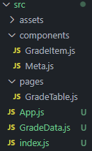
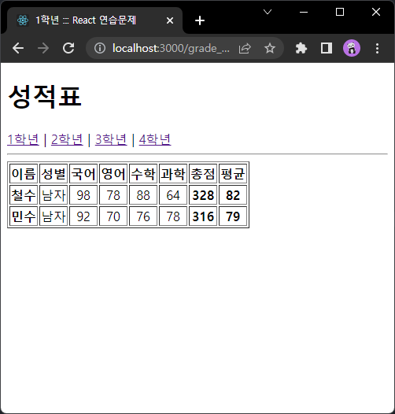
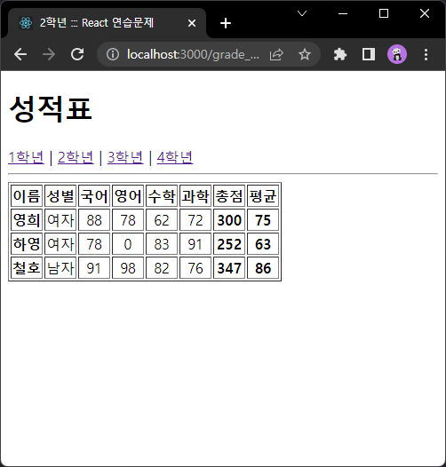
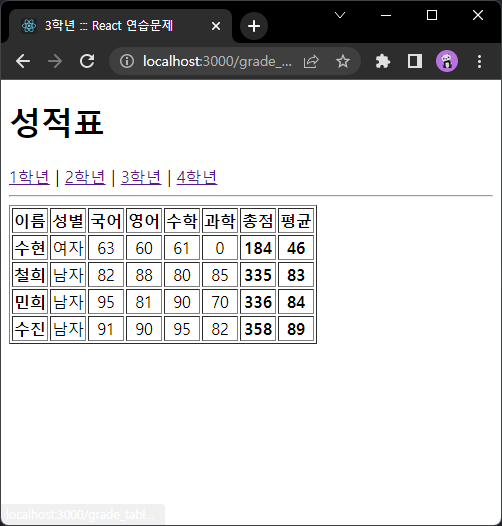
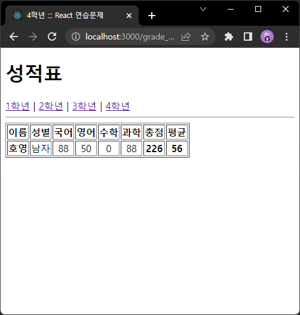

# 박정모 React 연습문제 4-1
> 2022-04-27

# 파일 구조


# App.js
```js
import React from 'react';
import { Link, Routes, Route } from 'react-router-dom';
import GradeTable from './pages/GradeTable';

function App() {
  return (
    <div className="App">
      <h1>성적표</h1>
      <nav>
        <Link to="/grade_table/1">1학년</Link>&nbsp;|&nbsp;
        <Link to="/grade_table/2">2학년</Link>&nbsp;|&nbsp;
        <Link to="/grade_table/3">3학년</Link>&nbsp;|&nbsp;
        <Link to="/grade_table/4">4학년</Link>
      </nav>
      <hr />
      <Routes>
        <Route path="/grade_table/:grade" element={<GradeTable />} />
      </Routes>

    </div>
  );
}

export default App;
```

# GradeTable.js
```js
import React from 'react';
import GradeItem from '../components/GradeItem';
import { useParams } from "react-router-dom";
import GradeData from '../GradeData';
import Meta from '../components/Meta';

const GradeTable = (props) => {
    

    const params = useParams();
    const grade = params.grade + '학년';

    return(
        <div>
        <Meta title={grade}/>
            <table border='1' cellPadding='1'>
                <thead>
                    <tr>
                        <th>이름</th>
                        <th>성별</th>
                        <th>국어</th>
                        <th>영어</th>
                        <th>수학</th>
                        <th>과학</th>
                        <th>총점</th>
                        <th>평균</th>
                    </tr>
                </thead>
                    {GradeData[grade].map((v, i) => {
                        return(<GradeItem 
                            name={v['이름']} 
                            gender={v['성별']} 
                            kor={v['국어']} 
                            eng={v['영어']} 
                            math={v['수학']} 
                            sci={v['과학']} />)
                    })}
            </table>
        </div>
    )
}

export default GradeTable;
```

# Meta.js
```js
import React from 'react';
import { Helmet } from 'react-helmet';
import logo from '../assets/img/logo192.png';

const Meta = (props) => {
    console.debug(props.title);
    return (
        <Helmet>
            <title>{props.title} ::: React 연습문제</title>
            <link rel='shortcut icon' href={props.image} type="image/png" />
            <link rel='icon' href={logo} type="image/png" />
        </Helmet>
    )
};

Meta.defaultProps = {
    title: '',
};

export default Meta;
```

# GradeItem.js
```js
import React from 'react';
import PropTypes from 'prop-types';

const GradeItem = ({name, gender, kor, eng, math, sci}) => {
    console.log(name);
    const sum = parseInt(kor + eng + math + sci);
    const avg = parseInt(sum / 4);
    return (
        <tbody>
                    <tr align="center">
                        <th>{name}</th>
                        <td>{gender}</td>
                        <td>{kor}</td>
                        <td>{eng}</td>
                        <td>{math}</td>
                        <td>{sci}</td>
                        <th>{sum}</th>
                        <th>{avg}</th>
                    </tr>
        </tbody>
    );
}

GradeItem.propTypes = {
    name: PropTypes.string.isRequired,
    gender: PropTypes.string.isRequired,
    kor : PropTypes.number,
    eng : PropTypes.number,
    sci : PropTypes.number,
    math : PropTypes.number,
}

GradeItem.defaultProps = {
    kor: 0,
    eng: 0,
    sci: 0,
    math: 0
}

export default GradeItem;
```

# 실행결과



