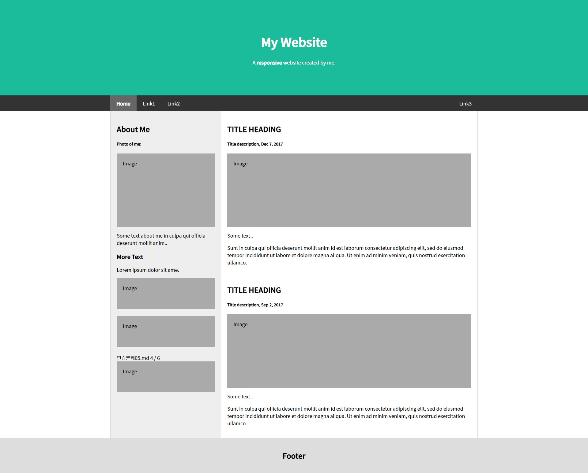

# 박정모 리액트 연습문제
> 2022-04-28

# 스크린샷


# common.css
```css
* {
    font-family: "Noto Sans KR";
}

body {
    margin: 0;
    padding: 0;
}
```

# App.js
```js
import React from "react";
import Header from "./component/Header";
import Content from "./page/Content";
import Footer from "./component/Footer";
import { Helmet } from "react-helmet";
import './assets/css/common.css';

const Meta = () => {
    return (
        <Helmet>
            <link rel="preconnect" href="https://fonts.googleapis.com" />
            <link rel="preconnect" href="https://fonts.gstatic.com" crossorigin />
            <link href="https://fonts.googleapis.com/css2?family=Gugi&family=Noto+Sans+KR:wght@100;300;400;500&display=swap" rel="stylesheet" />
        </Helmet>
    );
};

const App = () => {
    return (
        <div className="App">
            <Meta />
            <Header />
            <Content />
            <Footer />
        </div>
    );
}

export default App;
```
   
<hr />
   
# Header.js
```js
import React from "react";
import styled from "styled-components";
import { NavLink } from "react-router-dom";

const StyledHeader = styled.div`
    .header {
        .jumbotron {
            padding: 80px;
            text-align: center;
            background: #1abc9c;
            color: white;

            h1 {
                font-size: 40px;
            }
        }
    }

    .navbar {
        overflow: hidden;
        background-color: #333;
        position: sticky;
        top: 0;

        div {
            max-width: 1200px;
            margin: auto;
            display: flex;
            flex-direction: row;
            justify-content: flex-start;

            a {
                display: block;
                color: white;
                text-align: center;
                text-decoration: none;
                padding: 14px 20px;

                &.right {
                    margin-left: auto;
                }

                &:hover {
                    background-color: #ddd;
                    color: black;
                }

                &.select {
                    background-color: #666;
                    color: white;
                    font-weight: bold;
                }
            }
        }
    }
`;

const Header = () => {
    return (
        <StyledHeader>
            <header className="header">
                <div className="jumbotron">
                    <h1>My Website</h1>
                    <p>
                        A <b>responsive</b> website created by me.
                    </p>
                </div>
            </header>

            <nav className="navbar">
                <div>
                    <NavLink to="#" className="select">Home</NavLink> 
                    <NavLink to="#">Link1</NavLink>
                    <NavLink to="#">Link2</NavLink>
                    <NavLink to="#" className="right">Link3</NavLink>
                </div>
            </nav>
        </StyledHeader>
    );
};

export default Header;
```
   
   <hr />
   
# Content.js
```js
import React from "react";
import Main from "../component/Main";
import Side from "../component/Side";
import styled from "styled-components";

const Section = styled.section`
    max-width: 1200px;
    margin: auto;
    background-color: #eee;
    display: flex;
    flex-wrap: nowrap;
    flex-direction: row;

    .side {
        width: 360px;
        flex: none;
        border-left: 1px solid #d5d5d5;
        border-right: 1px solid #d5d5d5;
    }

    .container {
        padding: 20px;
    }

    .fakeimg {
        background-color: #aaa;
        width: auto;
        padding: 20px;
    }

    .main {
        flex: 0 1 auto;
        background-color: white;
        border-right: 1px solid #d5d5d5;
    }
`;

const Content = () => {
    return (
        <Section className="content">
            <Side />
            <Main />
        </Section>
    );
};

export default Content;
```
   
   <hr />
   
# Side.js
```js
import React from "react";


const Side = () => {
    return (
        <div className="side">
            <div className="container">
                <h2>About Me</h2>
                <h5>Photo of me:</h5>
                <div className="fakeimg" style={{ height: "200px" }}>
                    Image
                </div>
                <p>Some text about me in culpa qui officia deserunt mollit anim..</p>
                <h3>More Text</h3>
                <p>Lorem ipsum dolor sit ame.</p>
                <div className="fakeimg" style={{ height: "60px" }}>
                    Image
                </div>
                <br />
                <div className="fakeimg" style={{ height: "60px" }}>
                    Image
                </div>
                <br />
                연습문제05.md 4 / 6
                <div className="fakeimg" style={{ height: "60px" }}>
                    Image
                </div>
            </div>
        </div>
    );
};

export default Side;
```
   
   <hr />
      
# Main.js
```js
import React from "react";

const Main = () => {
    return (
        <div className="main">
            <div className="container">
                <h2>TITLE HEADING</h2>
                <h5>Title description, Dec 7, 2017</h5>
                <div className="fakeimg" style={{ height: "200px" }}>
                    Image
                </div>
                <p>Some text..</p>
                <p>Sunt in culpa qui officia deserunt mollit anim id est laborum consectetur adipiscing elit, sed do eiusmod tempor incididunt ut labore et dolore magna aliqua. Ut enim ad minim veniam, quis nostrud exercitation ullamco.</p>
                <br />
                <h2>TITLE HEADING</h2>
                <h5>Title description, Sep 2, 2017</h5>
                <div className="fakeimg" style={{ height: "200px" }}>
                    Image
                </div>
                <p>Some text..</p>
                <p>Sunt in culpa qui officia deserunt mollit anim id est laborum consectetur adipiscing elit, sed do eiusmod tempor incididunt ut labore et dolore magna aliqua. Ut enim ad minim veniam, quis nostrud exercitation ullamco.</p>
            </div>
        </div>
    );
};

export default Main;
```
   
   <hr />
      
# Footer.js
```js
import React from "react";
import styled from "styled-components";

const StyledFooter = styled.footer`
    padding: 20px;
    text-align: center;
    background: #ddd;
`;

const Footer = () => {
    return (
        <StyledFooter>
            <h2>Footer</h2>
        </StyledFooter>
    );
};

export default Footer;
```