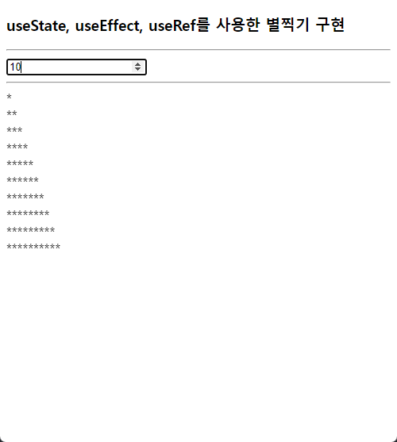

# 박정모 리액트 연습문제-별찍기
> 2022-05-03

## 구현결과

<hr />

## App.js
```js
import React from 'react';
import {useState, useRef, useEffect} from 'react';


function App() {

    const container = useRef();
    const [rowNum, setRowNum] = useState(0);

    const InputOnChange = (e) => {
        setRowNum(e.currentTarget.value);
    }

    useEffect(() => {
        // 필드 초기화
        container.current.innerHTML = '';
        // 별찍기
        for(let i = 0; i < rowNum; i++){
            for(let j=0; j < i+1; j++){
                container.current.innerHTML += '*';
            }
            container.current.innerHTML += '<br />';
        }
    },[rowNum]);   // 실행 요건 지정


  return (
    <div className="App">
        <h3>useState, useEffect, useRef를 사용한 별찍기 구현</h3>
        <hr />
      <input type='number' value={rowNum} onChange={InputOnChange} />
        <hr />
      <div ref={container}></div>
    </div>
  );
}

export default App;

```