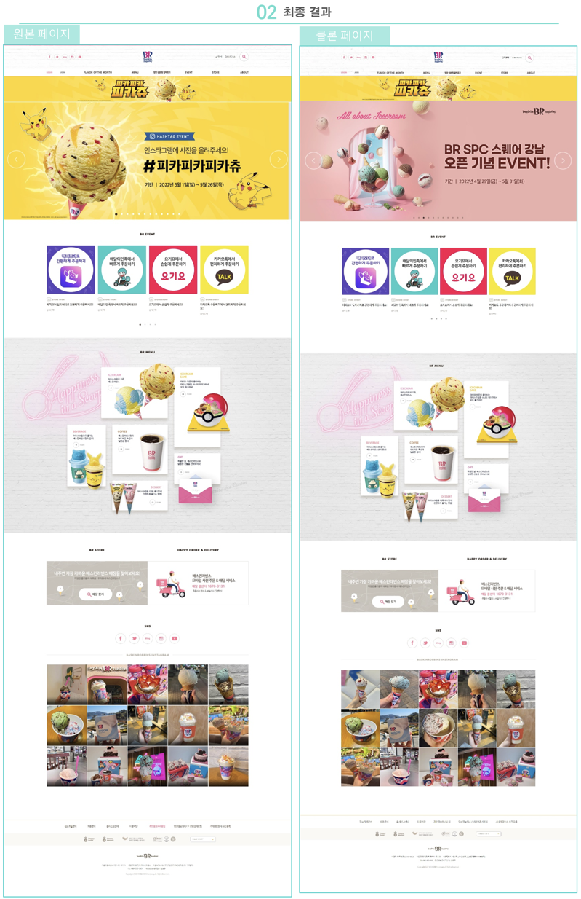
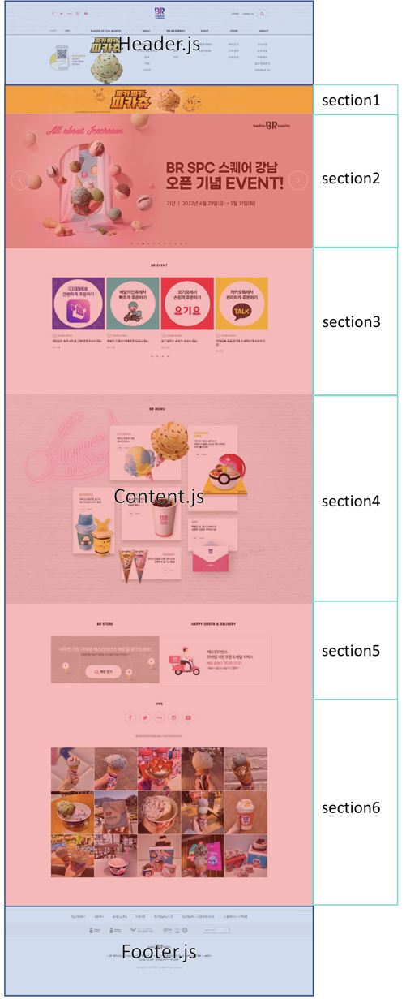
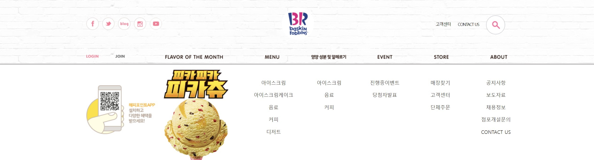
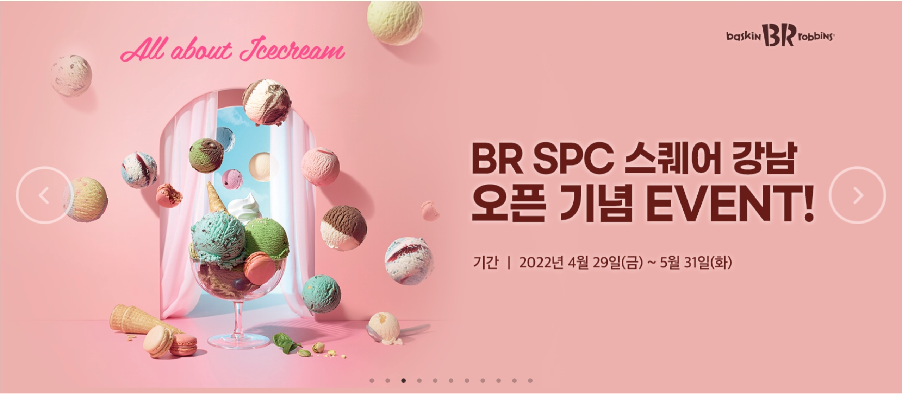
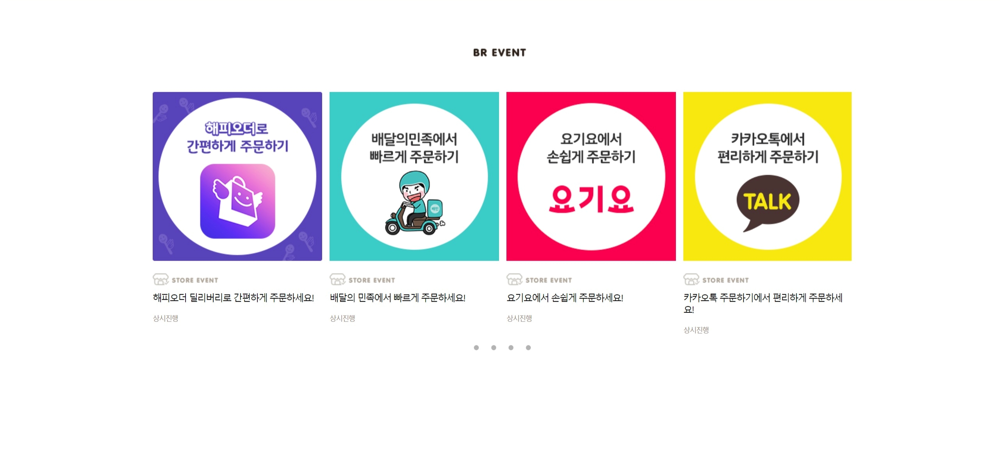
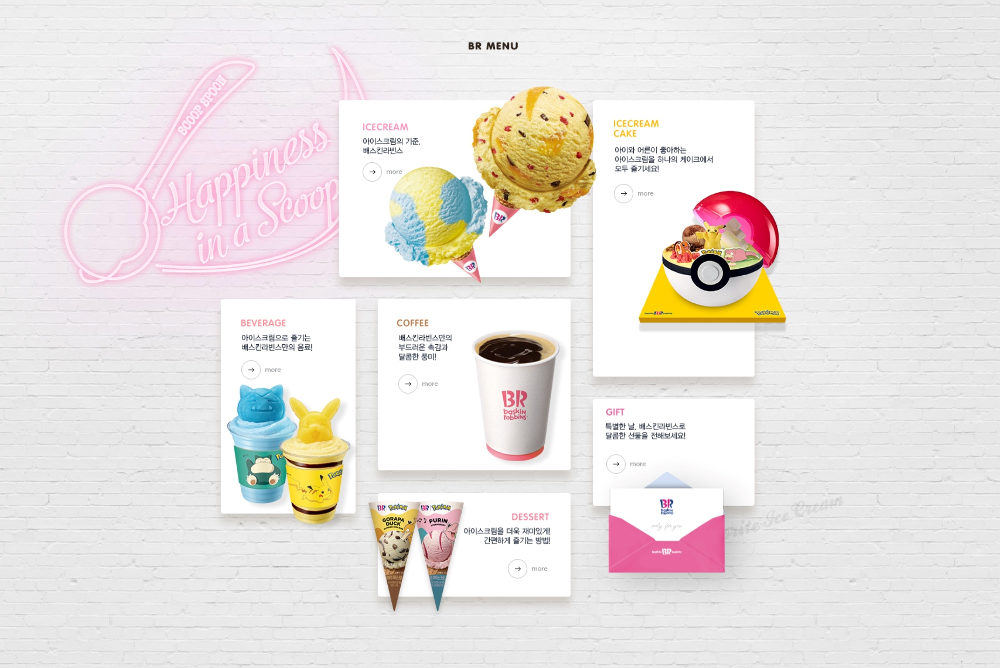
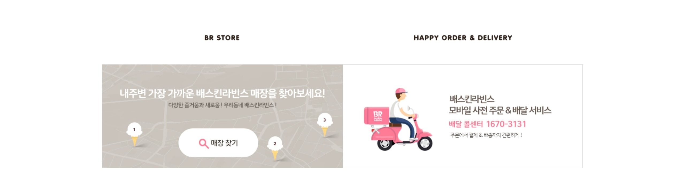
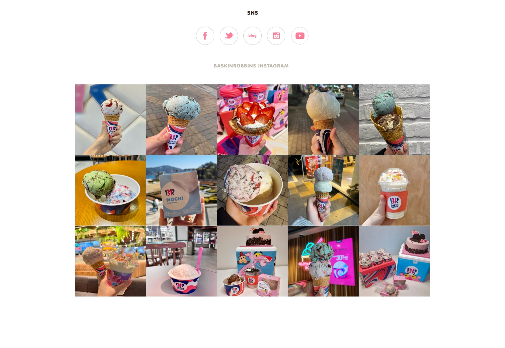
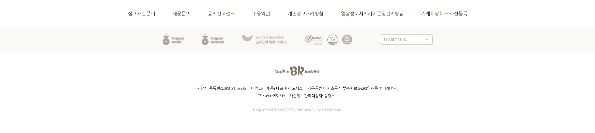

# 베스킨라빈스 리액트 클론코딩 - 박정모
> 2022-05-15

# 파일 구조


# 최종 결과

;

# 섹션 구분

;

# Index.js
```js
import React from "react";
import ReactDOM from "react-dom/client";
import App from "./App";
import { BrowserRouter } from "react-router-dom";
import { createGlobalStyle } from "styled-components";

const GlobalStyles = createGlobalStyle`
  font-family: "나눔바른고딕", "나눔고딕", "NanumGothic", "돋움", "Dotum", sans-serif;
  color: #483834;
  font-size: 13px;
  line-height: 1.5;
  letter-spacing:-.05em;
  a{
    text-decoration: none;
    color: #483834;
  }
`;

const root = ReactDOM.createRoot(document.getElementById("root"));
root.render(
    <React.StrictMode>
        <GlobalStyles />
        <BrowserRouter>
            <App />
        </BrowserRouter>
    </React.StrictMode>
);
```

# App.js
```js
/**
 * @filename: App.js
 * @description: 컴포넌트 렌더링
 * @author: 박정모(oooperbjm@gmail.com)
 */

import React from 'react';
// Reset.css 모듈 사용
import {Reset} from 'styled-reset';
import Header from './components/Header';
import Content from './pages/Content';
import Footer from './components/Footer';
// header 부분만 이미지 링크를 props로 전달해보았음
import data from './header_data';

const App = () => {
  return (
    <div>
      <Reset />
      <Header data={data.header}/>
      <Content />
      <Footer />
    </div>
  );
};

export default App;
```

# Header에 props로 전달할 header_data.js

```js
/**
 * @filename: header_data.js
 * @description: Header.js에 props로 전달할 이미지 링크
 * @author: 박정모(oooperbjm@gmail.com)
 */

const data = {
    header: [{
        icon: 'facebook',
        img: '/img/header_facebook_icon.png'
    }, {
        icon: 'twitter',
        img: '/img/header_twitter_icon.png'
    }, {
        icon: 'blog',
        img: '/img/header_blog_icon.png'
    }, {
        icon: 'instagram',
        img: '/img/header_instagram_icon.png'
    }, {
        icon: 'youtube',
        img: '/img/header_youtube_icon.png'
    }]
}


export default data;
```

# Header.js
```js
/**
 * @filename: Header.js
 * @description: Header 부분
 * @author: 박정모(oooperbjm@gmail.com)
 */

import React from "react";
import styled from "styled-components";
// import 부분이 너무 길어져서 하나의 파일에 이미지링크 통합
import { Img, Search, Logo, Gnb, Happypoint, Pika } from "../assets/img/image";
import { Link } from "react-router-dom";


const HeaderContainer = styled.div`
    width: 100%;
    height: 182px;
    background: url(${Img});
    border-bottom: 1px solid #e2d9d6;
    .header_top {
        width: 1200px;
        display: block;
        margin: auto;
        line-height: 136px;
        ul {
            margin-top: 11px;
            float: left;
            display: flex;
            li {
                padding-right: 10px;
                img {
                    width: 100%;
                }
            }
        }
        .header_logo {
            float: left;
            position: relative;
            left: 330px;
            margin-top: 22px;
            background: url(${Logo});
            height: 92px;
            width: 92px;
        }
        .header_menu {
            float: right;
            a {
                text-decoration: none;
                color: black;
                font-size: 12px;
                line-height: 54px;
                padding: 0 10px;
                letter-spacing: -0.1em;
                img {
                    vertical-align: middle;
                }
            }
        }
        &:after {
            content: "";
            float: none;
            display: block;
            clear: both;
        }
    }
    .header_nav {
        width: 1200px;
        margin: auto;
        display: flex;
        position: relative;
        top: -10px;
        text-indent: -9999px;
        .login {
            display: block;
            height: 46px;
            width: 40px;
            background: url(${Gnb}) no-repeat;
            cursor: pointer;
        }
        .join {
            position: relative;
            left: 40px;
            height: 46px;
            width: 36px;
            background: url(${Gnb});
            background-position: -95px 0;
            cursor: pointer;
        }
        .nav {
            position: relative;
            left: 140px;
            height: 46px;
            width: 980px;
            background: url(${Gnb});
            background-position: -125px 0;
            cursor: pointer;
        }
    }
    .open {
        border-top: 1px solid black;
        width: 100%;
        display: block;
        height: 0px;
        background-color: #ffffff;
        transition: height 0.5s;
        overflow: hidden;
        position: relative;
        top: -10px;
        z-index: 99999;
        ul {
            display: flex;
            width: 1200px;
            margin: auto;
            li {
                .happy-point {
                    padding-top: 60px;
                }
                ul {
                    position: relative;
                    left: 50px;
                    display: flex;
                    flex-direction: column;
                    width: 158px;
                    padding-top: 35px;
                    li {
                        text-align: center;
                        line-height: 35px;
                        font-size: 14px;
                        a:hover {
                            color: #e01783;
                        }
                    }
                }
            }
        }
    }
`;

const Header = (props) => {
    // 마우스 오버시 css 변경을 위한 ref
    const open = React.useRef();
    const openmenu = React.useRef();

    const OnMouseover = () => {
        openmenu.current.style.height = '276px';
    }

    const OnMouseout = () => {
        openmenu.current.style.height = '0px'
    }

    return (
        <HeaderContainer>
            <div className="header_top">
                <ul>
                    {props.data.map((v, i) => {
                        return (
                            <li key={i}>
                                <Link to="/" key={i}>
                                    
                                </Link>
                            </li>
                        );
                    })}
                </ul>
                <div className="header_logo"></div>
                <div className="header_menu">
                    <Link to="/">고객센터</Link>
                    <Link to="/">CONTACT US</Link>
                    <Link to="/">
                        
                    </Link>
                </div>
            </div>
            <div className="header_nav" >
                <div className="login">login</div>
                <div className="join">join</div>
                <div className="nav" ref={open} onMouseOver={OnMouseover} onMouseLeave={OnMouseout}>flavor of the month, menu, 영양성분 및 알레르기, event, store, about</div>
            </div>
            <div className="open" ref={openmenu} onMouseOver={OnMouseover} onMouseLeave={OnMouseout}>
                <ul>
                    <li>
                        
                    </li>
                    <li>
                        <Link to="/">
                            
                        </Link>
                    </li>
                    <li>
                        <ul>
                            <li>
                                <Link to="/">아이스크림</Link>
                            </li>
                            <li>
                                <Link to="/">아이스크림케이크</Link>
                            </li>
                            <li>
                                <Link to="/">음료</Link>
                            </li>
                            <li>
                                <Link to="/">커피</Link>
                            </li>
                            <li>
                                <Link to="/">디저트</Link>
                            </li>
                        </ul>
                    </li>
                    <li>
                        <ul>
                            <li>
                                <Link to="/">아이스크림</Link>
                            </li>
                            <li>
                                <Link to="/">음료</Link>
                            </li>
                            <li>
                                <Link to="/">커피</Link>
                            </li>
                        </ul>
                    </li>
                    <li>
                        <ul>
                            <li>
                                <Link to="/">진행중이벤트</Link>
                            </li>
                            <li>
                                <Link to="/">당첨자발표</Link>
                            </li>
                        </ul>
                    </li>
                    <li>
                        <ul>
                            <li>
                                <Link to="/">매장찾기</Link>
                            </li>
                            <li>
                                <Link to="/">고객센터</Link>
                            </li>
                            <li>
                                <Link to="/">단체주문</Link>
                            </li>
                        </ul>
                    </li>
                    <li>
                        <ul>
                            <li>
                                <Link to="/">공지사항</Link>
                            </li>
                            <li>
                                <Link to="/">보도자료</Link>
                            </li>
                            <li>
                                <Link to="/">채용정보</Link>
                            </li>
                            <li>
                                <Link to="/">점포개설문의</Link>
                            </li>
                            <li>
                                <Link to="/">CONTACT US</Link>
                            </li>
                        </ul>
                    </li>
                </ul>
            </div>
        </HeaderContainer>
    );
};

export default Header;
```



# 이미지 링크를 하나로 통합한 image.js
```js
/**
 * @filename: image.js
 * @description: import할 이미지들을 모아놓은 파일
 * @author: 박정모(oooperbjm@gmail.com)
 */

// Header.js용 images
export const Img = require( "./header_bg.gif");
export const Search = require( "./header_search_icon.png");
export const Logo = require( "./header_logo.png");
export const Gnb = require( "./gnb_menu.png");
export const Happypoint = require( './img_happypoint_app.jpg');
export const Pika = require( './img_monthly_fom_220429.png');

// Section3.js용 image
export const Event = require('./section3_event.png');

// Section4.js용 image
export const Bg = require('./section4_bg.jpg');
export const Menu = require('./section4_menu.png');
export const Brmenu = require('./section4_brmenu.png');

// Section5.js용 image
export const Store = require('./section5_store.png');
export const Find = require('./section5_store_find.jpg');
export const Order = require('./section5_order.png');
export const Delivery = require('./section5_delivery.png');

// Section6.js용 image
export const Sns = require('./section6_sns.png');
export const Facebook = require('./section6_facebook.png');
export const Blog = require('./section6_blog.png');
export const Instagram = require('./section6_instagram.png');
export const Twitter = require('./section6_twitter.png');
export const Youtube = require('./section6_youtube.png');
export const Text = require('./section6_text.png');

// footer.js용 image
export const Hp = require('./footer_hp.png');
export const Hm = require('./footer_hm.png');
export const Hs = require('./footer_hs.png');
export const Nt = require('./footer_nt.gif');
export const Ccm = require('./footer_ccm.png');
export const Ksa = require('./footer_ksa.png');
export const Footerlogo = require('./footer_logo.png');
export const Pointer = require('./family_size_off.png');
```


# Content.js
```js
/**
 * @filename: Content.js
 * @description: 헤더와 푸터를 제외한 실질적 컨텐츠 부분
 * @author: 박정모(oooperbjm@gmail.com)
 */


import React from 'react';
import Section1 from '../components/Section1';
import Section2 from '../components/Section2';
import Section3 from '../components/Section3';
import Section4 from '../components/Section4';
import Section5 from '../components/Section5';
import Section6 from '../components/Section6';
import styled from 'styled-components';

const ContentContainer = styled.div`

`

const Content = () => {


    return (
        <ContentContainer>
            <Section1 />
            <Section2 />
            <Section3 />
            <Section4 />
            <Section5 />
            <Section6 />
        </ContentContainer>
    );
};

export default Content;
```

# Content - Section1.js
```js
/**
 * @filename: Section1.js
 * @description: Content 파일 첫번째 부분
 * @author: 박정모(oooperbjm@gmail.com)
 */

import React from "react";
import styled from "styled-components";
import Section1Img from "../assets/img/1714824579.jpg";

const Section1Container = styled.div`
    width: 100%;
    /* background: url(${Section1Img}) repeat-x;
    background-position: center center; */
    background-color: #ffd826;
    height: fit-content;
    display: block;
    margin: auto;
    cursor: pointer;
    overflow: hidden;

    .img1 {
        width: 100%;
        transition: all 0.5s;
        height: 886px;
        display: block;
        margin: auto;
        position: absolute;
        top: 190px;
        z-index: 10000000;
    }
    .hide {
        height: 150px;
        display: none;
        transition: all 0.5s;
    }
`;

const Section1 = () => {
    return (
        <Section1Container>
            
        </Section1Container>
    );
};

export default Section1;
```


# Content - Section2.js
```js
/**
 * @filename: Section2.js
 * @description: Content 파일 두번째 부분, 슬라이더 이미지를 이용한 이벤트 링크
 * @author: 박정모(oooperbjm@gmail.com)
 */

import React from "react";
// slick 모듈 사용
import Slider from "react-slick";
import styled from 'styled-components';
// slick 모듈에 포함되지 않은 버튼 이미지 추가
import prevbtnIcon from '../assets/img/btn_banner_prev.png';
import nextbtnIcon from '../assets/img/btn_banner_next.png';
// axios를 통해 백엔드에서 데이터를 수신
import axios from 'axios';

const Section2Container = styled.div`
    padding-top: 3px;
    .buttonIcon {
        position: absolute;
        top: 650px;
        cursor: pointer;

        &:first-of-type {
            left: 30px;
        }

        &:nth-of-type(2) {
            right: 30px;
        }
    }
`

// slick 슬라이더 css 변경
const StyledSlider = styled(Slider)`
.slick-slide div {
    cursor: pointer;
}

.slick-list {
    width: 100%;
    display: block;
    margin: 0 auto;
    img {
        width: inherit;
    }
}

.slick-prev:before {
    opacity: 1;
    left: 0;
    color: black;
}

.slick-next:before {
    opacity: 1;
    color: black;
}

.slick-dots {
    bottom: 15px;
}
`

const Section2 = () => {

    const prevbtn = React.useRef();
    const nextbtn = React.useRef();
    const slickRef = React.useRef();

    // axios를 통해 백엔드에서 수신한 데이터를 저장할 상태값
    const [data, setData] = React.useState([]);

    // 컴포넌트가 로딩됨과 동시에 동작할 함수
    React.useEffect(()=>{
        (async ()=>{
            try {
                const response = await axios.get('http://localhost:4000/section2');
                setData(response.data);
            } catch(e) {
                console.error(e);
                alert('section2 ajax 연동 실패');
            }
        })();
    },[]);

    const settings = {
        dots: true,
        infinite: true,
        autoplay: true,
        speed: 500,
        slidesToShow: 1,
        slidesToScroll: 1,
        arrows: false,
    };

    // 좌우 이동 버튼에 적용할 onClick 함수
    const onClickPrev = React.useCallback(() => {
        slickRef.current.slickPrev()
    },[])

    const onClickNext = React.useCallback(() => {
        slickRef.current.slickNext()
    },[])


    return (
        <Section2Container>
            <StyledSlider ref={slickRef} {...settings}>
                {data.map((v, i)=> {
                    return (
                        <div key={i}>
                            {/* <div style={background(v.img)} /> */}
                            
                        </div>
                    )
                })}
            </StyledSlider>
            
            
        </Section2Container>
    );
};

export default Section2;
```



# Content - Section3.js
```js
/**
 * @filename: Section3.js
 * @description: Content 파일 세번째 부분, 슬라이더 이미지를 이용한 이벤트 링크
 * @author: 박정모(oooperbjm@gmail.com)
 */

import React from "react";
import styled from "styled-components";
import axios from 'axios';
import { Event } from "../assets/img/image";
// Section2에서 slick을 이용해보았기에 Section3에서는 직접 슬라이더를 구현해봄

const Section3Container = styled.div`
    width: 1200px;
    height: 721px;
    margin: auto;
    padding-top: 85px;
    .event {
        display: block;
        margin: auto;
        width: 90px;
    }
    .list {
        width: 1200px;
        margin: auto;
        overflow: hidden;
        position: relative;
    }
    ul {
        display: flex;
        flex-direction: row;
        margin-top: 60px;
        width: 1200px;
        justify-content: space-between;
        cursor: pointer;
        position: relative;
        left: 0;
        transition: left 0.2s;
        li {
            width: 288px;
            margin: 0 7px;
            .image-wrap {
                width: 100%;
            }
            .text {
                padding-top: 20px;
                h3 {
                    font-size: 16px;
                    letter-spacing: -0.1em;
                    padding: 8px 0;
                    line-height: 20px;
                }
                p {
                    font-size: 12px;
                    letter-spacing: -0.1em;
                    margin: 11px 0;
                    color: #948780;
                }
            }
        }
    }

    h1 {
        font-size: 80px;
        line-height: 10px;
        text-align: center;
        cursor: pointer;
        letter-spacing: -8px;
        span {
        opacity: 0.3;
            &:hover {
                opacity: 1;
            }
        }
    }
`;
const Section3 = () => {

    const list = React.useRef();
    const [data, setData] = React.useState([]);

    React.useEffect(() => {
        (async () => {
            try {
                const response = await axios.get('http://localhost:4000/section3');
                setData(response.data);
            } catch (e) {
                console.error(e);
                alert('Ajax 연동 실패');
            }
        })();
    },[]);

    // 페이지 이동 버튼을 누를 때 dataset에 저장된 값만큼 style의 left값을 이동
    const onClick = React.useCallback((e) => {
        list.current.style.left = e.currentTarget.dataset.left;
    },[]);


    return (
        <Section3Container>
            
            <div className='list'>
                <ul ref={list}>
                    {data.map((v, i) => {
                        return (
                            <li key={i}>
                                <div className="image-wrap">
                                    
                                </div>
                                <div className="text">
                                    
                                    <h3>{v.msg}</h3>
                                    <p>{v.date}</p>
                                </div>
                            </li>
                        );
                    })}
                </ul>
                </div>
                {/* 페이지 이동 버튼부분 */}
                <h1><span data-left='0px' onClick={onClick}>· </span><span data-left='-1210px' onClick={onClick}>· </span><span data-left='-2420px' onClick={onClick}>· </span><span data-left='-3630px' onClick={onClick}>· </span></h1>
        </Section3Container>
    );
};

export default Section3;
```




# Content - Section4.js
```js
/**
 * @filename: Section4.js
 * @description: Content 파일 네번째 부분, 간단한 설명을 포함한 메뉴 이미지에 링크
 * @author: 박정모(oooperbjm@gmail.com)
 */

import React from "react";
import styled from "styled-components";
import { Link } from "react-router-dom";
import { Bg, Brmenu, Menu } from "../assets/img/image";

const Section4Container = styled.div`
    height: 1157px;
    background: url(${Bg});
    background-position: -400px center;
    position: relative;
    .brmenu {
        position: relative;
        top: -823px;
        left: 800px;
        z-index: 100;
    }
    .menu {
        position: relative;
        top: 150px;
        left: 280px;
    }

    a {
        display: block;
    }
        .icecream {
            width: 395px;
            height: 302px;
            position: absolute;
            top: 175px;
            left: 580px;
        }
        .icecream-cake {
            width: 276px;
            height: 472px;
            position: absolute;
            top: 180px;
            left: 1010px;
        }

        .coffee {
            width: 329px;
            height: 292px;
            position: absolute;
            top: 515px;
            left: 645px;
        }

        .beverage {
            width: 230px;
            height: 366px;
            position: absolute;
            top: 515px;
            left: 377px;
        }

        .dessert {
            width: 329px;
            height: 177px;
            position: absolute;
            top: 845px;
            left: 645px;
        }

        .gift {
            width: 276px;
            height: 183px;
            position: absolute;
            top: 685px;
            left: 1012px;
        }
    
`;
const Section4 = () => {
    return (
        <Section4Container>
            
            {/* 메뉴이미지가 하나로 통합되어있기에 각 부분에 position: absolute 적용한 <a>태그를 덮어씌움 */}
            
            <Link to="/" className="icecream" />
            <Link to="/" className="icecream-cake" />
            <Link to="/" className="coffee" />
            <Link to="/" className="beverage" />
            <Link to="/" className="dessert" />
            <Link to="/" className="gift" />
        </Section4Container>
    );
};

export default Section4;
```




# Content - Section5.js
```js
/**
 * @filename: Section5.js
 * @description: Content 파일 다섯번째 부분, 매장찾기 & 해피오더, 배달 링크
 * @author: 박정모(oooperbjm@gmail.com)
 */

import React from 'react';
import styled from 'styled-components';
import { Store, Find, Order, Delivery } from '../assets/img/image';
import {Link} from 'react-router-dom';

const Section5Container = styled.div`
    height: 547px;
    display: flex;
    margin: auto;
    width: 1200px;
    div {
        width: 600px;
    }
    .content1 {
        margin: auto;
    }
    .content2 {
        margin: auto;
        }
    .name {
            margin: auto;
            display: block;
            padding-bottom: 60px;
    }
`

const Section5 = () => {
    return (
        <Section5Container>
            <div className='content1'>
                
                <Link to='/'></Link>
            </div>
            <div className='content2'>
                
                <Link to='/'></Link>
            </div>
        </Section5Container>
    );
};

export default Section5;
```




# Content - Section6.js
```js
/**
 * @filename: Section6.js
 * @description: Content 파일 여섯번째 부분, SNS링크와 인스타그램 이미지 링크
 * @author: 박정모(oooperbjm@gmail.com)
 */


import React from 'react';
import styled from 'styled-components';
import {Sns, Facebook, Blog, Twitter, Instagram, Youtube, Text} from '../assets/img/image';
import {Link} from 'react-router-dom';
import axios from 'axios';

const Section6Container = styled.div`
    height: 1025px;
    position: relative;
    .sns {
        display: block;
        margin: auto;
    }
    ul {
        display: flex;
        width: 400px;
        justify-content: space-around;
        margin: 40px auto;
        padding-bottom: 30px;
    }
    hr {
        width: 1200px;
        display: block;
        margin: auto;
        border: none;
        border-top: 1px solid gray;
    }
    .textwrap {
        position: absolute;
        top: 178px;
        left: 700px;
    }
    .instagram {
        padding-top: 20px;
        width: 1200px;
        margin: auto;
        ul {
            display: flex;
            width: 1200px;
            overflow: hidden;
            flex-wrap: wrap;
            li {
                margin: 1px 0;
                width: 238px;
                height: 238px;
                img {
                    width: 238px;
                    height: 238px;
                }
            }
        }
    }
`

const Section6 = () => {

    const [section6, setSection6] = React.useState([]);
    

    React.useEffect(() => {
        (async () => {

            try {
                const response = await axios.get('http://localhost:4000/section6')
                setSection6(response.data);
            } catch (e) {
                console.error(e);
                alert('Ajax 연동 실패');
            }
        })();
    },[])

    return (
        <Section6Container>
            <div className='snsbtn'>
                
                <ul>
                    <li><Link to='/'></Link></li>
                    <li><Link to='/'></Link></li>
                    <li><Link to='/'></Link></li>
                    <li><Link to='/'></Link></li>
                    <li><Link to='/'></Link></li>
                </ul>
            </div>
            <hr />
            <div className='textwrap'>
                <Link to='/'></Link>
            </div>
            <div className='instagram'>
                <ul>
                {section6.map((v, i) => {
                    return(
                        <li key={i}>
                            <Link to='/'></Link>
                        </li>
                    )
                })}
                </ul>
            </div>
        </Section6Container>
    );
};

export default Section6;
```




# Footer.js
```js
/**
 * @filename: Footer.js
 * @description: 최하단 Footer 부분
 * @author: 박정모(oooperbjm@gmail.com)
 */


import React from "react";
import styled from "styled-components";
import { Link } from "react-router-dom";
import { Hp, Hm, Hs, Nt, Ccm, Ksa, Footerlogo, Pointer } from "../assets/img/image";

const FooterContainer = styled.div`
    height: 390.5px;
    width: 100%;
    margin-top: 120px;
    border-top: 1px solid orange;
    .policy {
        width: 1200px;
        margin: auto;
        padding: 10px 0;
        ul {
            display: flex;
            width: fit-content;
            margin: auto;
            li {
                margin: 20px 25px;
                a {
                    font-size: 14px;
                    letter-spacing: -0.08em;
                }
            }
        }
    }
    .brand_family {
        background-color: #f9f8f7;
        height: 75px;
        ul {
            width: fit-content;
            display: flex;
            margin: auto;
            li {
                margin: 23px 25px;
                select {
                    padding: 7px 10px;
                    margin-left: 30px;
                    font-size: 11px;
                    width: 150px;
                    border-radius: 5px;
                    border: 1px solid #b1ab9f;
                    color: #b1ab9f;
                    box-shadow: 2px 2px #d0cecc;
                    -webkit-appearance: none;
                    -moz-appearance: none;
                    background: url(${Pointer}) no-repeat 97% 50%/15px auto;
                    background-color: white;
                    appearance: none;
                    &:focus {
                        outline: none;
                    }
                }
                img {
                    height: 31px;
                }
            }
        }
    }
    .logo {
        width: fit-content;
        margin: auto;
        padding: 40px 0 30px 0;
    }
    .info {
        width: fit-content;
        margin: auto;
        p {
            font-size: 11px;
            text-align: center;
            letter-spacing: -.05em;
            padding-bottom: 10px;
            span {
                margin: 0 7px;
            }
        }
    }
    footer {
        padding-top: 20px;
        width: fit-content;
        margin: auto;
        font-size: 11px;
        letter-spacing: -.05em;
        color: #b1ab9f;
    }
`;

const Footer = () => {
    return (
        <FooterContainer>
            <div className="policy">
                <ul>
                    <li>
                        <Link to="/">점포개설문의</Link>
                    </li>
                    <li>
                        <Link to="/">채용문의</Link>
                    </li>
                    <li>
                        <Link to="/">윤리신고센터</Link>
                    </li>
                    <li>
                        <Link to="/">이용약관</Link>
                    </li>
                    <li>
                        <Link to="/">
                            <span>개인정보처리방침</span>
                        </Link>
                    </li>
                    <li>
                        <Link to="/">영상정보처리기기운영관리방침</Link>
                    </li>
                    <li>
                        <Link to="/">거래희망회사 사전등록</Link>
                    </li>
                </ul>
            </div>
            <div className="brand_family">
                <ul>
                    <li>
                        <Link to="/">
                            
                        </Link>
                    </li>
                    <li>
                        <Link to="/">
                            
                        </Link>
                    </li>
                    <li>
                        <Link to="/">
                            
                        </Link>
                    </li>
                    <li>
                        <Link to="/">
                            
                        </Link>&nbsp;&nbsp;

                        <Link to="/">
                            
                        </Link>&nbsp;&nbsp;

                        <Link to="/">
                            
                        </Link>
                    </li>
                    <li>
                        <select>
                            <option value="familysite">
                                FAMILY SITE
                            </option>
                            <option value="던킨도너츠">던킨도너츠</option>
                            <option value="파리바게트">파리바게트</option>
                            <option value="삼립">삼립</option>
                            <option value="파스쿠찌">파스쿠찌</option>
                            <option value="해피포인트 카드">해피포인트 카드</option>
                            <option value="BR코리아">BR코리아</option>
                            <option value="SPC MAGAZINE">SPC MAGAZINE</option>
                            <option value="SPC그룹사이트">SPC그룹사이트</option>
                            <option value="배스킨스쿨">배스킨스쿨</option>
                        </select>
                    </li>
                </ul>
            </div>
            <div className="logo">
                
            </div>
            <div className='info'>
                <p>
                    <span>사업자 등록번호:303-81-09535</span>
                    <span>비알코리아(주) 대표이사 도세호</span>
                    <span>서울특별시 서초구 남부순환로 2620(양재동 11-149번지)</span>
                </p>
                <p>
                    TEL: 080-555-3131
                    <span>개인정보관리책임자: 김경우</span>
                </p>
            </div>
            <footer>Copyright&copy;2016BRKOREA Company.All Rights Reserved.</footer>
        </FooterContainer>
    );
};

export default Footer;
```




### 후기
> 약간 홈페이지 폰트들이 은근슬쩍 이미지로 대체되어있는게 많아서 편했다.   
> slick 모듈로 슬라이더를 써보고나니 또 괜히 직접 만들어보고싶어서 다음 섹션에서는 직접 만들어보았다.   
> 처음엔 props로 전달도 해보고 axios로 백엔드에서 받아도 보고, 파일을 따로 만들어서 import도 해보았는데, import부분은 axios로 대체하였다.   
> axios 쓰는게 살짝 어려웠는데, 클론코딩 해보면서 이제 감이 잡혔다.   
> 자꾸 아이스크림을 보면서 작업하다보니 배가고파서 집중이 중간중간 끊기는 감이 없지않아 있었다...   
> 주석은 중복되는 내용들은 따로 작성하지 않고 진행하였다.   
> 다른분들 파일 보면 섹션 구분 이름 멋지게 짓던데 나는 너무 대충 지은 것 같다.(협업할 때는 이러지 말자)   