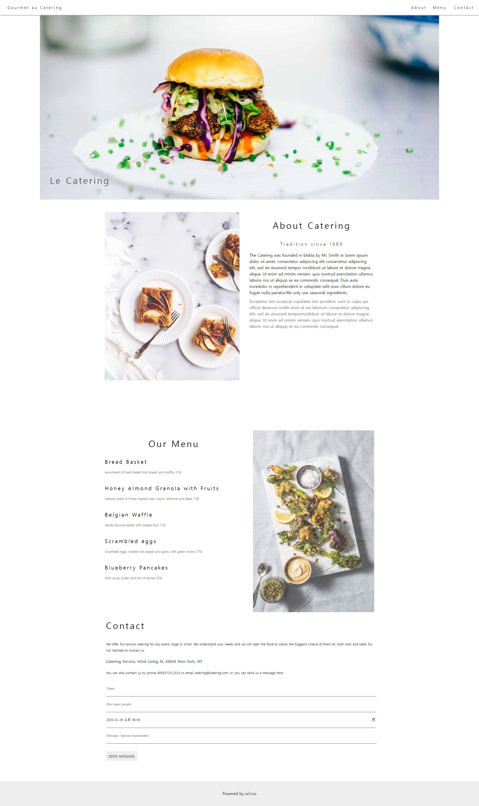
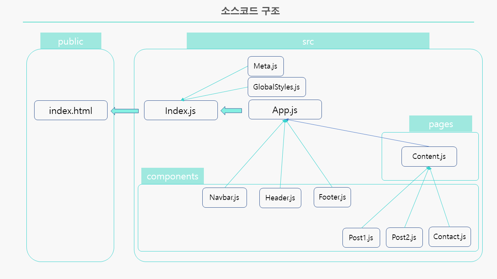

# 박정모 리액트 클론코딩 1
> 2022-04-29
 




# Index.js
<hr />

```js
import React from 'react';
import ReactDOM from 'react-dom/client';
import App from './App';
import { BrowserRouter } from 'react-router-dom';
import GlobalStyles from "./GlobalStyles";
import Meta from "./Meta";

const root = ReactDOM.createRoot(document.getElementById('root'));
root.render(
    <React.StrictMode>
        <GlobalStyles />
        <Meta />
        <BrowserRouter>
            <App/>
        </BrowserRouter>
    </React.StrictMode>
);
```

# GlobalStyles.js
<hr />

```js
/**
 * @filename: GlobalStyles.js
 * @description: 전역으로 적용될 기본 스타일시트. reset을 적용하였음.
 * @author: 박정모 (oooperbjm@gmail.com)
 */

import { createGlobalStyle } from "styled-components";

/**
 * 전역 스타일 시트를 정의한 객체
 * @type {GlobalStyleComponent<{}, DefaultTheme>}
 */
const GlobalStyles = createGlobalStyle`
* {
    font-family: 'Times New Roman', Georgia, Serif;
}


html, body {
    box-sizing: border-box;
}


a{
    text-decoration: none;
    color: #000000;
}


/** reset.css 참조 */

/* http://meyerweb.com/eric/tools/css/reset/ 
   v2.0 | 20110126
   License: none (public domain)
*/

html, body, div, span, applet, object, iframe,
h1, h2, h3, h4, h5, h6, p, blockquote, pre,
a, abbr, acronym, address, big, cite, code,
del, dfn, em, img, ins, kbd, q, s, samp,
small, strike, strong, sub, sup, tt, var,
b, u, i, center,
dl, dt, dd, ol, ul, li,
fieldset, form, label, legend,
table, caption, tbody, tfoot, thead, tr, th, td,
article, aside, canvas, details, embed,
figure, figcaption, footer, header, hgroup,
menu, nav, output, ruby, section, summary,
time, mark, audio, video {
  margin: 0;
  padding: 0;
  border: 0;
  font-size: 100%;
  font: inherit;
  vertical-align: baseline;
}

/* HTML5 display-role reset for older browsers */
article, aside, details, figcaption, figure,
footer, header, hgroup, menu, nav, section {
  display: block;
}

body {
  line-height: 1;
}

ol, ul {
  list-style: none;
}

blockquote, q {
  quotes: none;
}

blockquote:before, blockquote:after,
q:before, q:after {
  content: '';
  content: none;
}

table {
  border-collapse: collapse;
  border-spacing: 0;
}
`;

export default GlobalStyles;
```

# Meta.js
<hr />

```js
/**
 * SEO 처리를 정의한 객체
 * @param props
 * @returns {JSX.Element}
 */
const Meta = (props) => {
    return (
        <HelmetProvider>
            <Helmet>
                <title>Clone Codding 1 ::: by React</title>
                <meta charSet="utf-8"/>
                {/* SEO 태그 */}
                <meta name='description' content={props.description}/>
                <meta name='keywords' content={props.keywords}/>
                <meta name='author' content={props.author}/>
                <meta property='og:type' content='website'/>
                <meta property='og:title' content={props.title}/>
                <meta property='og:description' content={props.description}/>
                <meta property='og:image' content={props.image}/>
                <meta property='og:url' content={props.url}/>
            </Helmet>
        </HelmetProvider>
    );
};

Meta.defaultProps = {
    title: 'React Example',
    description: 'React.js 예제 입니다.',
    keywords : 'React',
    author : '박정모',
    url: window.location.href,
};

export default Meta;
```

# App.js
<hr />

```js
import React from 'react';
import Navbar from './components/Navbar';
import Header from './components/Header';
import Content from './pages/Content';
import Footer from './components/Footer';

function App() {
    return (
        <div className="App">
            <Navbar />
            <Header />
            <Content />
            <Footer />
        </div>
    );
}

export default App;
```


# Navbar.js
<hr />

```js
import React from "react";
import { Link } from "react-router-dom";
import styled from "styled-components";

const Nav = styled.div`
  width: 100%;
  height: 40px;
  padding: 10px;
  margin: 0px;
  box-shadow: 0px 2px 3px #a1a1a1;
  position: fixed;
  background-color: #ffffff;
  z-index: 100;

  a {
    display: block;
    letter-spacing: 4px;
    cursor: pointer;
    float: left;
    height: 30px;
    padding: 10px 10px 0px 10px;
    /* margin-bottom: 10px; */
    font-size: 15px;
    line-height: 20px;

    &:hover {
      background-color: #27272747;
    }
    &: first-child {
      position: absolute;
      left: 20px;
    }
  }

  .right3 {
    position: absolute;
    right: 30px;
  }
  .right2 {
    position: absolute;
    right: 140px;
  }

  .right1 {
    position: absolute;
    right: 220px;
  }

  &:after {
    float: none;
    clear: both;
    display: block;
    content: "";
  }
`;

const Navbar = () => {
  return (
    <Nav>
      <Link to="#"> Gourmet au Catering </Link>
      <Link to="#" className="right1">
        {" "}
        About{" "}
      </Link>
      <Link to="#" className="right2">
        {" "}
        Menu{" "}
      </Link>
      <Link to="#" className="right3">
        {" "}
        Contact{" "}
      </Link>
    </Nav>
  );
};

export default Navbar;
```

# Header.js
<hr />

```js
import React from "react";
import Hamburger from "../assets/img/hamburger.jpg";
import styled from "styled-components";

const Headercontainer = styled.header`
  position: relative;
  width: 1600px;
  margin: auto;

  img {
    display: block;
    width: 100%;
    margin: auto;
    position: relative;
    z-index: -1;
  }
  h1 {
    display: block;
    font-size: 36px;
    color: #505050;
    position: absolute;
    bottom: 60px;
    left: 40px;
    letter-spacing: 5px;
  }
  &:after {
    content: "";
    display: block;
    float: none;
    clear: both;
  }
`;

const Header = () => {
  return (
    <Headercontainer>
      
      <h1>Le Catering</h1>
    </Headercontainer>
  );
};

export default Header;
```

# Content.js
<hr />

```js
import React from "react";
import Post1 from "../components/Post1";
import Post2 from "../components/Post2";
import Contact from "../components/Contact";


const Content = () => {
  return (
    <div>
      <Post1 />
      <Post2 />
      <Contact />
    </div>
  );
};

export default Content;
```

# Post1.js
<hr />

```js
import React from "react";
import Img1 from "../assets/img/tablesetting2.jpg";
import styled from "styled-components";

const About = styled.div`
  width: 1080px;
  max-width: 100%;
  margin: auto;
  padding-top: 50px;

  * {
    vertical-align: middle;
  }

  img {
    display: block;
    margin: auto;
    width: 50%;
    max-width: 80%;
    min-width: 30%;
    border-radius: 4px;
    float: left;
    margin-right: 40px;
    opacity: 0.8;
  }

  h2 {
    font-size: 35px;
    text-align: center;
    line-height: 300%;
    letter-spacing: 5px;
    padding-bottom: 10px;
  }

  .content1 {
    max-height: 750px;
    text-overflow: ellipsis;
    overflow: hidden;

    .subtitle {
      text-align: center;
      font-size: 18px;
      font-weight: 100;
      letter-spacing: 5px;
      padding-bottom: 20px;
    }

    p {
      font-size: 16px;
      line-height: 25px;

      &:last-child {
        color: #5f5f5f;
        padding-top: 10px;
      }
    }
  }
  &:after {
    float: none;
    clear: both;
    content: "";
    display: block;
    padding-bottom: 200px;
  }
`;

const Post1 = () => {
  return (
    <About>
      <div className="image">
        
      </div>
      <h2>About Catering</h2>
      <div className="content1">
        <p className="subtitle">Tradition since 1889</p>
        <p>
          The Catering was founded in blabla by Mr. Smith in lorem ipsum dolor
          sit amet, consectetur adipiscing elit consectetur adipiscing elit, sed
          do eiusmod tempor incididunt ut labore et dolore magna aliqua. Ut enim
          ad minim veniam, quis nostrud exercitation ullamco laboris nisi ut
          aliquip ex ea commodo consequat. Duis aute iruredolor in reprehenderit
          in voluptate velit esse cillum dolore eu fugiat nulla pariatur.We only
          use seasonal ingredients.
        </p>
        <p>
          Excepteur sint occaecat cupidatat non proident, sunt in culpa qui
          officia deserunt mollit anim id est laborum consectetur adipiscing
          elit, sed do eiusmod temporincididunt ut labore et dolore magna
          aliqua. Ut enim ad minim veniam, quis nostrud exercitation ullamco
          laboris nisi ut aliquip ex ea commodo consequat.
        </p>
      </div>
    </About>
  );
};

export default Post1;
```

# Post2.js
<hr />

```js
import React from 'react';
import Img1 from '../assets/img/tablesetting.jpg';
import styled from 'styled-components';

const Menu = styled.div`
    width: 1080px;
    max-width: 100%;
    margin: auto;
    
    img {
      display: block;
      margin: auto;
      width: 45%;
      max-width: 80%;
      min-width: 30%;
      border-radius: 4px;
      float: right;
      margin-left: 40px;
      opacity: 0.8;
    }
    h2 {
      font-size: 35px;
      text-align: center;
      line-height: 300%;
      letter-spacing: 5px;
      padding-bottom: 10px;
    }
    h3 {
      font-size: 21px;
      font-weight: 500;
      letter-spacing: 4px;
      padding-bottom: 20px;
    }
    p {
      font-size: 12px;
      line-height: 25px;
      padding-bottom: 40px;
      color: #5f5f5f;
    }
  &:after {
    float: none;
    clear: both;
    content: '';
    display: block;
  }
`

const Post2 = () => {
    return (
        <Menu>
                
            <h2>Our Menu</h2>
            <ul>
                <li>
                    <h3>Bread Basket</h3>
                    <p>Assortment of fresh baked fruit breads and muffins 5.50</p>
                </li>
                <li>
                    <h3>Honey Almond Granola with Fruits</h3>
                    <p>Natural cereal of honey toasted oats, raisins, almonds and dates 7.00</p>
                </li>
                <li>
                    <h3>Belgian Waffle</h3>
                    <p>Vanilla flavored batter with malted flour 7.50</p>
                </li>
                <li>
                    <h3>Scrambled eggs</h3>
                    <p>Scrambled eggs, roasted red pepper and garlic, with green onions 7.50</p>
                </li>
                <li>
                    <h3>Blueberry Pancakes</h3>
                    <p>With syrup, butter and lots of berries 8.50</p>
                </li>
            </ul>
        </Menu>
    );
};

export default Post2;
```

# Contact.js
<hr />

```js
import React from 'react';
import styled from 'styled-components';

const Contactcontainer = styled.div`
  display: block;
  width: 1080px;
  height: auto;
  margin: auto;
  padding-left: 10px;
  
  h2 {
    font-size: 35px;
    font-weight: 400;
    line-height: 300%;
    letter-spacing: 5px;
    padding-bottom: 10px;
  }
  p {
    font-size: 13px;
    line-height: 25px;
    font-weight: 400;
    padding-bottom: 20px;    
    
    &:nth-child(3) {
      font-size: 15px;
      color: #667c89;
      font-weight: bolder;      
    }
  }
  
  input {
    display: block;
    width: 100%;
    border: none;
    line-height: 60px;
    border-bottom: 1px solid #505050;
  }
  
  a {
    line-height: 100px;
    font-size: 0.9em;
    background-color: #eee;
    padding: 10px;
    
    &:hover{
      background-color: #8d8d8d;
    }
  }

`

const Contact = () => {
    return (
        <Contactcontainer>
            <h2>Contact</h2>
            <p>We offer full-service catering for any event, large or small. We understand your needs and we will cater the food to satisfy the biggerst criteria of them all, both look and taste. Do not hesitate to contact us.</p>
            <p>Catering Service, 42nd Living St, 43043 New York, NY</p>
            <p>You can also contact us by phone 00553123-2323 or email catering@catering.com, or you can send us a message here:</p>
            <fieldset>
                <input type="text" placeholder="Name" id="name" />
                <input type="number" placeholder="How many people" />
                <input type="datetime-local" value="2020-11-16T20:00" />
                <input type="text" placeholder="Message \ Special requirements" />
            </fieldset>
            <a href="#name">SEND MESSAGE</a>
        </Contactcontainer>
    );
};

export default Contact;
```

# Footer.js
<hr />

```js
import React from 'react';
import styled from 'styled-components';

const Footercontainer = styled.div`
  line-height: 100px;
  margin-top: 50px;
  background-color: #eee;
  text-align: center;
`

const Footer = () => {
    return (
        <Footercontainer>
            <address>Powered by w3.css</address>
        </Footercontainer>
    );
};

export default Footer;
```

## 후기
> 그리 오래되진 않은 시점에 진행했던 클론코딩인데 지금 보니 DOM이 어색하게 되어있는 부분들이 보여서 살짝 다듬어야 했습니다. 뭔가 리액트를 하다보니 DOM을 어떻게 짜야할지 좀 더 큰 시점(?)에서 봐야한다는 걸 알았습니다. CSS도 어색한 부분들이 보이긴 하지만 크게 문제가 되는 곳은 없기에 그대로 적용시켰습니다.