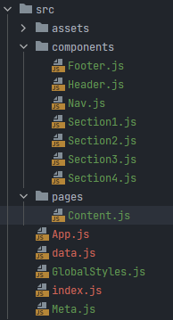

# 박정모 리액트 클론코딩 2
> 2022-05-02

## 구현결과 


## 파일 구조


## index.js
```js
import React from 'react';
import ReactDOM from 'react-dom/client';
import App from './App';
import { BrowserRouter } from 'react-router-dom';
import Meta from './Meta';
import GlobalStyles from "./GlobalStyles";

const root = ReactDOM.createRoot(document.getElementById('root'));
root.render(
    <React.StrictMode>
        <GlobalStyles />
        <Meta />
        <BrowserRouter>
            <App/>
        </BrowserRouter>
    </React.StrictMode>
);
```

## Meta.js
```js
/**
 * @filename: Meta.js
 * @description: <head>태그 내의 SEO 처리 및 기본 참조 리소스 명시
 * @author: 박정모(oooperbjm@gmail.com)
 */

import React from "react";
import { Helmet, HelmetProvider } from "react-helmet-async";

/**
 * SEO 처리를 정의한 객체
 * @param props
 * @returns {JSX.Element}
 */
const Meta = (props) => {
    return (
        <HelmetProvider>
            <Helmet>
                <title> Clone Codding 2::: by React </title> 
                <meta charSet="utf-8" /> 
                {/* SEO 태그 */} 
                <meta name="description" content={props.description} /> 
                <meta name="keywords" content={props.keywords} />
                <meta name="author" content={props.author} /> 
                <meta property="og:type" content="website" />
                <meta property="og:title" content={props.title} /> 
                <meta property="og:description" content={props.description} /> 
                <meta property="og:image" content={props.image} /> 
                <meta property="og:url" content={props.url} />
            </Helmet>
        </HelmetProvider>
    );
};

Meta.defaultProps = {
    title: "React Example",
    description: "React.js 예제 입니다.",
    keywords: "React",
    author: "박정모",
    url: window.location.href,
};

export default Meta;
```

## GlobalStyles.js
> font-family, reset.css 적용 / 여러 components에서 사용할 hide class 적용
```js
import { createGlobalStyle } from "styled-components";

const GlobalStyles = createGlobalStyle`
  /* http://meyerweb.com/eric/tools/css/reset/ 
     v2.0 | 20110126
     License: none (public domain)
  */

  html, body, div, span, applet, object, iframe,
  h1, h2, h3, h4, h5, h6, p, blockquote, pre,
  a, abbr, acronym, address, big, cite, code,
  del, dfn, em, img, ins, kbd, q, s, samp,
  small, strike, strong, sub, sup, tt, var,
  b, u, i, center,
  dl, dt, dd, ol, ul, li,
  fieldset, form, label, legend,
  table, caption, tbody, tfoot, thead, tr, th, td,
  article, aside, canvas, details, embed,
  figure, figcaption, footer, header, hgroup,
  menu, nav, output, ruby, section, summary,
  time, mark, audio, video {
    margin: 0;
    padding: 0;
    border: 0;
    font-size: 100%;
    font: inherit;
    vertical-align: baseline;
  }

  /* HTML5 display-role reset for older browsers */
  article, aside, details, figcaption, figure,
  footer, header, hgroup, menu, nav, section {
    display: block;
  }

  * {
    font-family: Verdana, sans-serif;
    font-size: 15px;
    line-height: 1.5;
    text-decoration: none;
    color: #000;
    boxing: border-box;
  }

  hr {
    width: 1500px;
    border-color: #ffffff;
  }

  body {
    line-height: 1;
  }

  a {
    text-decoration: none;
  }

  ol, ul {
    list-style: none;
  }

  blockquote, q {
    quotes: none;
  }

  blockquote:before, blockquote:after,
  q:before, q:after {
    content: '';
    content: none;
  }

  table {
    border-collapse: collapse;
    border-spacing: 0;
  }

  .hide {
    display: none;
    visibility: hidden;
  }
`;

export default GlobalStyles;
```

## App.js
```js
import React from 'react';
import Nav from './components/Nav';
import Header from './components/Header';
import Content from './pages/Content';
import Footer from './components/Footer';

function App() {
    return (
        <div className="App">
            <Nav/>
            <Header/>
            <Content/>
            <Footer/>
        </div>
    );
}

export default App;
```

## Nav.js
> 페이지 넓이가 600 미만으로 줄어들 때, 우측 메뉴버튼에 hide 클래스 적용하여 숨김
```js
import React from 'react';
import { Link } from 'react-scroll';
import styled from 'styled-components';

const Navcontainer = styled.div`
  background-color: white;
  width: 100%;
  height: 55px;
  box-shadow: 0 2px 5px rgba(0, 0, 0, 0.3);
  display: flex;
  justify-content: space-between;
  position: fixed;
  top: 0;
  z-index: 99999;
  flex-wrap: nowrap;
  
  a {
    margin: 10px auto;
    padding: 0 10px;
    line-height: 35px;
    letter-spacing: 5px;
    font-size: 15px;

    &:hover {
      background-color: #cacaca;
    }
  }

  .main-logo {
    margin-left: 30px;

    span {
      font-weight: 900;
    }
  }

  .top-navs {
    position: relative;
    right: 100px;
    width: 250px;
    display: flex;
    justify-content: space-between;
    a {
      padding: 0 10px;
      cursor: pointer;
    }
  }

`

const Nav = () => {

    const [innerWidth, setInnerWidth] = React.useState(false);


    window.addEventListener('resize', () => {
        setInnerWidth(window.innerWidth < 600)
    })

    return (
        <Navcontainer>
            <Link to="top" className='main-logo'><span><b>BR</b></span> Architects</Link>
            <div className={innerWidth? 'hide' : 'top-navs'}>
                <Link to='project' spy={true} smooth={true}>Projects</Link>
                <Link to='about' spy={true} smooth={true}>About</Link>
                <Link to='contact' spy={true} smooth={true}>Contact</Link>
            </div>
        </Navcontainer>
    );
};

export default Nav;
```

## Header.js
> Nav.js와 마찬가지로 페이지 넓이가 600 미만으로 줄어들 때, span태그에 hide클래스 적용하여 숨김
```js
import React from 'react';
import styled from 'styled-components';
import Img1 from '../assets/img/architect.jpg';


const Jumbotrons = styled.header`
  max-width: 1500px;
  max-height: 800px;
  position: relative;
  margin: auto;
  display: flex;
  justify-content: center;
  align-items: center;
  flex: 0 1 auto;
  vertical-align: middle;
  z-index: -10;
  img{
    width: 100%;
    height: 100%;
    vertical-align: middle;
  }
  h1 {
    text-align: center;
    font-size: 35px;
    color: white;
    letter-spacing: 4px;
    position: absolute;
    line-height: 50px;
    top: 50%;
    vertical-align: middle;
    
    span {
      &:first-child {
        color: white;
        background-color: rgba(0, 0, 0);
        padding: 8px 17px;
        font-weight: bold;
        opacity: 0.7;
      }
      &:last-child {
        color: white;
        font-weight: 500;
      }
      
    }
  }
`

const Header = () => {

    const [innerWidth, setInnerWidth] = React.useState(false);


    window.addEventListener('resize', () => {
        setInnerWidth(window.innerWidth < 600)
    })

    return (
        <Jumbotrons id='top'>
            
            <h1><span>BR</span>&nbsp;
                <span
                    className={innerWidth ? 'hide' : ''}
                >Architects</span></h1>
        </Jumbotrons>
    );
};

export default Header;
```

## Content.js
> data.js의 각 항목을 props로 전달
```js
import React from 'react';
import Section1 from '../components/Section1';
import Section2 from '../components/Section2';
import Section3 from '../components/Section3';
import Section4 from "../components/Section4";
import styled from 'styled-components';
import data from '../data'

const Contentcontainer = styled.div`
  max-width: 1500px;
  margin: auto;
  height: auto;
  position: relative;
  padding: 0 30px 0 30px;

  h3 {
    font-size: 24px;
  }

  hr {
    margin: 30px 0;
    border: none;
    border-top: 1px solid #d5d5d5;
    width: auto;
  }
`

const Content = () => {
    return (
        <Contentcontainer>
            <Section1 data={data.project}/>
            <Section2 data={data.about}/>
            <Section3/>
            <Section4/>
        </Contentcontainer>
    );
};

export default Content;
```

## Section1.js
```js
import React from 'react';
import styled from 'styled-components';

const Section1container = styled.div`
  div#project {
    padding: 65px 0 0 0;
  }
  ul {
    display: flex;
    justify-content: space-evenly;
    flex-wrap: wrap;

    li {
      max-width: 375px;
      flex: 1 1 auto;

      div {
        position: relative;
        padding-bottom: 20px;

        img {
          width: 96%;
        }

        p {
          position: absolute;
          top: 0;
          color: white;
          background-color: black;
          display: block;
          width: fit-content;
          padding: 10px 15px 10px 15px;
        }
      }
    }
  }
`


const Section1 = (props) => {
    return (
        <Section1container>
            <div id='project'>
            <h3>Projects</h3>
            </div>
            <hr/>
            <ul>
                {props.data.map((v, i) => {
                    return (<li>
                        <div>
                            
                            <p>{v.subject}</p>
                        </div>
                    </li>)
                })}
            </ul>
        </Section1container>
    );
};

export default Section1;
```

## Section2.js
```js
import React from 'react';
import styled from 'styled-components';
import {Link} from 'react-router-dom';

const Section2container = styled.div`
  div {
    padding-top: 65px;
  }
    
  p{
    font-size: 16.4px;
    line-height: 20px;
  }
  ul {
    display: flex;
    justify-content: space-evenly;
    padding-top: 50px;
    flex-wrap: wrap;
    
    li {
      width: 355px;
      flex: 0 1 auto;
      display: flex;
      flex-direction: column;
      margin: 0 10px;
      
      img {
        width: 100%;
        filter: grayscale(0.8);
        margin: auto;
      }
      h3 {
        letter-spacing: 0;
        padding-top: 20px;
        display: block;
      }
      p:nth-of-type(1) {
        color: #7e7e7e;
        line-height: 50px;
        display:block;
      }
      a {
        display: block;
        margin: 10px 0;
        width: 350px;
        padding: 13px 0;
        text-align: center;
        background-color: #f1f1f1;
        
        &:hover {
          background-color: #cacaca;
        }
      }
    }
  }
`

const Section2 = (props) => {
    return (
        <Section2container>
            <div id='about'>
            <h3>About</h3>
            </div>
            <hr />
            <p>{props.data.content}</p>
            <ul>
                {props.data.member.map((v, i) => {
                    return(
                        <li>
                            
                            <h3>{v.name}</h3>
                            <p>{v.position}</p>
                            <p>{v.desc}</p>
                            <Link to='/'>Contact</Link>
                        </li>
                    )
                })}
            </ul>
        </Section2container>
    );
};

export default Section2;
```

## Section3.js
```js
import React from 'react';
import styled from 'styled-components';

const Section3container = styled.div`
  div {
    padding-top: 65px;
  }

  hr {
    margin-bottom: 20px;
  }

  p {
    padding-bottom: 20px;
  }

  fieldset {
    display: flex;
    flex-direction: column;

    input {
      height: 35px;
      margin: 5px 0;
      padding: 0 10px;
    }

    a {
      width: 170px;
      margin-top: 30px;
      padding: 10px 0;
      background-color: black;
      color: white;
      text-align: center;
    }
  }
`

const Section3 = () => {
    return (
        <Section3container>
            <div id='contact'>
                <h3>Contact</h3>
            </div>
            <hr/>
            <p>Lets get in touch and talk about your next project.</p>
            <fieldset>
                <input type='text' placeholder='Name' id='name'/>
                <input type='email' placeholder='Email' id='email'/>
                <input type='text' placeholder='Subject' id='subject'/>
                <input type='text' placeholder='Comment' id='comment'/>
                <a href='#name'>SEND MESSAGE</a>
            </fieldset>
        </Section3container>
    );
};

export default Section3;
```

## Section4.js
```js
import React from 'react';
import styled from 'styled-components';
import Img1 from '../assets/img/map.jpg';

const Section4container = styled.div`
  height: fit-content;
  padding-top: 50px;
  display: flex;
  img {
    width: 100%;
    flex: 0 1 auto;
  }
`

const Section4 = () => {
    return (
        <Section4container>
            
        </Section4container>
    );
};

export default Section4;
```

## Footer.js
```js
import React from 'react';
import styled from 'styled-components';

const Footercontainer = styled.div`
  margin-top: 10px;
    height: 90px;
  background-color:black;
  address {
    line-height: 90px;
    text-align: center;
    color: white;
    span {
      text-decoration: underline;
      cursor: pointer;
      color: white;
    }
  }
`

const Footer = () => {
    return (
        <Footercontainer>
            <address>Powered by <span>w3.css</span></address>
        </Footercontainer>
    );
};

export default Footer;
```

### 후기
> display:flex를 사용하고 flex속성으로 컨트롤 하다보니 뭔가 반응형 느낌...?이 날 수 있게 되었다. flex 속성을 이리 저리 만져보다보니 감이 잡히는 기분이 든다.
> 확실히 DOM만 잘 파악한다면 한 번에 컨트롤 해야하는 분량이 줄어들어 각 부분 부분에 더욱 집중할 수 있는 듯 하다.