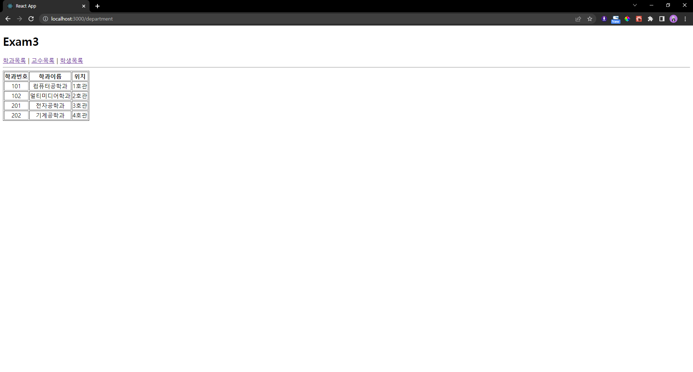
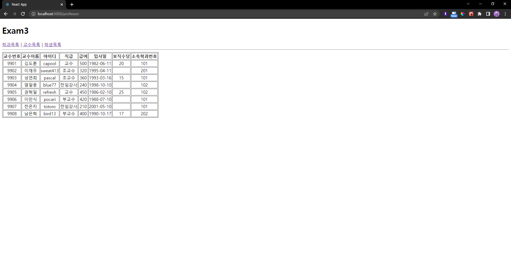
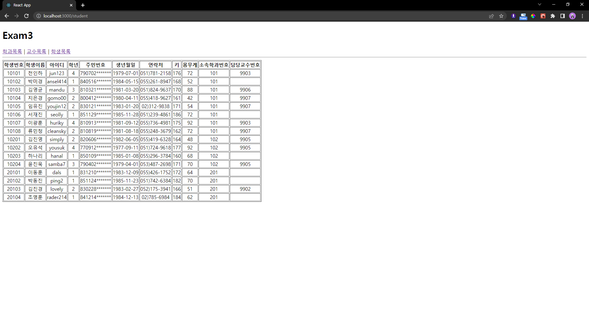

# 박정모 React 연습문제5
> 2022-04-26

## App.js
> 사실 props 냅다 집어넣다가... 먼저 제출하신 분꺼 보고... 아예 배열 자체를 props로 보내고 안에서 핸들링하는 방법을 깨닫고 수정했습니다...
```js
import React from 'react';
import { Link, Routes, Route } from 'react-router-dom';
import Department from './pages/Department';
import Professor from './pages/Professor';
import Student from './pages/Student';
import Data from './pages/myschool'

function App() {
  return (
    <div>
      <h1>Exam3</h1>
      <nav>
        <Link to='./department'>학과목록</Link>&nbsp;|&nbsp;
        <Link to='./professor'>교수목록</Link>&nbsp;|&nbsp;
        <Link to='./student'>학생목록</Link>
      </nav>
      <hr />

      <Routes>
        <Route path='/department' element={<Department department={Data.department}/>} />
        <Route path='/professor' element={<Professor professor={Data.professor}/>} />
        <Route path='/student' element={<Student student={Data.student}/>} />
      </Routes>

    </div>
  );
}

export default App;

```

<hr />

## Department.js
```js
import React from "react";

const Department = (props) => {
    return (
        <div>
            <table border="1">
                <thead>
                    <tr align="center">
                        <th>학과번호</th>
                        <th>학과이름</th>
                        <th>위치</th>
                    </tr>
                </thead>
                <tbody>
                    {props.department.map((v, i) => {
                        return (
                            <tr align="center">
                                <td key={i}>{v.id}</td>
                                <td key={i + "a"}>{v.dname}</td>
                                <td key={i + "b"}>{v.loc}</td>
                            </tr>
                        );
                    })}
                </tbody>
            </table>
        </div>
    );
};

export default Department;
```
### 학과목록 스크린샷


<hr />

## Professor.js
```js
import React from "react";

const Professor = (props) => {
    return (
        <div>
            <table border="1">
                <thead>
                    <tr align="center">
                        <th>교수번호</th>
                        <th>교수이름</th>
                        <th>아이디</th>
                        <th>직급</th>
                        <th>급여</th>
                        <th>입사일</th>
                        <th>보직수당</th>
                        <th>소속학과번호</th>
                    </tr>
                </thead>
                <tbody>
                    {props.professor.map((v, i) => {
                        return(
                            <tr align="center">
                                <td>{v.id}</td>
                                <td>{v.name}</td>
                                <td>{v.userid}</td>
                                <td>{v.position}</td>
                                <td>{v.sal}</td>
                                <td>{v.hiredate.substring(0, 10)}</td>
                                <td>{v.comm}</td>
                                <td>{v.deptno}</td>
                            </tr>
                        )
                    })}
                </tbody>
            </table>
        </div>
    );
};

export default Professor;

```
### 교수목록 스크린샷



## Student.js
```js
import React from "react";

const Student = (props) => {
    return (
        <div>
            <table border="1">
                <thead>
                    <tr align="center">
                        <th>학생번호</th>
                        <th>학생이름</th>
                        <th>아이디</th>
                        <th>학년</th>
                        <th>주민번호</th>
                        <th>생년월일</th>
                        <th>연락처</th>
                        <th>키</th>
                        <th>몸무게</th>
                        <th>소속학과번호</th>
                        <th>담당교수번호</th>
                    </tr>
                </thead>
                <tbody>
                        {props.student.map((v, i) => {
                            return(
                                <tr align="center">
                                    <td>{v.id}</td>
                                    <td>{v.name}</td>
                                    <td>{v.userid}</td>
                                    <td>{v.grade}</td>
                                    <td>{v.idnum.substring(0, 6)+'*******'}</td>
                                    <td>{v.birthdate.substring(0, 10)}</td>
                                    <td>{v.tel}</td>
                                    <td>{v.height}</td>
                                    <td>{v.weight}</td>
                                    <td>{v.deptno}</td>
                                    <td>{v.profno}</td>
                                </tr>
                            )
                        })}
                </tbody>
            </table>
        </div>
    );
};

export default Student;
```
### 학생목록 스크린샷



