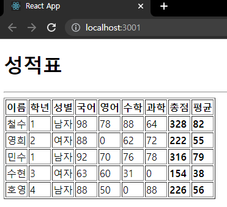

# 박정모 React 연습문제
> 2022-04-25

이렇게 하는게 아닌 것 같은데.... 
App.js에 `<GradeItem />`만 집어넣고 표를 그리면 태그를 통해서 props가 전달이 되는게 없어서 단순히 GradeData를 핸들링하는 방식으로 구현을 했을 때 defaultProps가 적용이 되질 않았습니다..
강사님이 힌트 주신거 보면 `<GradeItem />` 만 가지고 props가 전달이 되는 것 같은데 그 방법을 모르겠습니다...

# App.js
```javascript
import React from "react";
import GradeItem from "./components/GradeItem";
import GradeData from "./GradeData";

function App() {
    return (
        <div className="App">
            <h1>성적표</h1>
            <hr />
            <table border="1px">
                <thead>
                    <tr>
                        <th>이름</th>
                        <th>학년</th>
                        <th>성별</th>
                        <th>국어</th>
                        <th>영어</th>
                        <th>수학</th>
                        <th>과학</th>
                        <th>총점</th>
                        <th>평균</th>
                    </tr>
                </thead>
                <tbody>
                <GradeItem name={GradeData[0].name} grade={GradeData[0].grade} gender={GradeData[0].gender} kor={GradeData[0].kor} eng={GradeData[0].eng} math={GradeData[0].math} sci={GradeData[0].sci} />
                <GradeItem name={GradeData[1].name} grade={GradeData[1].grade} gender={GradeData[1].gender} kor={GradeData[1].kor} eng={GradeData[1].eng} math={GradeData[1].math} sci={GradeData[1].sci} />
                <GradeItem name={GradeData[2].name} grade={GradeData[2].grade} gender={GradeData[2].gender} kor={GradeData[2].kor} eng={GradeData[2].eng} math={GradeData[2].math} sci={GradeData[2].sci} />
                <GradeItem name={GradeData[3].name} grade={GradeData[3].grade} gender={GradeData[3].gender} kor={GradeData[3].kor} eng={GradeData[3].eng} math={GradeData[3].math} sci={GradeData[3].sci} />
                <GradeItem name={GradeData[4].name} grade={GradeData[4].grade} gender={GradeData[4].gender} kor={GradeData[4].kor} eng={GradeData[4].eng} math={GradeData[4].math} sci={GradeData[4].sci} />
                </tbody>
            </table>
        </div>
    );
}

export default App;

```

# GradeItem.js
```javascript
import React from "react";
import GradeData from "../GradeData";
import PropTypes from 'prop-types';

const GradeItem = ({ name, grade, gender, kor, eng, math, sci }) => {
    console.log(GradeData);
    let sum = kor + eng + math + sci;
    let avg = sum / 4;
        return (
            <tr>
                <td>{name}</td>
                <td>{grade}</td>
                <td>{gender}</td>
                <td>{kor}</td>
                <td>{eng}</td>
                <td>{math}</td>
                <td>{sci}</td>
                <td><b>{parseInt(sum)}</b></td>
                <td><b>{parseInt(avg)}</b></td>
            </tr>
        );
};

GradeItem.defaultProps ={
    kor: 0,
    eng: 0,
    math: 0,
    sci: 0
}

GradeItem.propTypes = {
    name: PropTypes.string,
    gender: PropTypes.string,
    grade: PropTypes.number,
    kor: PropTypes.number,
    eng: PropTypes.number,
    math: PropTypes.number,
    sci: PropTypes.number
}


export default GradeItem;
```

