# 리액트를 다루는 기술 정리 - 박정모
> 2022-05-06

# # 03장 - 컴포넌트
컴포넌트의 기능은 단순한 템플릿 이상   
- 데이터가 만들어졌을 때 UI를 생성
- hook을 이용하여 컴포넌트가 화면에서 나타날 때, 사라질 때, 변화가 일어날 때 주어진 작업을 처리
- 임의 메서드(함수)를 만들어 특별한 기능 부여 가능

## 3.1 클래스형 컴포넌트 - PASS
Why?
함수형 컴포넌트의 장점
- 클래스형 컴포넌트보다 선언이 편리
- 메모리 자원도 클래스형보다 적게 사용
- 배포할 때에도 사이즈가 더 작음
- 기존 함수형 컴포넌트의 경우 state와 라이프사이클 API 사용이 불가능 하였으나 hook을 사용하여 해결됨
- 따라서, 리액트 공식 메뉴얼에서도 함수 컴포넌트와 Hooks의 사용을 권장함

## 3.2 첫 컴포넌트 생성

### 3.2.3 모듈 내보내기 및 불러오기

- export default (...)
  - 위 코드는 컴포넌트 최하단에 작성하며, 다른 파일에서 import할 때, 위에 선언한 component 함수를 불러오도록 설정함
- import (...) from (..파일 위치..)
  - 위 코드는 컴포넌트 최상단에 작성하며, 다른 컴포넌트를 불러온다.

## 3.3 props
props = properties의 줄임말    
props 값은 부모 컴포넌트가 자식 컴포넌트를 불러올 때 설정함   

### 3.3.1 JSX 내부에서 props 렌더링 + 3.3.2 컴포넌트를 사용할 때 props 값 지정하기
props 값은 컴포넌트 함수의 파라미터로 받아와서 사용함   
JSX문법이기에 `{}`기호로 감싸서 사용
<hr />

#### 실습결과

#### App.js

```js
import React from 'react';
import MyComponent from './components/MyComponent';

const App = () => {
    return (
        <MyComponent name='React'/>
    );
};

export default App;
```

#### MyComponent.js

```js
import React from 'react';

const MyComponent = (props) => {
    return (
        <div>
            안녕하세요, 제 이름은 {props.name}입니다.
        </div>
    );
};

export default MyComponent;

```

<hr />

### 3.3.3 props 기본값 설정: defaultProps
props값을 따로 지정하지 않았을 때 기본값으로 사용될 값을 설정하는 방법   
컴포넌트 작성 후 `컴포넌트명.defaultProps = { json형식 }` 으로 지정

<hr />

#### 실습결과
#### App.js

```js
(...)
return (
    <MyComponent />
);
(...)
```

#### MyComponent.js

```js
import React from 'react';

const MyComponent = (props) => {
    return (
        <div>
            안녕하세요, 제 이름은 {props.name}입니다.
        </div>
    );
};

MyComponent.defaultProps = {
    name : '기본 이름',
}
export default MyComponent;
```

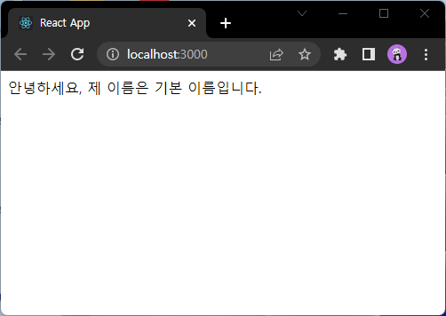

<hr />

### 3.3.4 태그 사이의 내용을 보여주는 children
리액트 컴포넌트를 사용할 때, 태그 사이의 내용을 보여주는 props = children   

<hr />

#### 실습결과
#### App.js
```js
(...)
return (
    <MyComponent>리액트</MyComponent>
);
(...)
```

#### MyComponent.js

```js
(...)
return (
    <div>
        안녕하세요, 제 이름은 {props.name}입니다.<br />
        children 값은 {props.children}입니다.
    </div>
);
(...)
```


<hr />

### 3.3.5 비구조화 할당 문법을 통해 props 내부 값 추출하기
비구조 문법 간단 정리

```js
const json = { a: 1, b: 2, c: 3 };
```
이러한 json이 있을 때
```js
const a = json.a;
const b = json.b;
const c = json.c;
```
이렇게 추출하는 것을   
```js
const {a, b, c} = json;
```
으로 표현할 수 있다.   

따라서 props로 전달되는 값을 비구조 할당으로 받으면 편리하다.

<hr />

#### 실습결과
#### MyComponent.js

```js
(...)
const MyComponent = ({name, children}) => {
    return (
        <div>
            안녕하세요, 제 이름은 {name}입니다.<br />
            children 값은 {children}입니다.
        </div>
    );
};
(...)
```

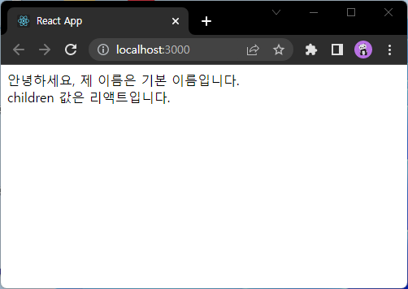

<hr />


### 3.3.6 propTypes를 통한 props 검증
컴포넌트의 필수 props를 지정할 때나 데이터타입을 지정할 때 사용   
propTypes의 경우 import 구문을 통해 불러와야 사용이 가능   
```js
import PropTypes from 'prop-types';
```
사용법
- 컴포넌트 하단에 `컴포넌트명.propTypes = { name: PropTypes.string }` 의 형식으로 사용   
- 설정한 type과 다른 type의 props가 전달될 경우 Console탭에 에러를 띄움   
<br />
  - 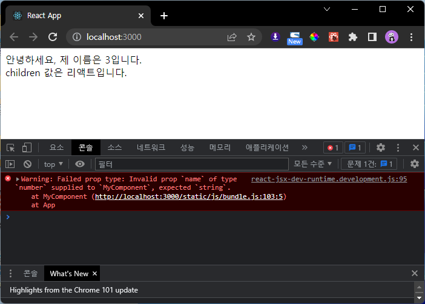   
<br />
- json으로 전달하는 propTypes의 value 끝에 `.isRequired`를 붙일 경우, props로 전달되지 않을 때 경고를 출력   
<br />
  - 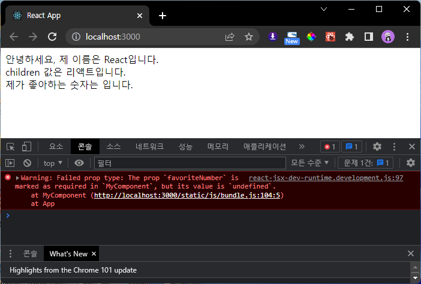
<br />
- PropTypes의 종류

|                        ***종류***                         |      ***설명***       |
|:-------------------------------------------------------:|:-------------------:|
|                         *array*                         |         배열          |
|                         *bool*                          |      boolean값       |
|                         *func*                          |         함수          |
|                        *number*                         |         숫자          |
|                        *string*                         |         문자열         |
|                    *instanceOf(클래스)*                    |    특정 클래스의 인스턴스     |
|                 *oneOf(['dog','cat'])*                  |   주어진 배열 요소 중 하나    |
| *oneOfType([React.PropTypes.string, PropTypes.number])* | 주어진 배열 안의 type 중 하나 |
|                          *any*                          |        아무 종류        |


## 3.4 state
state?
- 컴포넌트 내부에서 바뀔 수 있는 값
- props는 컴포넌트 사용시점에서 부모에게 주입받는 값이며 컴포넌트는 props를 읽기 전용으로만 사용이 가능(수정 불가)

### 3.4.2 함수 컴포넌트에서 useState 사용하기
#### 3.4.2.2 useState 사용하기
```js
import React, {useState} from 'react';

const Say = () => {
    const [message, setMessage] = useState('');
    const onClickEnter = () => setMessage('안녕하세요! :)');
    const onClickLeave = () => setMessage('안녕히 가세요! :)');

    return (
        <div>
            <button onClick={onClickEnter}>입장</button>
            <button onClick={onClickLeave}>퇴장</button>
            <h1>{message}</h1>
        </div>
    );
};

export default Say;
```
- useState함수의 파라미터는 상태(state)의 초깃값을 입력
- useState함수는 배열을 리턴함
  - 첫 번째 원소 : 현재 상태(state)
  - 두 번째 원소 : 상태를 바꿔주는 함수(setter)
- 상태값은 직접 대입으로 바꿀 수 없고 setter함수를 이용하여야 함
- 상태명, 세터명은 임의로 작성이 가능
- 위 예시로 든 Say.js 컴포넌트의 결과 스크린샷
  - 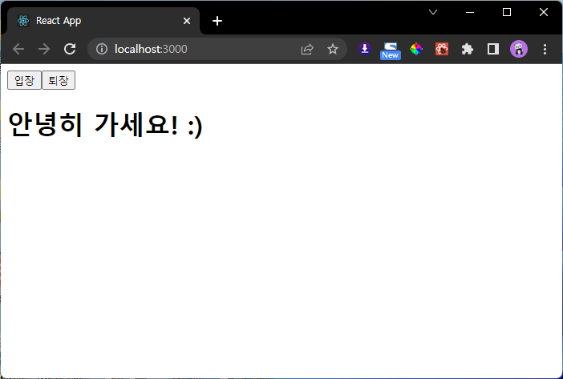

#### 3.4.2.3 한 컴포넌트에서 useState 여러번 사용하기
useState는 컴포넌트 안에서 여러번 사용이 가능
- 여러 상태값을 핸들링할 수 있다는 의미!

<hr />
실습 결과

```js
import React, {useState} from 'react';

const Say = () => {
    const [message, setMessage] = useState('');
    const onClickEnter = () => setMessage('안녕하세요! :)');
    const onClickLeave = () => setMessage('안녕히 가세요! :)');

    const [color, setColor] = useState('black');

    return (
        <div>
            <button onClick={onClickEnter}>입장</button>
            <button onClick={onClickLeave}>퇴장</button>
            <h1 style={{color}}>{message}</h1>
            <button style={{color: 'red'}} onClick={()=>setColor('red')}>빨간색</button>
            <button style={{color: 'green'}} onClick={()=>setColor('green')}>초록색</button>
            <button style={{color: 'blue'}} onClick={()=>setColor('blue')}>파란색</button>
        </div>
    );
};

export default Say;
```


<hr />

## 3.5 state를 사용할 때의 주의사항
앞서 말했듯이 state값을 바꿔야 할 때는 setter를 반드시 사용해야 함   
배열이나 객체를 state값으로 사용했을 경우에도 마찬가지
1. 배열이나 객체의 사본을 만든다. 
2. 그 사본의 값을 업데이트 한다.
  - json의 경우
      
    ```js
    const object = {a: 1, b: 2, c: 3}
    ```
    - 위와 같은 값을 업데이트 할 경우

    ```js
    const nextObject = { ...object, b: 5};
    ```
    - 의 형식으로 업데이트 한다.   
    - 여기서 `...object`는 `object`의 모든 원소를 나열하라는 의미
    - json의 key값이 두 번 쓰였을 경우, 후자의 value가 덮어쓰는 원리   
    <br />
  - 배열의 경우
    
    ```js
    const array = [
      { id: 1, value: true },
      { id: 2, value: false },
      { id: 3, value: true },
    ]
    ```
    - 위와 같은 배열을 업데이트 할 때는

    ```js
    // 새 항목 추가
    let nextArray1 = array.concat({id: 4, value: false});
    // 기존 항목 제거(id가 2인 항목 제거)(2인 항목만 제외하고 리턴)
    let nextArray2 = array.filter(item => item.id !== 2);
    // 기존 항목 변경(id가 1인 항목의 value를 false로 변경)
    let nextArray3 = array.map(item => (item.id === 1 ? { ... item, value: false} : item));
    ```
    - 의 형식으로 업데이트 한다. 
           
3. 업데이트된 사본의 값을 setter함수에 파라미터로 전달한다.

# #04장 - 이벤트 핸들링
이벤트 = 사용자가 웹 브라우저에서 DOM요소들과 상호작용 하는 것   

## 4.1 리액트의 이벤트 시스템
HTML의 이벤트와 인터페이스가 동일하다.

### 4.1.1 이벤트를 사용할 때 주의사항
1. 이벤트 이름은 `카멜 표기법(camelCase)`으로 작성
2. 이벤트에 실행할 자바스크립트 코드가 아니라 `함수 형태의 객체`를 전달
   - callback으로 전달
   - 외부의 별도 함수를 연결
3. DOM 요소에만 이벤트 설정이 가능
   - 직접 만든 component에는 이벤트를 자체적 설정불가
   - 하지만 props로 전달받아 이를 컴포넌트 내부의 DOM이벤트로 설정은 가능

### 4.2.2 onChange 이벤트 핸들링하기

#### 4.2.2.1 onChange 이벤트 설정
```js
import React from 'react';

const EventPractice = () => {
    return (
        <div>
            <h1>이벤트 연습</h1>
            <input
                type='text'
                name='message'
                placeholder='아무거나 입력해 보세요'
                onChange={
                    (e) => {
                        console.log(e);
                    }
                }
                />
        </div>
    );
};

export default EventPractice;
```

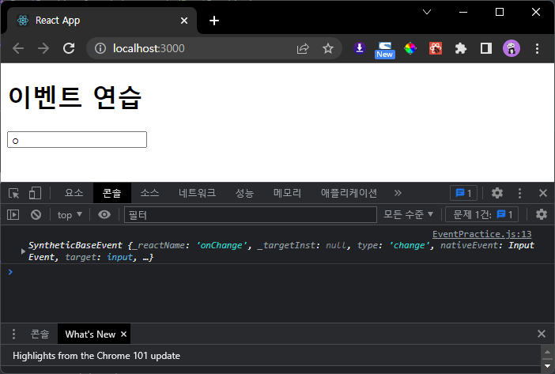
<hr />

- 여기서 콘솔에 기록되는 `e`객체는 SyntheticEvent
- `e.target`은 이벤트가 발생한 태그 자체를 가리킴
- 따라서 input 태그에 입력받는 값은 `e.target.value`이다.

  ```js
  (...)
                          console.log(e.target.value);
  (...)
  ```

  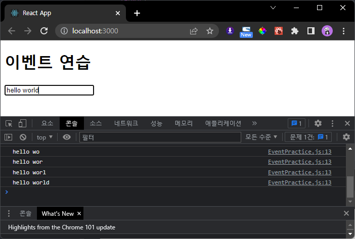 

#### 4.2.2.2 state에 input 값 담기

```js
import React from 'react';

const EventPractice = () => {
    const [message, setMessage] = React.useState('');

    return (
        <div>
            <h1>이벤트 연습</h1>
            <input
                type='text'
                name='message'
                placeholder='아무거나 입력해 보세요'
                value={message}
                onChange={
                    (e) => {
                        setMessage(e.target.value);
                    }
                }
                />
        </div>
    );
};

export default EventPractice;
```

<hr />

1. 처음 input태그의 value는 message의 초깃값인 `''`빈 문자열
2. onChange가 동작하여, 입력받는 값이 message에 setter로 전달됨
3. 입력값을 전달받은 message가 input태그의 value에 적용됨

<hr />

#### 4.2.2.3 버튼을 누를 때 comment 값을 공백으로 설정
```js
(...)
            <button 
                onClick = {() => {
                    alert(message);
                    setMessage('');
                }}
                >확인</button>
        </div>
    );
};

export default EventPractice;
```

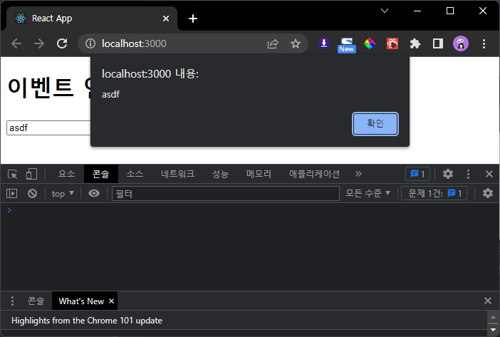
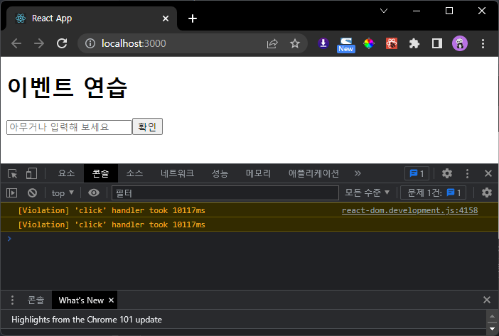
> Violation => 이벤트에 걸린 시간이 오래걸린다는 경고(not 오류) -> 콘솔 필터에서 '상세'를 끄면 안보임   
> 프레임 드랍이 생길 수 있는 부분에 관한 경고메시지

<hr />

1. 버튼을 누를 경우 message값을 alert로 띄워줌
2. setter를 이용하여 message값을 `''`빈 문자열으로 바꿈
3. input의 value값이 빈 문자열으로 바뀌면서 리셋

<hr />

## 4.2.3 임의 메서드(함수) 만들기

위에서 작성한 코드의 이벤트에 callback으로 전달하던 함수를 외부에 임의로 정의하여 호출

```js
import React from 'react';

const EventPractice = () => {
    const [message, setMessage] = React.useState('');

    const handleChange = (e) => {
        setMessage(e.target.value);
    }

    const handleClick = (e) => {
        alert(message);
        setMessage('');
    }

    return (
        <div>
            <h1>이벤트 연습</h1>
            <input
                type='text'
                name='message'
                placeholder='아무거나 입력해 보세요'
                value={message}
                onChange={handleChange}
            />
            <button 
                onClick = {handleClick}
                >확인</button>
        </div>
    );
};

export default EventPractice;
```

## 4.3 함수 컴포넌트로 구현해보기 (input 여러개 다루기)
```js
import React from 'react';

const EventPractice = () => {
    const [username, setUsername] = React.useState('');
    const [message, setMessage] = React.useState('');

    const onChangeUsername = e => setUsername(e.target.value);
    const onChangeMessage = e => setMessage(e.target.value);

    const onClick = () => {
        alert(username + ': ' + message);
        setUsername('');
        setMessage('');
    };

    const onKeyPress = e => {
        if (e.key === 'Enter') {
            onClick();
        }
    };

    return (
        <div>
            <h1>이벤트 연습</h1>
            <input
                type="text"
                name='username'
                placeholder='사용자명'
                value={username}
                onChange={onChangeUsername}
            />
            <input
                type='text'
                name='message'
                placeholder='아무거나 입력해 보세요'
                value={message}
                onChange={onChangeMessage}
                onKeyPress={onKeyPress}
            />
            <button onClick={onClick}>확인</button>
        </div>
    );
};

export default EventPractice;
```

- 위 코드는 각각의 input에 각각의 함수를 작성하여 만듦
  1. 여기서 state의 값을 json으로 한 번에 묶고,
  2. input 태그의 name값을 state의 key와 매칭을 시키면,
  3. 세터 함수에 전달하는 파라미터를 input태그의 name값을 이용하여 적용할 수 있다.
  
```js
import React from 'react';

const EventPractice = () => {
    const [form, setForm] = React.useState({
        username: '',
        message: '',
    });

    const {username, message} = form;
    
    const onChange = e => {
        const nextForm = {
            ...form,
            [e.target.name]: e.target.value,
        }
        setForm(nextForm);
    }

    const onClick = () => {
        alert(username + ': ' + message);
        setForm({
            username: '',
            message: '',
        })
    };

    const onKeyPress = e => {
        if (e.key === 'Enter') {
            onClick();
        }
    };

    return (
        <div>
            <h1>이벤트 연습</h1>
            <input
                type="text"
                name='username'
                placeholder='사용자명'
                value={username}
                onChange={onChange}
            />
            <input
                type='text'
                name='message'
                placeholder='아무거나 입력해 보세요'
                value={message}
                onChange={onChange}
                onKeyPress={onKeyPress}
            />
            <button onClick={onClick}>확인</button>
        </div>
    );
};

export default EventPractice;
```

- 여기서 아래 부분의 [e.target.name]처럼 객체 안에서 key를 `[]`로 감쌀 경우 그 안에 넣은 레퍼런스가 가리키는 실제 값이 key로 사용된다.
- 놀라워라!
```js
 const onChange = e => {
        const nextForm = {
            ...form,
            [e.target.name]: e.target.value,
        }
        setForm(nextForm);
    }
```

- 위 코드의 결과 스크린샷

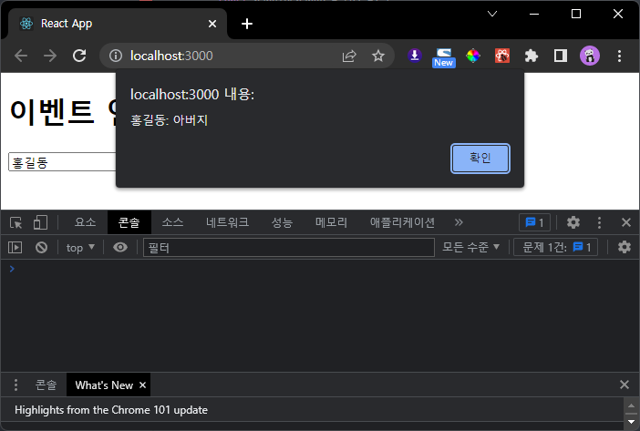
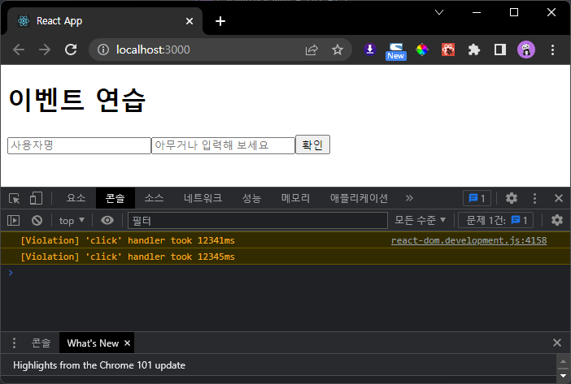