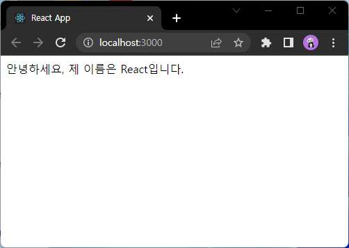
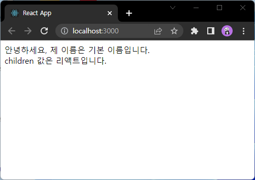
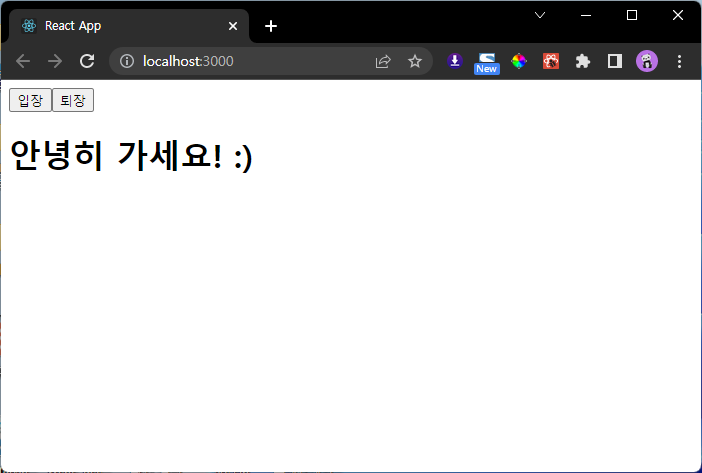
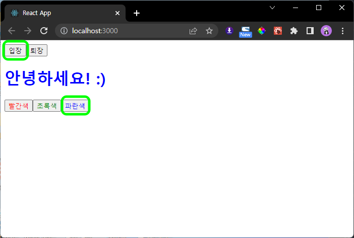

# 3.2.3 모듈 내보내기 및 불러오기

## App.js

```js
import React from 'react';
import MyComponent from './components/MyComponent';

const App = () => {
    return (
        <MyComponent />
    );
};

export default App;
```

## MyComponent.js

```js
import React from 'react';

const MyComponent = () => {
    return (
        <div>
            나의 새롭고 멋진 컴포넌트!
        </div>
    );
};

export default MyComponent;

```


# 3.3 props

## App.js

```js
import React from 'react';
import MyComponent from './components/MyComponent';

const App = () => {
    return (
        <MyComponent name='React'/>
    );
};

export default App;
```

## MyComponent.js

```js
import React from 'react';

const MyComponent = (props) => {
    return (
        <div>
            안녕하세요, 제 이름은 {props.name}입니다.
        </div>
    );
};

export default MyComponent;

```


# 3.3.3 defaultProps
## App.js

```js
(...)
return (
    <MyComponent />
);
(...)
```

## MyComponent.js

```js
import React from 'react';

const MyComponent = (props) => {
    return (
        <div>
            안녕하세요, 제 이름은 {props.name}입니다.
        </div>
    );
};

MyComponent.defaultProps = {
    name : '기본 이름',
}
export default MyComponent;
```


# 3.3.4 태그 사이의 내용을 보여주는 children

## App.js
```js
(...)
return (
    <MyComponent>리액트</MyComponent>
);
(...)
```

## MyComponent.js

```js
(...)
return (
    <div>
        안녕하세요, 제 이름은 {props.name}입니다.<br />
        children 값은 {props.children}입니다.
    </div>
);
(...)
```


# 3.3.5 비구조화 할당 문법을 통해 props 내부 값 추출하기

## MyComponent.js

```js
(...)
const MyComponent = ({name, children}) => {
    return (
        <div>
            안녕하세요, 제 이름은 {name}입니다.<br />
            children 값은 {children}입니다.
        </div>
    );
};
(...)
```



# 3.3.6 propTypes를 통한 props검증
## App.js
```js
(...)
return (
    <MyComponent name={3}>리액트</MyComponent>
);
(...)
```

## MyComponent.js
```js
import React from 'react';
import PropTypes from 'prop-types';

(...)

MyComponent.propTypes = {
    name: PropTypes.string,
};
export default MyComponent;
```


# 3.3.6.1 isRequired를 사용하여 필수 propTypes 설정

## App.js
```js
import React from 'react';
import MyComponent from './components/MyComponent';

const App = () => {
    return (
        <MyComponent name='React'>리액트</MyComponent>
    );
};

export default App;
```

## MyComponent.js
```js
(...)

    return (
        <div>
            안녕하세요, 제 이름은 {name}입니다.<br />
            children 값은 {children}입니다. <br />
            제가 좋아하는 숫자는 {favoriteNumber} 입니다.
        </div>
    );

(...)

MyComponent.propTypes = {
    name: PropTypes.string,
    favoriteNumber: PropTypes.number.isRequired,
};
export default MyComponent;
```


## App.js
```js
(...)
    return (
        <MyComponent name='React' favoriteNumber={24}>리액트</MyComponent>
    );
(...)
```


# 3.4.2 함수 컴포넌트에서 useState 사용하기

## App.js
```js
import React from 'react';
import Say from './components/Say';

const App = () => {
    return (
        <Say />
    );
};

export default App;
```

## Say.js

```js
import React, {useState} from 'react';

const Say = () => {
    const [message, setMessage] = useState('');
    const onClickEnter = () => setMessage('안녕하세요! :)');
    const onClickLeave = () => setMessage('안녕히 가세요! :)');

    return (
        <div>
            <button onClick={onClickEnter}>입장</button>
            <button onClick={onClickLeave}>퇴장</button>
            <h1>{message}</h1>
        </div>
    );
};

export default Say;
```



# 3.4.2.3 한 컴포넌트에서 useState 여러 번 사용하기

## App.js는 전과 같음

## Say.js
```js
import React, {useState} from 'react';

const Say = () => {
    const [message, setMessage] = useState('');
    const onClickEnter = () => setMessage('안녕하세요! :)');
    const onClickLeave = () => setMessage('안녕히 가세요! :)');

    const [color, setColor] = useState('black');

    return (
        <div>
            <button onClick={onClickEnter}>입장</button>
            <button onClick={onClickLeave}>퇴장</button>
            <h1 style={{color}}>{message}</h1>
            <button style={{color: 'red'}} onClick={()=>setColor('red')}>빨간색</button>
            <button style={{color: 'green'}} onClick={()=>setColor('green')}>초록색</button>
            <button style={{color: 'blue'}} onClick={()=>setColor('blue')}>파란색</button>
        </div>
    );
};

export default Say;
```

