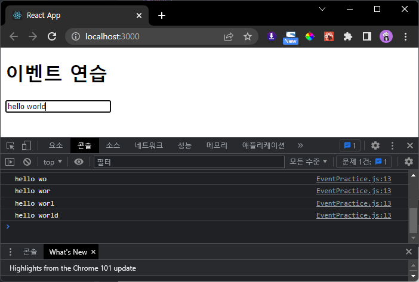
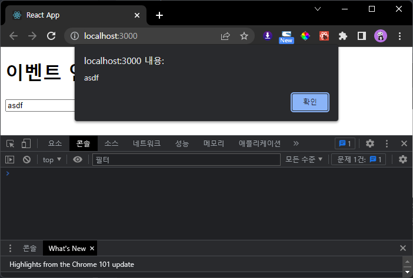
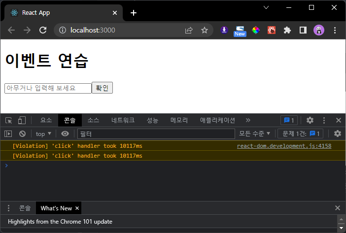
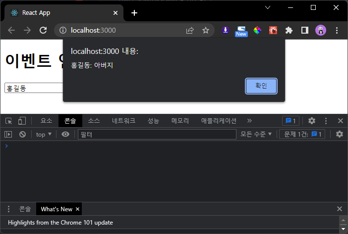
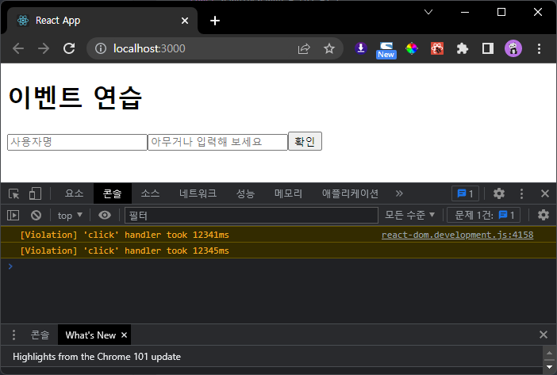

# 4.2.1.1 컴포넌트 생성

## App.js
```js
import React from 'react';
import EventPractice from './components/EventPractice';

const App = () => {
    return (
        <EventPractice />
    );
};

export default App;
```
## EventPractice.js
```js
import React from 'react';

const EventPractice = () => {
    return (
        <div>
            <h1>이벤트 연습</h1>
            <input
                type='text'
                name='message'
                placeholder='아무거나 입력해 보세요'
                onChange={
                    (e) => {
                        console.log(e);
                    }
                }
                />
        </div>
    );
};

export default EventPractice;
```


# 같은 단원 수정

## EventPractice.js
```js
(...)
                onChange={
                    (e) => {
                        console.log(e.target.value);
                    }
                }
(...)

export default EventPractice;
```


# 4.2.2.2 state에 input값 담기

## EventPractice.js
```js
import React from 'react';

const EventPractice = () => {
    const [message, setMessage] = React.useState('');

    return (
        <div>
            <h1>이벤트 연습</h1>
            <input
                type='text'
                name='message'
                placeholder='아무거나 입력해 보세요'
                value={message}
                onChange={
                    (e) => {
                        setMessage(e.target.value);
                    }
                }
                />
        </div>
    );
};

export default EventPractice;
```


# 4.2.2.3 버튼을 누를 때 comment값을 공백으로 설정

## EventPractice.js
```js
(...)
            <button 
                onClick = {() => {
                    alert(message);
                    setMessage('');
                }}
                >확인</button>
        </div>
    );
};

export default EventPractice;
```


> Violation => 이벤트에 걸린 시간이 오래걸린다는 경고(not 오류) -> 콘솔 필터에서 '상세'를 끄면 안보임   
> 프레임 드랍이 생길 수 있는 부분에 관한 경고메시지

# 4.2.3 임의 메서드 만들기

## EventPractice.js
```js
import React from 'react';

const EventPractice = () => {
    const [message, setMessage] = React.useState('');

    const handleChange = (e) => {
        setMessage(e.target.value);
    }

    const handleClick = (e) => {
        alert(message);
        setMessage('');
    }

    return (
        <div>
            <h1>이벤트 연습</h1>
            <input
                type='text'
                name='message'
                placeholder='아무거나 입력해 보세요'
                value={message}
                onChange={handleChange}
            />
            <button 
                onClick = {handleClick}
                >확인</button>
        </div>
    );
};

export default EventPractice;
```

## 결과 스크린 샷은 위와 같음

# 4.3 함수 컴포넌트로 구현해보기(input 여러개 다루기)

## EventPractice.js
```js
import React from 'react';

const EventPractice = () => {
    const [username, setUsername] = React.useState('');
    const [message, setMessage] = React.useState('');

    const onChangeUsername = e => setUsername(e.target.value);
    const onChangeMessage = e => setMessage(e.target.value);

    const onClick = () => {
        alert(username + ': ' + message);
        setUsername('');
        setMessage('');
    };

    const onKeyPress = e => {
        if (e.key === 'Enter') {
            onClick();
        }
    };

    return (
        <div>
            <h1>이벤트 연습</h1>
            <input
                type="text"
                name='username'
                placeholder='사용자명'
                value={username}
                onChange={onChangeUsername}
            />
            <input
                type='text'
                name='message'
                placeholder='아무거나 입력해 보세요'
                value={message}
                onChange={onChangeMessage}
                onKeyPress={onKeyPress}
            />
            <button onClick={onClick}>확인</button>
        </div>
    );
};

export default EventPractice;
```



# 4.3 함수 컴포넌트로 구현해보기(함수 하나로 input 여러개 다루기)

## EventPractice.js
```js
import React from 'react';

const EventPractice = () => {
    const [form, setForm] = React.useState({
        username: '',
        message: '',
    });

    const {username, message} = form;
    
    const onChange = e => {
        const nextForm = {
            ...form,
            [e.target.name]: e.target.value,
        }
        setForm(nextForm);
    }

    const onClick = () => {
        alert(username + ': ' + message);
        setForm({
            username: '',
            message: '',
        })
    };

    const onKeyPress = e => {
        if (e.key === 'Enter') {
            onClick();
        }
    };

    return (
        <div>
            <h1>이벤트 연습</h1>
            <input
                type="text"
                name='username'
                placeholder='사용자명'
                value={username}
                onChange={onChange}
            />
            <input
                type='text'
                name='message'
                placeholder='아무거나 입력해 보세요'
                value={message}
                onChange={onChange}
                onKeyPress={onKeyPress}
            />
            <button onClick={onClick}>확인</button>
        </div>
    );
};

export default EventPractice;
```

## 결과는 위와 같음