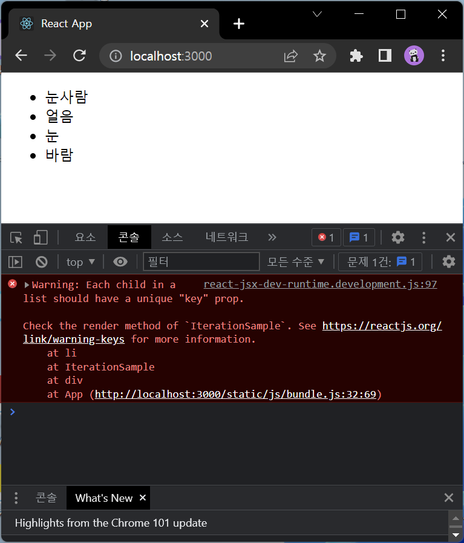
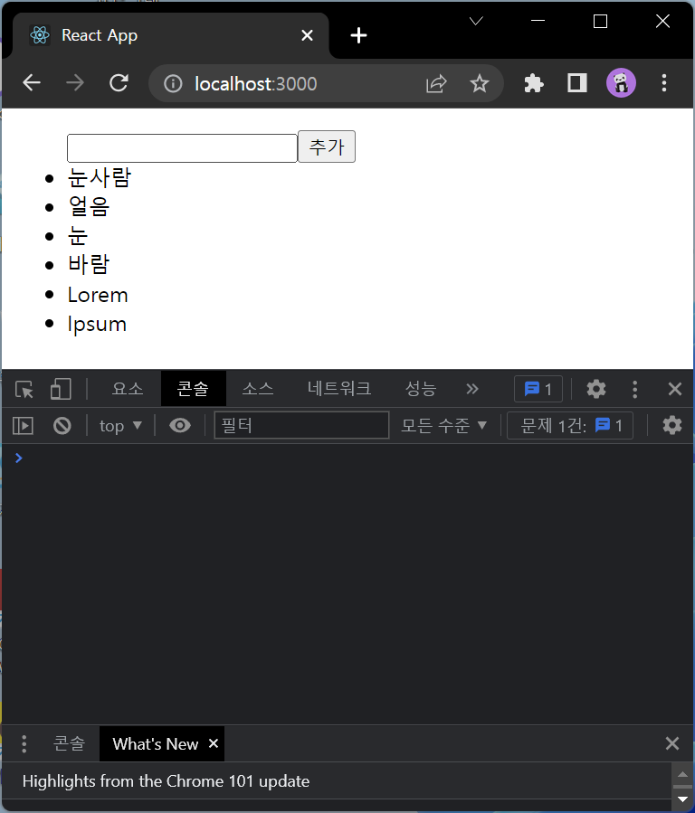
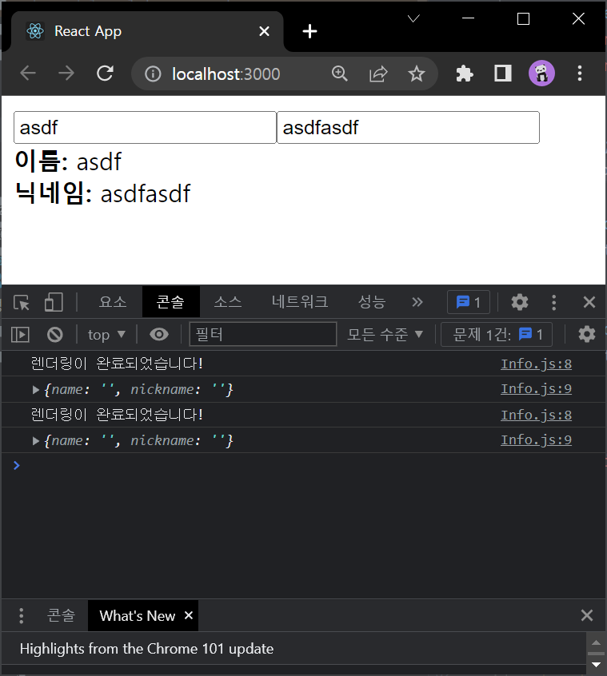

# 리액트를 다루는 기술 정리 - 박정모
> 2022-05-09

# #05장 - ref:DOM에 이름 달기
ref - HTML에서 DOM에 id를 이용하여 사용하듯이 리액트 프로젝트 내부의 DOM에 이름을 다는 개념   
리액트 프로젝트 내부에서도 id 사용이 완전히 불가능 한 것은 아니나, 컴포넌트의 재사용시 id 중복이 일어날 수 있으므로 권장하지 않음   

## 5.1 ref는 어떤 상황에서 사용해야 할까?
- **꼭** DOM을 직접적으로 건드려야 할 때
- 단순히 input값을 가져오는 정도의 작업은 ref가 아닌 state의 응용만으로 해결이 가능하다.

### 5.1.3 DOM을 꼭 사용해야 하는 상황
- 특정 input에 focus 주기
- 스크롤 박스 조작하기
- Canvas 요소에 그림 그리기 등

## 5.2 ref 사용
- 컴포넌트 내부에서 useRef();를 통해 변수를 담는다.
- 해당 변수를 제어하고자 하는 요소에 props로 전달한다. (ref={...})
- 변수를 전달받은 DOM에 접근하기 위해서는 `ref변수명.current`를 사용한다.
  - 여기서 `ref변수명.current`는 일반 HTML에서 `document.querySelector(...)`와 완전히 동일하므로 사용법 또한 같다.

## 5.3 컴포넌트에 ref 달기
- 컴포넌트에도 ref를 달 수 있다.
- 주로 컴포넌트 내부의 DOM을 외부에서 사용할 때 사용한다.
- 사용법
  - 컴포넌트를 사용할 때도 DOM과 마찬가지로 ref를 props로 전달한다.
  - 컴포넌트 내부 선언문에서 `React.forwardRef((props, ref) => {...}`의 형식으로 작성한다.
  - `React.forwardRef`의 파라미터 `ref`가 바로 상위 컴포넌트에서 주입한 ref props이다.

<hr />

#### 실습 

#### ScrollBox.js
```js
import React from 'react';

const ScrollBox = React.forwardRef((props, ref)  => {
    const style = {
        border: '1px solid black',
        height: '300px',
        width: '300px',
        overflow: 'auto',
        position: 'relative',
    };
    const innerStyle = {
        width: '100%',
        height: '650px',
        background: 'linear-gradient(white, green)',
    }
    return (
        <div
            style={style}
            ref={ref}>
            <div style={innerStyle}></div>

        </div>
    );
});

export default ScrollBox;
```
#### App.js
```js
import React from 'react';
import ScrollBox from "./components/ScrollBox";

const App = () => {
    const scrollBoxRef = React.useRef();

    return (
        <div>
            <ScrollBox ref={scrollBoxRef}/>
            <button onClick={() => {
                const {scrollHeight, clientHeight} = scrollBoxRef.current;
                scrollBoxRef.current.scrollTop = scrollHeight - clientHeight;
            }}>맨 밑으로
            </button>
        </div>
    );
};

export default App;
```


## 5.4 정리
- 컴포넌트 내부에서 DOM에 직접 접근해야 할 때 사용이 가능함
- 사용하기 전 ref를 사용하지 않고 기능을 구현할 수 있는지부터 고려할 것
- 컴포넌트끼리 ref를 전달받은걸 다시 전달하고 또 전달하는 방식은 사용은 가능하나 규모가 커질 경우 스파게티처럼 꼬여버릴 수 있으므로 사용하지 말 것.(리액트의 목적과 애초에 어긋나있는 개념)
- 컴포넌트끼리 데이터 교류를 할 때는 항상 `부모` ↔ `자식` 흐름
- 그 외 효율적인 교류는 Redux를 이용하자

# #06장 - 컴포넌트 반복
## 6.1 자바스크립트 배열의 map() 함수
PASS

## 6.2 데이터 배열을 컴포넌트 배열로 변환하기
- 배열의 map() 함수는 원본 배열의 원소를 이용하여 `원본 배열의 길이와 같은` 배열을 리턴하므로, 이를 이용하여 배열의 원소들을 이용한 JSX코드를 리턴할 수 있다.   
- 여기서 JSX코드는 DOM자체로 사용해도 되고, 컴포넌트를 사용해도 된다.

<hr />

#### 실습

#### IterationSample.js
```js
import React from 'react';

const IterationSample = () => {
    const names = ['눈사람', '얼음', '눈', '바람'];
    const nameList = names.map((v) => <li>{v}</li>);
    return (
        <ul>
            {nameList}
        </ul>
    );
};

export default IterationSample;
```


## 6.3 key
- 위 실습에서 출력된 에러는 `경고: list의 각 child는 고유한 key prop을 꼭 가져야 합니다.` 이다.   
- 리액트에서 key는 컴포넌트 배열을 렌더링 했을 때, 어떤 원소의 변동여부를 알아내기 위해 사용한다.   
- 데이터 원본에 고유한 값이 없을 경우엔 map함수의 index를 이용하면 된다.   
- key값은 props처럼 전달한다.

## 6.4 응용
|     초기 상태 설정하기     |
|:------------------:|
| ↓|
| **데이터 추가 기능 구현하기** |
| ↓|
| **데이터 제거 기능 구현하기** |


### 6.4.1 초기 상태 설정하기

<hr />

#### IterationSample.js
```js
import React from 'react';

const IterationSample = () => {
    const [names, setNames] = React.useState([
        { id: 1, text: '눈사람'},
        { id: 2, text: '얼음'},
        { id: 3, text: '눈'},
        { id: 4, text: '바람'},
    ]);
    const [inputText, setInputText] = React.useState('');
    const [nextId, setNextId] = React.useState(5);
    const nameList = names.map((name => <li key={name.id}>{name.text}</li>));
    return (
        <ul>
            {nameList}
        </ul>
    );
};

export default IterationSample;
```

<br />

1. 상태값 names를 고유한 id값과 text를 가진 json의 배열로 설정
2. names 배열에 map 함수를 적용하여 `<li>`태그의 key값으로 각 원소의 id값을, 내용으로는 각 원소의 text를 적용  
<br />


### 6.4.2 데이터 추가 기능 구현하기

<hr />

## IterationSample.js
```js
import React from 'react';

const IterationSample = () => {
    const [names, setNames] = React.useState([
    { id: 1, text: '눈사람'},
    { id: 2, text: '얼음'},
    { id: 3, text: '눈'},
    { id: 4, text: '바람'},
    ]);
    const [inputText, setInputText] = React.useState('');
    const [nextId, setNextId] = React.useState(5);

    const onChange = (e) => setInputText(e.target.value);
    const onClick = (e) => {
        const nextNames = names.concat({
            id: nextId, text: inputText
        });
        setNextId(nextId+1);
        setNames(nextNames);
        setInputText('');
    };

    const nameList = names.map((name => <li key={name.id}>{name.text}</li>));
    return (
        <ul>
            <input value={inputText} onChange={onChange} />
            <button onClick={onClick}>추가</button>
            {nameList}
        </ul>
    );
};

export default IterationSample;
```

<br />

3. 상태값 names의 초깃값의 id값인 4 다음 수인 5를 nextId라는 상태값의 초깃값으로 전달.
4. input태그의 입력값을 상태값 inputText의 세터에 전달하는 함수를 onChange에 적용
5. names 배열에 concat함수를 적용하여 id는 nextId, text는 inputText인 원소를 추가한 배열을 nextNames에 복사하여 names의 세터에 전달하고, nextId의 값을 1 증가시키고, inputText를 리셋시키는 함수를 생성하여 버튼의 클릭이벤트에 적용한다.
   - 여기서 Names에 원소를 추가할 때 push를 사용하지 않고 concat을 사용한 이유
   - push를 사용할 경우 원본 배열에 추가되고, concat은 새로운 배열을 만들어서 복사함
   - 상태를 업데이트 할 때는 기존 상태는 유지한 채로 새로운 값을 상태로 설정해야 하는데 이를 `불변성 유지`라고 한다.

<br />



### 6.4.3 데이터 제거 기능 구현하기

<hr />

#### IterationSample.js
```js
(...)
    const onRemove = id => {
        const nextNames = names.filter(name => name.id !== id);
        setNames(nextNames);
    }

    const nameList = names.map((name => <li key={name.id} onDoubleClick={() => onRemove(name.id)}>{name.text}</li>));
(...)
```

<br />

6. 배열의 filter를 사용하여 특정 조건을 만족하는 값들만 추출하여 복사함.
7. 여기서 특정 조건은 더블클릭된 대상의 id값과 일치하지 않는 값들을 의미 (= 더블클릭된 대상만 제외한 나머지 원소를 복사)
8. 이를 Names의 세터에 전달

<br />


## 6.5 정리
- 컴포넌트 배열을 렌더링 할 때는 key값의 설정에 항상 주의 할 것
- key 값이 중복될 경우 렌더링 과정에서 오류 발생 가능성


# #08장 - Hooks

## 8.1 useState
- 가장 기본적인 Hook
- 함수 컴포넌트에서 가변적인 상태값을 사용할 수 있게 해줌
- useState 파라미터로는 상태의 기본 값을 전달
- useState는 배열을 리턴함
  - 첫 번째 원소는 상태값, 두 번째 원소는 상태값을 업데이트 할 수 있는 함수(setter)
- 상태값이 업데이트 될 때, 컴포넌트는 자동으로 리렌더링 된다.

### 8.1.1 useState를 여러 번 사용하기
하나의 useState는 하나의 상태값만 관리할 수 있다.   
한 컴포넌트 안에서 여러개의 useState를 사용할 수 있다.

<hr />

#### 실습

#### Info.js
```js
import React, { useState } from 'react';

const Info = () => {
    const [name, setName] = useState('');
    const [nickname, setNickname] = useState('');

    const onChangeName = e => {
        setName(e.target.value);
    }

    const onChangeNickname = e => {
        setNickname(e.target.value);
    }

    return (
        <div>
            <div>
                <input value={name} onChange={onChangeName}/>
                <input value={nickname} onChange={onChangeNickname}/>
            </div>
            <div>
                <div>
                    <b>이름:</b> {name}
                </div>
                <div>
                    <b>닉네임:</b> {nickname}
                </div>
            </div>
        </div>
    );
};

export default Info;
```


## 8.2 useEffect
useEffect는 컴포넌트가 렌더링될 때마다 특정 작업을 수행한다.   

<hr />

#### 실습
#### Info.js
```js
import React, { useState, useEffect } from 'react';

const Info = () => {
    const [name, setName] = useState('');
    const [nickname, setNickname] = useState('');

    useEffect(() => {
        console.log('렌더링이 완료되었습니다!');
        console.log({
            name,
            nickname
        });
    });
(...)
```


### 8.2.1 마운트 될 때만 실행하고 싶을 때
위 코드는 처음 렌더링 될 때 뿐만 아니라 상태값이 바뀔때마다 계속해서 useEffect가 반복실행된다.   
useEffect함수의 두 번째 파라미터로 빈 배열을 기입할 경우, 처음 렌더링 될 때만 코드가 실행된다.

```js
(...)
    useEffect(() => {
        console.log('렌더링이 완료되었습니다!');
        console.log({
            name,
            nickname
        });
    }, []);  // <--여기!!!★
(...)
```



### 8.2.2 특정 값이 업데이트 될 때만 실행하고 싶을 때
useEffect의 두 번째 파라미터의 배열에 적용하고 싶은 상태값 or props로 전달받은 값 등을 기입하면 해당 값에 변화가 일어날 때만 실행된다.
```js
(...)
    useEffect(() => {
        console.log('렌더링이 완료되었습니다!');
        console.log({
            name,
            nickname
        });
    }, [name]); // <-- name값에 변화가 일어날 때마다 실행하시오.
(...)

```


> name에 a를 입력하고 nickname을 입력한 후 b를 입력했으나 name에 입력될 때만 실행되었다.

### 8.2.3 뒷정리하기
컴포넌트가 언마운트 되기 전이나 업데이트 되기 전에 수행할 작업은 뒷정리 함수에서 적용한다.   
뒷정리 함수는 다른건 없고 useEffect의 return값에 함수를 입력하는 방식이다.   
useEffect의 두 번째 파라미터에 아무것도 전달하지 않을 경우, 렌더링 될 때마다 실행이 된다.   
두 번째 파라미터로 빈 배열을 넣으면 오직 언마운트 될 때만 실행된다.

<hr />

#### App.js
```js
import React from 'react';
import Info from './components/Info';

const App = () => {
    const [visible, setVisible] = React.useState(false);
    return (
        <div>
            <button
                onClick={() => {
                    setVisible(!visible);
                }}
                >
                {visible ? '숨기기' : '보이기'}
            </button>
            <hr />

            {visible && <Info/>}
        </div>
    );
};

export default App
```

#### Info.js
```js
import React, { useState, useEffect } from 'react';

const Info = () => {
    const [name, setName] = useState('');
    const [nickname, setNickname] = useState('');

    useEffect(() => {
        console.log('effect');
        console.log(name);
        return () => {
            console.log('cleanup');
            console.log(name);
        }
    }, [name]);

    const onChangeName = e => {
        setName(e.target.value);
    }

    const onChangeNickname = e => {
        setNickname(e.target.value);
    }

    return (
        <div>
            <div>
                <input value={name} onChange={onChangeName}/>
                <input value={nickname} onChange={onChangeNickname}/>
            </div>
            <div>
                <div>
                    <b>이름:</b> {name}
                </div>
                <div>
                    <b>닉네임:</b> {nickname}
                </div>
            </div>
        </div>
    );
};

export default Info;
```
> 위 코드에서 useEffect의 두 번째 파라미터의 name을 지우면 언마운트때만 실행됨!


## 8.3 useReducer
- useReducer는 useState보다 더 다양한 컴포넌트 상황에 다양한 상태를 다른 값으로 업데이트할 때 씀
- `현재 상태`, 업데이트를 위해 필요한 정보를 담은 `action`값을 전달받아 새로운 상태를 리턴함
- useState와 마찬가지로 불변성을 지켜야 하므로, 원본이 아닌 복사본을 이용한다.

### 8.3.1 카운터 구현하기


```js
import React, {useReducer} from 'react';

function reducer(state, action) {
    switch(action.type){
        case 'INCREMENT':
            return { value: state.value + 1 };
        case 'DECREMENT':
            return { value: state.value - 1 };
        default:
            return state;
    }
}

const Counter = () => {
    const [state, dispatch] = useReducer(reducer, {value: 0});

    return (
        <div>
            <p>현재 카운터 값은 <b>{state.value}</b>입니다.</p>
            <button onClick={()=>dispatch({ type: 'INCREMENT'})}>+1</button>
            <button onClick={()=>dispatch({ type: 'DECREMENT'})}>-1</button>
        </div>
    );
};

export default Counter
```


- useReducer의 첫 번째 파라미터에는 리듀서 함수를, 두 번재 파라미터에는 리듀서의 기본값을 기입함
- dispatch는 액션을 발생 시키는 함수. useState의 세터와 비슷
  - 세터는 전달받은 값을 바로 상태값에 적용
  - dispatch는 전달받은 값을 리듀서 함수에 action값으로 전달
- useReducer의 장점은 컴포넌트의 업데이트 로직을 컴포넌트 바깥으로 빼낼 수 있다는 것

### 8.3.2 인풋 상태 관리하기

<hr />

#### 실습

#### Info.js
```js
import React, { useReducer } from 'react';

function reducer(state, action) {
    return {
        ...state,
        [action.name]: action.value,
    };
}

const Info = () => {
    const [state, dispatch] = useReducer(reducer, {
        name: '',
        nickname:'',
    });
    const {name, nickname} = state;

    const onChange = e => {
        dispatch(e.target);
    }

    return (
        <div>
            <div>
                <input name='name' value={name} onChange={onChange}/>
                <input name='nickname' value={nickname} onChange={onChange}/>
            </div>
            <div>
                <div>
                    <b>이름:</b> {name}
                </div>
                <div>
                    <b>닉네임:</b> {nickname}
                </div>
            </div>
        </div>
    );
};

export default Info;
```

1. input태그에 onChange함수로 인해 dispatch(e.target)이 실행된다.
   - 여기서 e.target은 input태그 자체
2. reducer함수로 인해 전달된 input태그의 name이 키값, value가 value로 사용되어 기존의 state를 업데이트한다.
3. state가 업데이트됨에 따라 자동으로 리렌더링된다.


## 8.4 useMemo
함수 컴포넌트 내부에서 발생하는 연산을 최적화 할 수 있다.

<hr />

#### 실습

#### Average.js
```js
import React, { useState } from 'react';

const getAverage = numbers => {
    console.log('평균값 계산 중...');
    if (numbers.length === 0) return 0;
    const sum = numbers.reduce((a, b) => a + b);
    return sum / numbers.length;
};

const Average = () => {
    const [list, setList] = useState([]);
    const [number, setNumber] = useState('');

    const onChange = e => {
        setNumber(e.target.value);
    };
    const onInsert = e => {
        const nextList = list.concat(parseInt(number));
        setList(nextList);
        setNumber('');
    };

    return (
        <div>
            <input value={number} onChange={onChange}/>
            <button onClick={onInsert}>등록</button>
            <ul>
                {list.map((value, index) => {
                    return <li key={index}>{value}</li>
                })}
            </ul>
            <div>
                <b>평균값: </b>{getAverage(list)}
            </div>
        </div>
    );
};

export default Average;
```


- 위 코드의 결과값 이미지를 보면, 숫자를 등록할 때 뿐 아니라, input태그에 숫자를 기입하는 과정에서도 함수가 호출된다.
- 해당 함수는 인풋 내용이 바뀌는 때는 실행될 필요가 없다.
- useMemo는 이런 상황에 사용
- 특정 값이 바뀌었을 때만 연산을 실행하고, 원하는 값이 바뀌지 않은 경우에는 이전에 연산했던 결과를 다시 사용한다.

#### 실습 코드 수정

```js
(...)
    const Avg = useMemo(() => getAverage(list), [list]);

return (
    (...)
            
            <ul>
            {list.map((value, index) => {
                    return <li key={index}>{value}</li>
                })}
            </ul>
            <div>
              <b>평균값:</b> {avg}
            </div>
    (...)   
)
```


## 8.5 useCallback
- useMemo와 비슷
- 렌더링 성능 최적화에 사용
- 만들어놨던 함수의 재사용이 가능
- 위 코드의 경우 렌더링 될 때마다 반복하여 새로운 onChange와 onInsert함수를 만들어서 사용해야 한다.
- 이 부분을 최적화 시키는 것이 useCallback

```js
import React, { useState, useMemo, useCallback } from 'react';

(...)

    const onChange = useCallback(e => {
        setNumber(e.target.value);
    }, []);

    const onInsert = useCallback(e => {
        const nextList = list.concat(parseInt(number));
        setList(nextList);
        setNumber('');
    }, [number, list]);

(...)
```


- useCallback의 첫 번째 파라미터는 생성하고싶은 함수를, 두 번째 파라미터는 값이 변경될 때마다 이 함수를 생성하고 싶은 값들의 배열을 넣는다.
- onChange의 경우 두 번째 파라미터로 빈 배열을 기입했기 때문에, 컴포넌트가 렌더링 될 때 사용한 함수를 끝까지 재사용한다.
- onInsert의 경우 두 번째 파라미터로 [number, list]값을 주었기 때문에, 두 값이 바뀌거나 새로운 항목이 추가될 때에만 함수를 새로 생성한다.
  - 함수가 상태값에 의존해야 할 경우(상태값에 따라 함수의 내용이 바뀌는 경우) 반드시 두 번째 파라미터에 해당 값을 넣어야 한다.

## 8.6 useRef
PASS

## 8.7 커스텀 Hooks 만들기
여러 컴포넌트에서 비슷한 기능을 공유할 경우 나만의 Hook을 만들 수 있다.   

<hr />

#### 실습
#### useInputs.js
```js
import React, {useReducer} from 'react';

function reducer(state, action) {
    return {
        ...state,
        [action.name]: action.value,
    };
}
export default function useInputs(initialForm) {
    const [state, dispatch] = useReducer(reducer, initialForm);
    const onChange = e => {
        dispatch(e.target);
    };
    return [state, onChange];
}
```

이 Hook을 컴포넌트에서 사용

```js
import React from 'react';
import useInputs from './UseInputs';

const Info = () => {
    const [state, onChange] = useInputs({
        name: '',
        nickname:'',
    });
    const {name, nickname} = state;

    return (
        <div>
            <div>
                <input name='name' value={name} onChange={onChange}/>
                <input name='nickname' value={nickname} onChange={onChange}/>
            </div>
            <div>
                <div>
                    <b>이름:</b> {name}
                </div>
                <div>
                    <b>닉네임:</b> {nickname}
                </div>
            </div>
        </div>
    );
};

export default Info;
```

## 8.8 다른 Hooks

[nikgraf.github](https://nikgraf.github.io/react-hooks)   
[rehooks](https://github.com/rehooks/awesome-react-hooks)
