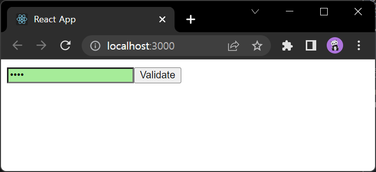
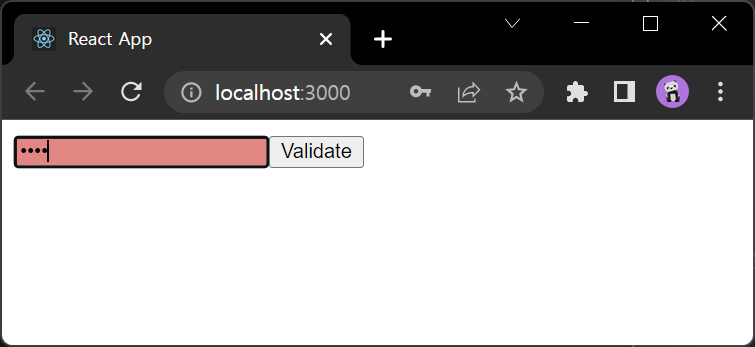
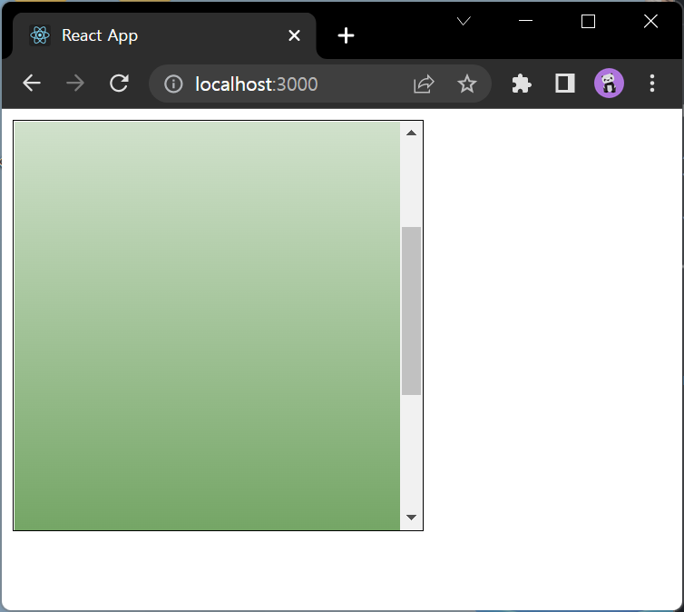
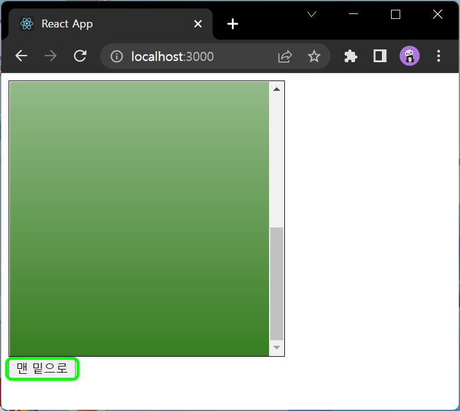

# 5.1.1 예제 컴포넌트 생성

## ValidationSample.js
```js
import React, {useState, useRef} from 'react';
import '../assets/css/ValidationSample.css';

const ValidationSample = () => {
    const [password, setPassword] = useState('');
    const [clicked, setClicked] = useState(false);
    const [validated, setValidated] = useState(false);

    const handleChange = (e) => {
        setPassword(e.target.value);
    }

    const handleButtonClick = (e) => {
        setClicked(true);
        setValidated(password === '0000');
    }

    return (
        <div>
            <input
                type='password'
                value={password}
                onChange={handleChange}
                className={clicked ? (validated ? 'success' : 'failure') : ''}
            />
            <button onClick={handleButtonClick}>Validate</button>
        </div>
    );
};

export default ValidationSample;

```




# 5.2.3.2 버튼 onClick 이벤트 코드 수정

## ValidationSample.js
```js
(...)
    const handleButtonClick = (e) => {
        setClicked(true);
        setValidated(password === '0000');
        input.current.focus();
    }

    const input = useRef();

    return (
        <div>
            <input
                type='password'
                value={password}
                onChange={handleChange}
                className={clicked ? (validated ? 'success' : 'failure') : ''}
                ref={input}
            />
            <button onClick={handleButtonClick}>Validate</button>
        </div>
    );
};

export default ValidationSample;
```


# 5.3 컴포넌트에 ref 달기

# 5.3.2 컴포넌트 초기 설정

## ScrollBox.js
```js
import React from 'react';

const ScrollBox = React.forwardRef((props, ref)  => {
    const style = {
        border: '1px solid black',
        height: '300px',
        width: '300px',
        overflow: 'auto',
        position: 'relative',
    };
    const innerStyle = {
        width: '100%',
        height: '650px',
        background: 'linear-gradient(white, green)',
    }
    return (
        <div
            style={style}
            ref={ref}>
            <div style={innerStyle}></div>

        </div>
    );
});

export default ScrollBox;
```



# 5.3.4 컴포넌트에 ref 달고 내부 메서드 사용

## App.js
```js
import React from 'react';
import ScrollBox from "./components/ScrollBox";

const App = () => {
    const scrollBoxRef = React.useRef();

    return (
        <div>
            <ScrollBox ref={scrollBoxRef}/>
            <button onClick={() => {
                const {scrollHeight, clientHeight} = scrollBoxRef.current;
                scrollBoxRef.current.scrollTop = scrollHeight - clientHeight;
            }}>맨 밑으로
            </button>
        </div>
    );
};

export default App;
```

