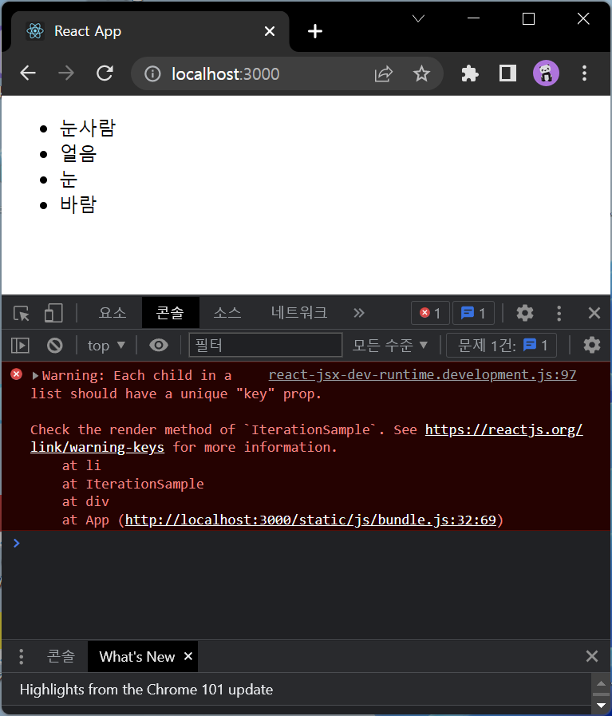
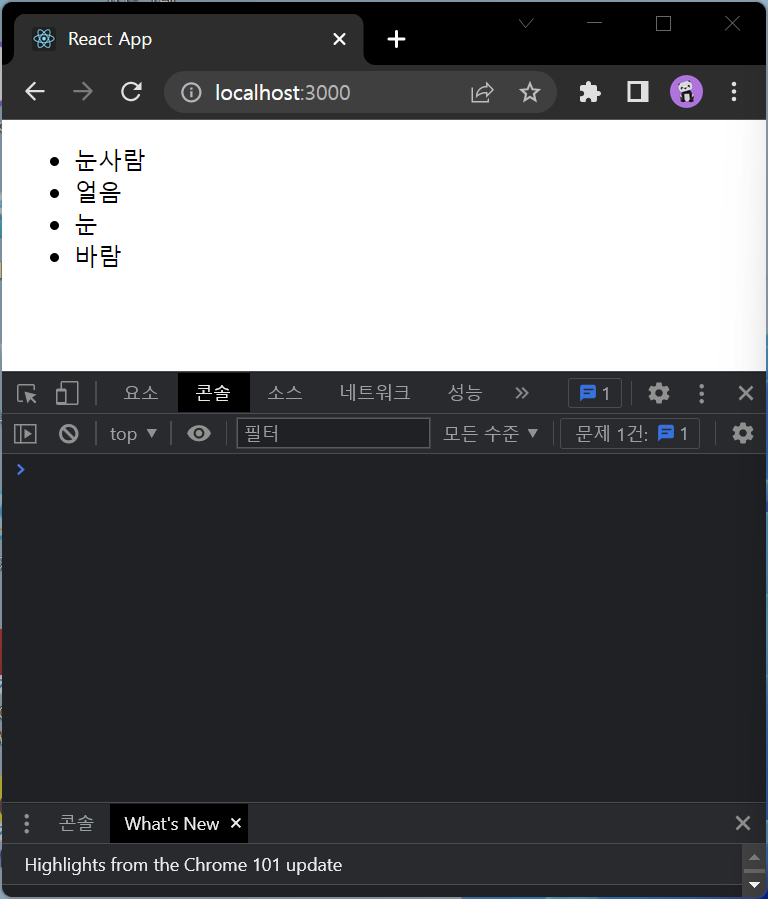
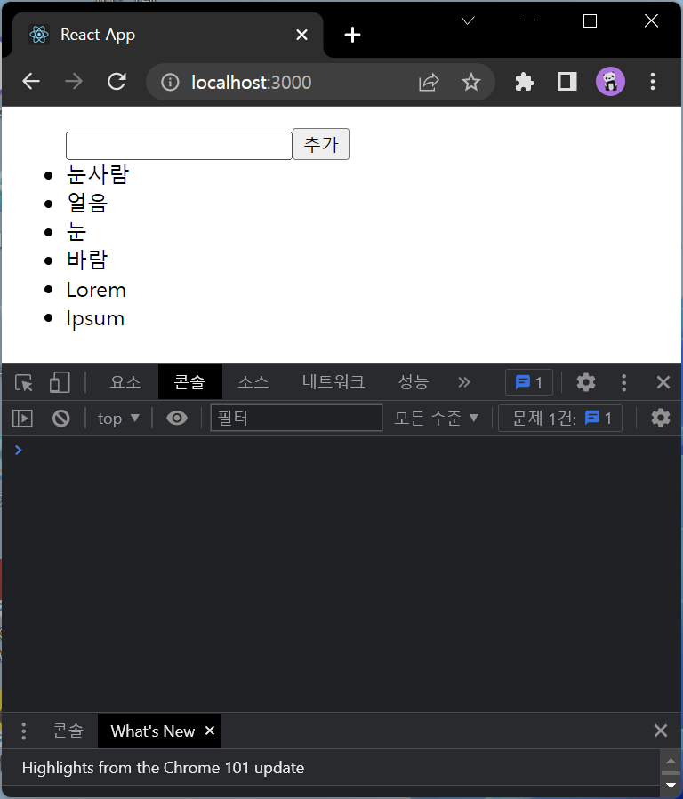
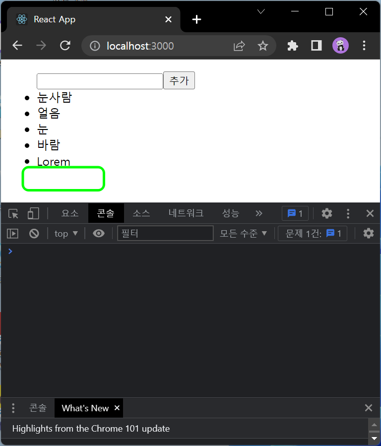

# 6.2.1 컴포넌트 수정하기

## IterationSample.js
```js
import React from 'react';

const IterationSample = () => {
    const names = ['눈사람', '얼음', '눈', '바람'];
    const nameList = names.map((v) => <li>{v}</li>);
    return (
        <ul>
            {nameList}
        </ul>
    );
};

export default IterationSample;
```


# 6.4.1 초기 상태 설정하기

## IterationSample.js
```js
import React from 'react';

const IterationSample = () => {
    const [names, setNames] = React.useState([
        { id: 1, text: '눈사람'},
        { id: 2, text: '얼음'},
        { id: 3, text: '눈'},
        { id: 4, text: '바람'},
    ]);
    const [inputText, setInputText] = React.useState('');
    const [nextId, setNextId] = React.useState(5);
    const nameList = names.map((name => <li key={name.id}>{name.text}</li>));
    return (
        <ul>
            {nameList}
        </ul>
    );
};

export default IterationSample;
```



# 6.4.2 데이터 추가 기능 구현하기

## IterationSample.js
```js
import React from 'react';

const IterationSample = () => {
    const [names, setNames] = React.useState([
    { id: 1, text: '눈사람'},
    { id: 2, text: '얼음'},
    { id: 3, text: '눈'},
    { id: 4, text: '바람'},
    ]);
    const [inputText, setInputText] = React.useState('');
    const [nextId, setNextId] = React.useState(5);

    const onChange = (e) => setInputText(e.target.value);
    const onClick = (e) => {
        const nextNames = names.concat({
            id: nextId, text: inputText
        });
        setNextId(nextId+1);
        setNames(nextNames);
        setInputText('');
    };

    const nameList = names.map((name => <li key={name.id}>{name.text}</li>));
    return (
        <ul>
            <input value={inputText} onChange={onChange} />
            <button onClick={onClick}>추가</button>
            {nameList}
        </ul>
    );
};

export default IterationSample;
```


# 6.4.3 데이터 제거 기능 구현하기

## IterationSample.js
```js
import React from 'react';

const IterationSample = () => {
    const [names, setNames] = React.useState([
    { id: 1, text: '눈사람'},
    { id: 2, text: '얼음'},
    { id: 3, text: '눈'},
    { id: 4, text: '바람'},
    ]);
    const [inputText, setInputText] = React.useState('');
    const [nextId, setNextId] = React.useState(5);

    const onChange = (e) => setInputText(e.target.value);
    const onClick = (e) => {
        const nextNames = names.concat({
            id: nextId, text: inputText
        });
        setNextId(nextId+1);
        setNames(nextNames);
        setInputText('');
    };

    const onRemove = id => {
        const nextNames = names.filter(name => name.id !== id);
        setNames(nextNames);
    }

    const nameList = names.map((name => <li key={name.id} onDoubleClick={() => onRemove(name.id)}>{name.text}</li>));
    return (
        <ul>
            <input value={inputText} onChange={onChange} />
            <button onClick={onClick}>추가</button>
            {nameList}
        </ul>
    );
};

export default IterationSample;
```

