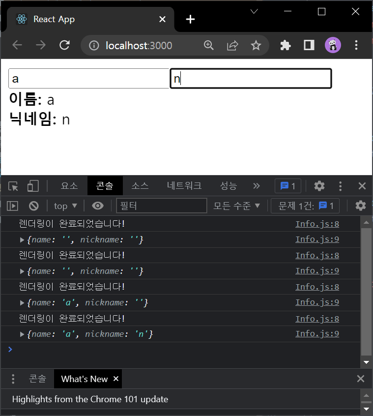
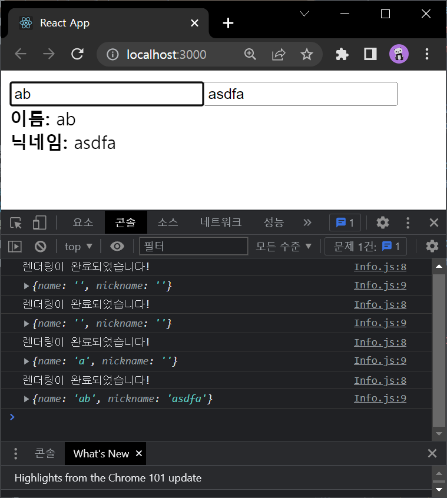
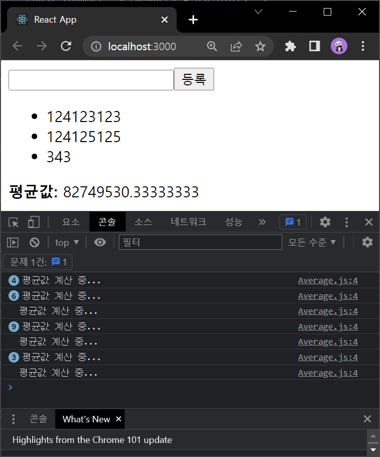
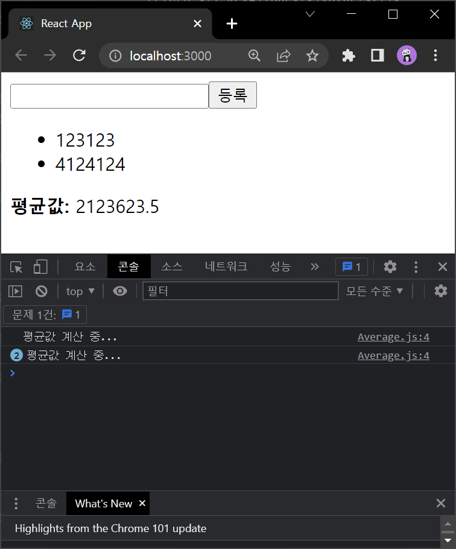

# 8.1.1 useState를 여러 번 사용하기

## Info.js
```js
import React, { useState } from 'react';

const Info = () => {
    const [name, setName] = useState('');
    const [nickname, setNickname] = useState('');

    const onChangeName = e => {
        setName(e.target.value);
    }

    const onChangeNickname = e => {
        setNickname(e.target.value);
    }

    return (
        <div>
            <div>
                <input value={name} onChange={onChangeName}/>
                <input value={nickname} onChange={onChangeNickname}/>
            </div>
            <div>
                <div>
                    <b>이름:</b> {name}
                </div>
                <div>
                    <b>닉네임:</b> {nickname}
                </div>
            </div>
        </div>
    );
};

export default Info;
```


# 8.2 useEffect

## Info.js
```js
import React, { useState, useEffect } from 'react';

const Info = () => {
    const [name, setName] = useState('');
    const [nickname, setNickname] = useState('');

    useEffect(() => {
        console.log('렌더링이 완료되었습니다!');
        console.log({
            name,
            nickname
        });
    });

    const onChangeName = e => {
        setName(e.target.value);
    }

    const onChangeNickname = e => {
        setNickname(e.target.value);
    }

    return (
        <div>
            <div>
                <input value={name} onChange={onChangeName}/>
                <input value={nickname} onChange={onChangeNickname}/>
            </div>
            <div>
                <div>
                    <b>이름:</b> {name}
                </div>
                <div>
                    <b>닉네임:</b> {nickname}
                </div>
            </div>
        </div>
    );
};

export default Info;
```




# 8.2.1 마운트 될 때만 실행하고 싶을 때

```js
(...)
    useEffect(() => {
        console.log('렌더링이 완료되었습니다!');
        console.log({
            name,
            nickname
        });
    }, []);
(...)
```


# 8.2.2 특정값이 업데이트 될 때만 실행하고 싶을 때

```js
(...)
    useEffect(() => {
        console.log('렌더링이 완료되었습니다!');
        console.log({
            name,
            nickname
        });
    }, [name]);
(...)

```



# 8.2.3 뒷정리하기

## App.js
```js
import React from 'react';
import Info from './components/Info';

const App = () => {
    const [visible, setVisible] = React.useState(false);
    return (
        <div>
            <button
                onClick={() => {
                    setVisible(!visible);
                }}
                >
                {visible ? '숨기기' : '보이기'}
            </button>
            <hr />

            {visible && <Info/>}
        </div>
    );
};

export default App
```

## Info.js
```js
import React, { useState, useEffect } from 'react';

const Info = () => {
    const [name, setName] = useState('');
    const [nickname, setNickname] = useState('');

    useEffect(() => {
        console.log('effect');
        console.log(name);
        return () => {
            console.log('cleanup');
            console.log(name);
        }
    }, [name]);

    const onChangeName = e => {
        setName(e.target.value);
    }

    const onChangeNickname = e => {
        setNickname(e.target.value);
    }

    return (
        <div>
            <div>
                <input value={name} onChange={onChangeName}/>
                <input value={nickname} onChange={onChangeNickname}/>
            </div>
            <div>
                <div>
                    <b>이름:</b> {name}
                </div>
                <div>
                    <b>닉네임:</b> {nickname}
                </div>
            </div>
        </div>
    );
};

export default Info;
```


# 8.3 useReducer

# 8.3.1 카운터 구현하기
```js
import React, {useReducer} from 'react';

function reducer(state, action) {
    switch(action.type){
        case 'INCREMENT':
            return { value: state.value + 1 };
        case 'DECREMENT':
            return { value: state.value - 1 };
        default:
            return state;
    }
}

const Counter = () => {
    const [state, dispatch] = useReducer(reducer, {value: 0});

    return (
        <div>
            <p>현재 카운터 값은 <b>{state.value}</b>입니다.</p>
            <button onClick={()=>dispatch({ type: 'INCREMENT'})}>+1</button>
            <button onClick={()=>dispatch({ type: 'DECREMENT'})}>-1</button>
        </div>
    );
};

export default Counter
```


# 8.3.2 인풋 상태 관리하기

## Info.js
```js
import React, { useReducer } from 'react';

function reducer(state, action) {
    return {
        ...state,
        [action.name]: action.value,
    };
}

const Info = () => {
    const [state, dispatch] = useReducer(reducer, {
        name: '',
        nickname:'',
    });
    const {name, nickname} = state;

    const onChange = e => {
        dispatch(e.target);
    }

    return (
        <div>
            <div>
                <input name='name' value={name} onChange={onChange}/>
                <input name='nickname' value={nickname} onChange={onChange}/>
            </div>
            <div>
                <div>
                    <b>이름:</b> {name}
                </div>
                <div>
                    <b>닉네임:</b> {nickname}
                </div>
            </div>
        </div>
    );
};

export default Info;
```


# 8.4 useMemo

## Average.js
```js
import React, { useState } from 'react';

const getAverage = numbers => {
    console.log('평균값 계산 중...');
    if (numbers.length === 0) return 0;
    const sum = numbers.reduce((a, b) => a + b);
    return sum / numbers.length;
};

const Average = () => {
    const [list, setList] = useState([]);
    const [number, setNumber] = useState('');

    const onChange = e => {
        setNumber(e.target.value);
    };
    const onInsert = e => {
        const nextList = list.concat(parseInt(number));
        setList(nextList);
        setNumber('');
    };

    return (
        <div>
            <input value={number} onChange={onChange}/>
            <button onClick={onInsert}>등록</button>
            <ul>
                {list.map((value, index) => {
                    return <li key={index}>{value}</li>
                })}
            </ul>
            <div>
                <b>평균값: </b>{getAverage(list)}
            </div>
        </div>
    );
};

export default Average;
```




# useMemo를 통한 연산 최적화
```js
(...)
    const Avg = useMemo(() => getAverage(list), [list]);

return (
    (...)
            
            <ul>
            {list.map((value, index) => {
                    return <li key={index}>{value}</li>
                })}
            </ul>
            <div>
                <b>평균값:</b> {avg}
            </div>
    (...)   
)
```


# 8.5 useCallback

```js
import React, { useState, useMemo, useCallback } from 'react';

(...)

    const onChange = useCallback(e => {
        setNumber(e.target.value);
    }, []);

    const onInsert = useCallback(e => {
        const nextList = list.concat(parseInt(number));
        setList(nextList);
        setNumber('');
    }, [number, list]);

(...)
```

